| Chain Name | Difficulty | Date Started | Date Completed |
| ---------- | ---------- | ------------ | -------------- |
| Heron      | Medium     | 07/01/2024   | 08/01/2024     |
*Vulnlab.com* 

---

**Learning Points :**
- Learned that on a domain-joined Linux host, you can use [Keytabextract.py](https://github.com/sosdave/KeyTabExtract/blob/master/keytabextract.py) to decrypt the `krb5.keytab` file and obtain a user's NTLM hash.
- Learned to enumerate Windows shortcut files used for auto-connecting to PuTTY sessions to extract credentials.
- Learned how to exploit `WriteAccountRestrictions` permission in Active Directory (AD) for privilege escalation.
- Learned that when encountering `KDC_ERR_WRONG_REALM` or `KDC_ERR_S_PRINCIPAL_UNKNOWN` errors during Kerberos exploitation, adding the host to the hosts file helps avoid classic Kerberos issues.
- Learned from [Uploading web.config for Fun and Profit 2](https://soroush.me/blog/tag/rce/) that if you have read/write access to the `web.config` file, you can replace it with a reverse shell and execute it by visiting the web page to obtain a shell on a Windows web server.
- Learned to enumerate the `C:\Windows\Scripts` folder for non-default user-created scripts.
- Learned to use `wmiexec` from Impacket to get a shell when RDP, WinRM, and reverse shells are unavailable.
- Learned how to abuse `WriteAccountRestrictions` with Resource-Based Constrained Delegation (RBCD) in an AD environment for privilege escalation.


---

**Attack Path :**
- Log into Host B using SSH.
- Scan ports on Host A using a transferred static Nmap binary.
- Use Chisel to pivot Host B and access Host A's (DC) ports.
- Access port 80 via web browser/curl with ProxyChains and discover three user emails.
- Add the emails to a file, then perform an ASREP/ASRPass attack to obtain and crack a user's hash.
- Enumerate available shares for the user and find the `transfer$` share with read/write access.
- Connect to the share, enumerate it, and find `groups.xml`, which can be decrypted using [gpp-decrypt](https://github.com/t0thkr1s/gpp-decrypt).
- Use the decrypted credentials to access the `accounting$` share.
- Replace content in the `web.config` file within the share with a PowerShell reverse shell.
- Log in to the webpage, obtain a reverse shell on the DC as a low-privileged user.
- Enumerate the DC and find a PowerShell script with credentials in `C:\Windows\Scripts`.
- Use those credentials to gain root access on Host B.
- Find the `krb5.keytab` in `/etc` on Host B, decrypt it, and obtain the `FRAJMP$` hash.
- Access the `home$` share, find a Windows shortcut file with additional credentials.
- Run BloodHound to enumerate user group permissions.
- Abuse the `WriteAccountRestrictions` privilege with the `adm_prju` credentials.
- Configure target object delegation using Impacket.
- Use `getST` to impersonate the domain admin user (`_admin`).
- Export the ticket and perform a DCSync attack using `secretsdump` to retrieve the `_admin` hash.
- Use `wmiexec` to get a shell on the machine as the domain admin.

---

Activity Log : 

- Ran Nmap on Host B from Eagle but received an error stating the host was down, despite successful ping. Used `-Pn` flag without success.
- Logged into Host B via SSH, transferred a static Nmap binary, and scanned Host A. Discovered open ports.
- Although the DC's ports were accessible from Host B, we couldn't access them from Eagle.
- Transferred Ligolo-ng to Host B and attempted pivoting, but encountered a "Connection was refused" error.
- Used Chisel instead, successfully establishing a connection.
- Added port 1080 as a SOCKS5 proxy in ProxyChains and accessed Host A's ports.
- Set up FoxyProxy in Firefox, accessed port 80 on Host A, and found three emails.
- Added users to a file, performed ASREp roast attack through ProxyChains, and obtained the hash for `samuel.davies`.
- Cracked the hash with Hashcat and verified with CrackMapExec via ProxyChains.
- Enumerated available shares for users with CrackMapExec and found read/write access to `transfer$`, which contained ADCS.
- Connected to the share with `smbclient`, but the share was empty.
- Enumerated the SYSVOL share, found a `logon.vbs` script, but it contained no useful data.
- Set `recurse` to on and `prompt` to off, ran `ls`, and found a `groups.xml` file.
- Decrypted it using [gpp-decrypt](https://github.com/t0thkr1s/gpp-decrypt) and confirmed the password worked for `svc-web-accounting-d` on the Domain Controller (DC).
- Found that `svc-web-accounting-d` had read/write access to the Accounting share.
- Connected to the share with `smbclient`, downloaded `web.config`, and accessed the page with the user's credentials.
- Replaced arguments in `web.config` with a PowerShell reverse shell, obtained a shell as `svc-web-accounting` on the DC, and retrieved the `Heron_User-1` flag from `C:\`.
- Enumerated directories but found no further progress. A hint led us to check the `scripts` folder in `C:\Windows`, where we found `ssh.ps1` containing credentials for a user on `frajmp`.
- Verified the existence of the `_local` user on Host B and switched to that user.
- Discovered `_local` had sudo rights, used `sudo su` to gain root access, and retrieved the `Heron_User-2` flag.
- Enumerated for Kerberos-related files on the Linux host and found `krb5.keytab` in `/etc`.
- Used [Keytabextract.py](https://github.com/sosdave/KeyTabExtract/blob/master/keytabextract.py) to decrypt it and retrieved an NTLM hash.
- Performed a password spray attack with CrackMapExec, but the hash didn't match any users.
- Identified the machine account `FRAJMP$` as owning the hash and performed a successful password spray attack using `_local`'s credentials.
- Accessed the `home$` share and found Windows shortcut files in the user's home directory.
- Used `cat` from Falcon to view the file properties and found a hardcoded credential pair.
- Verified the credentials with CrackMapExec but failed.
- Ran a BloodHound-python scan to generate the AD graph. Analyzed the file on a Windows machine and found the correct password.
- Verified that `adm_prju` credentials worked, marked `ADM_PRJU` as owned, and used the "Shortest Path from Owned Principals" in BloodHound to find that `ADMINS_T1` had `WriteAccountRestrictions` over the DC.
- Configured the target object for delegation using Impacket's `rbcd.py` script.
- Used Impacket's `getST.py` to obtain a service ticket and impersonated the `_admin` user (Domain Admin).
- Exported the ticket and tried a DCSync attack with `secretsdump`, but it failed.
- Added the domain and DC hostname to the Falcon hosts file and successfully launched the attack to dump the Domain Controller hashes.
- Attempted to log in with Evil-WinRM's Pass-the-Hash but failed due to the closed WinRM port. Tried RDP but also failed.
- Used `wmiexec` from Impacket to gain a shell on the Domain Controller as the `admin` user, retrieved the `Heron_Root` flag, and completed the chain.

---

_This is an assumed breach scenario. Heron Corp created a low-privileged local user account on a jump server for you and only the jump server is reachable from the start._

```
pentest:Heron123!
```

---

Running Nmap on Host B from Eagle did not return any results, as we received an error stating that the host is down, even though we could ping it and used the `-Pn` flag.

We were able to log in to Host B using SSH with the credentials provided, transferred the static Nmap binary, and ran an Nmap scan on Host A from Host B, discovering some open ports.

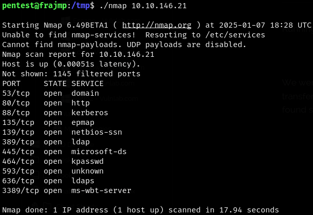

Even though the DC's ports are accessible from Host B, we couldn't access them from Eagle.

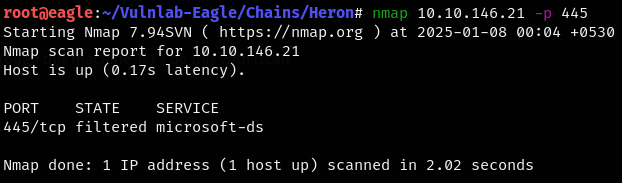

So, we transferred Ligolo-ng to Host B and used it as a pivot to access the ports of Host A from Eagle without using ProxyChains.

```
sudo ip route add 10.10.146.21/32 dev ligolo  //HostA_IP
```

We weren't able to set up a pivot using `ligolo-ng` as we encountered the error "Connection was refused."

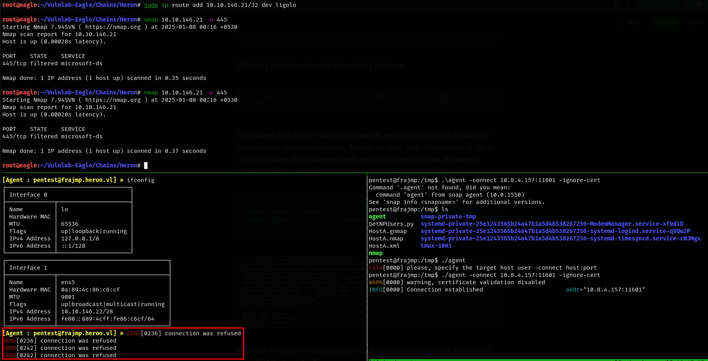

We used Chisel instead and were able to establish a connection.

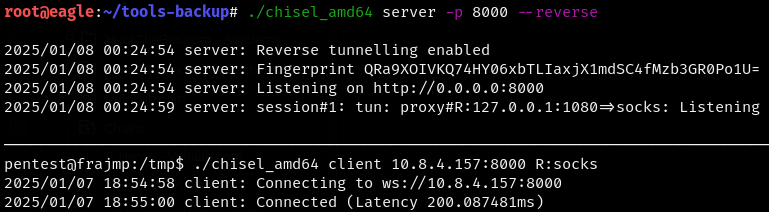

We added port 1080 as a SOCKS5 proxy to the ProxyChains config and were able to access Host A's ports.

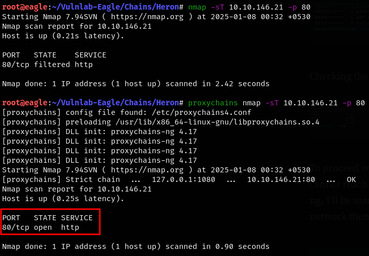

We added the SOCKS proxy configuration to FoxyProxy in Firefox, accessed port 80 on Host A, and were able to see three emails.

```
Wayne Wood
CEO
Email: wayne.wood@heron.vl
```

```
Julian Pratt
Head of IT
Email: julian.pratt@heron.vl
```

```
Samuel Davies
Accounting
Email: samuel.davies@heron.vl
```

We added the users to a file, performed an ASREP roast attack through ProxyChains, and were able to obtain the hash for the user `samuel.davies`.

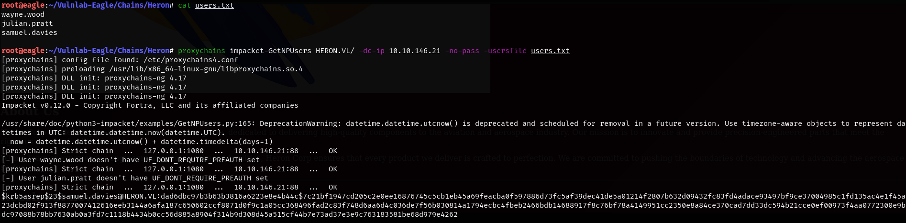

We cracked the hash using Hashcat.

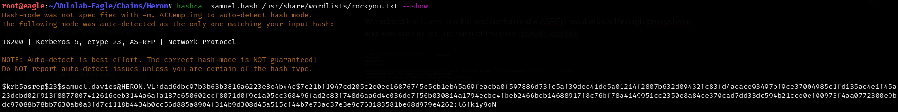

```
samuel.davies:l6fkiy9oN
```

We also confirmed that it works using CrackMapExec with ProxyChains.

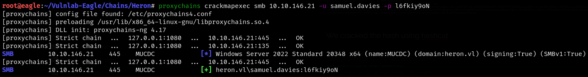

We also enumerated the available shares for the users using CrackMapExec and ProxyChains, and found that we had read/write access to the `transfer$` share, which also contained ADCS.

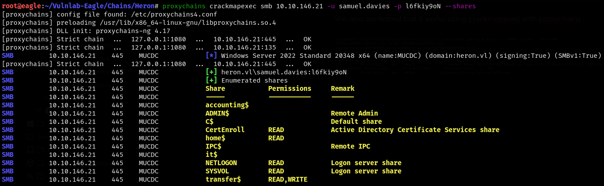

We connected to the share using `smbclient` and were able to see that the `transfer$` share was empty.

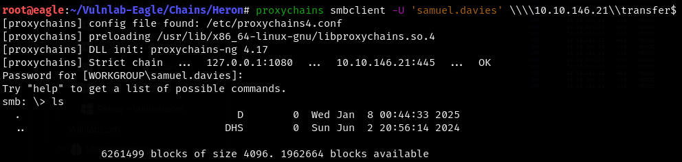

While enumerating the SYSVOL share, we found a `logon.vbs` script.

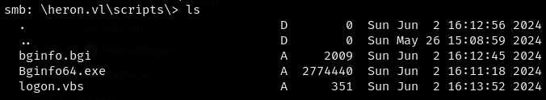

However, those files didn't contain anything useful. We set `recurse` to on and `prompt` to off, then ran `ls` and were able to see a `groups.xml` file.

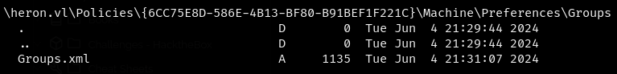

We saved the file and used [gpp-decrypt](https://github.com/t0thkr1s/gpp-decrypt) to decrypt it.

```
Administrator(built-in):H3r0n2024#!
```

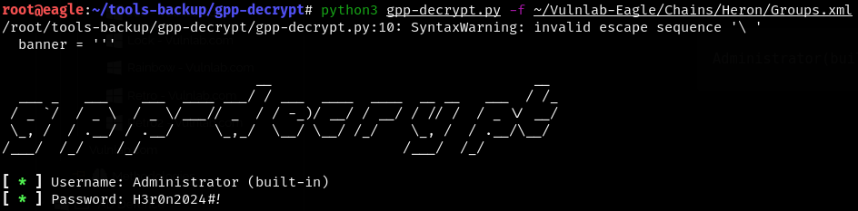

We used CrackMapExec and confirmed that the password works on the Domain Controller (DC) for the user `svc-web-accounting-d`, which we found in the `/home` directory of the Linux host.

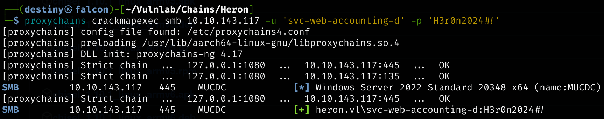

This user had read and write access to the Accounting share.

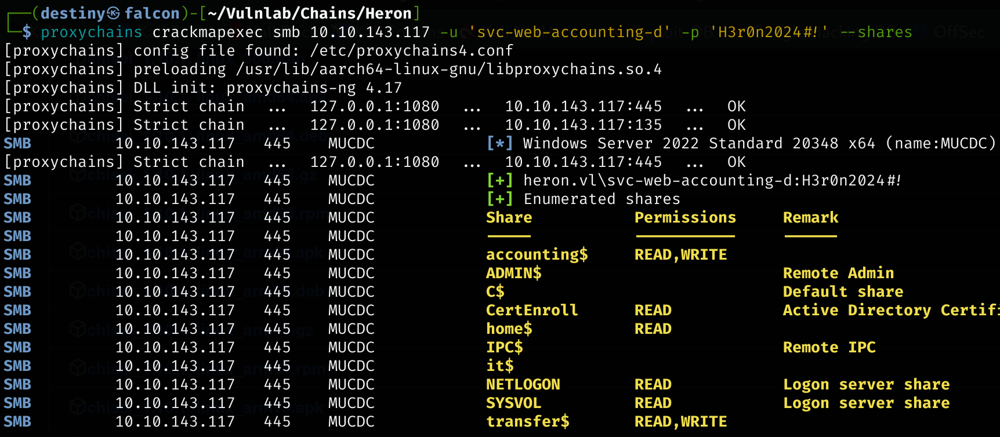

We used `smbclient` with `proxychains` to connect to the share.

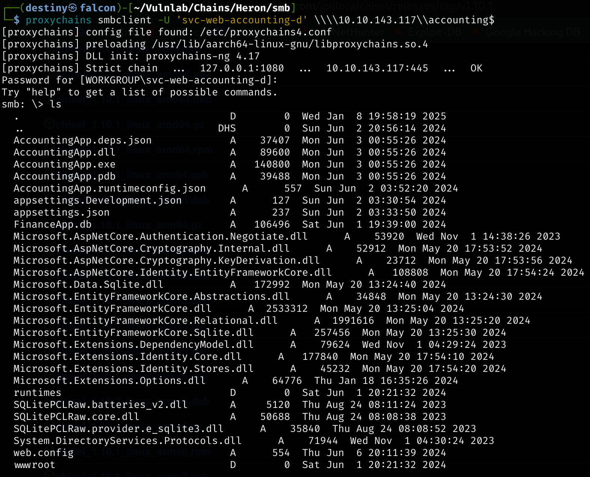

We downloaded the `web.config` file and found the following data:

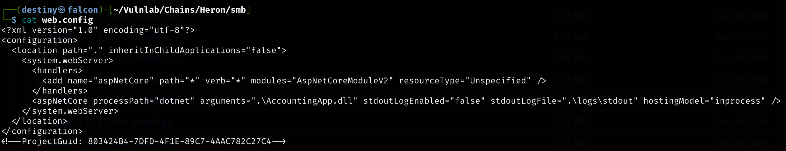

We found this blog post, [Uploading web.config for Fun and Profit 2](https://soroush.me/blog/tag/rce/), and checked if a web application was running in this folder/share. Since we had read and write access, we could edit the `web.config` file with a simple reverse shell, execute it by visiting the web page, and obtain a reverse shell.  

However, at that time, we only had access to one web application. Since the share's name was `accounting`, we added the DC with `accounting.heron.vl` as a VHOST in Falcon.

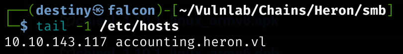

We added the SOCKS5 proxy to Firefox, accessed the page, and received a login prompt.

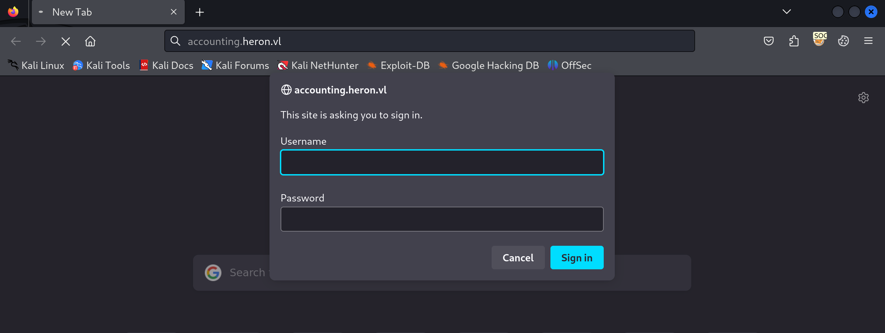

We used the credentials of the `svc-web-accounting-d` user and were able to log in.

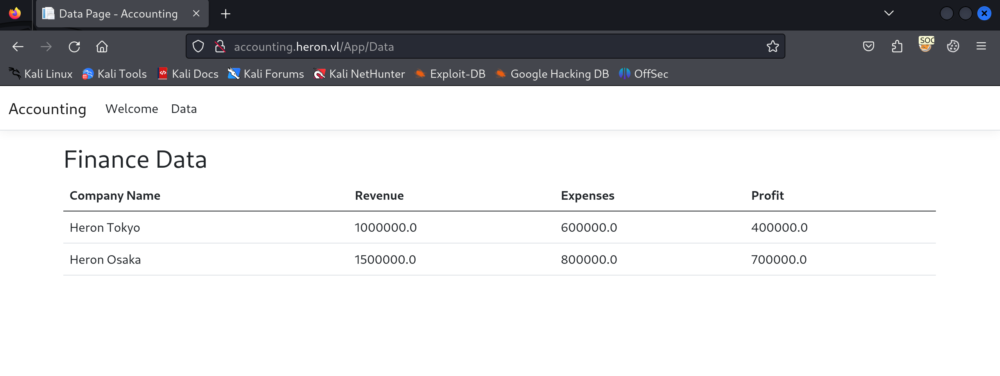

We edited the `web.config` file as shown below, replacing the arguments with a PowerShell Base64 reverse shell from revshells.com.

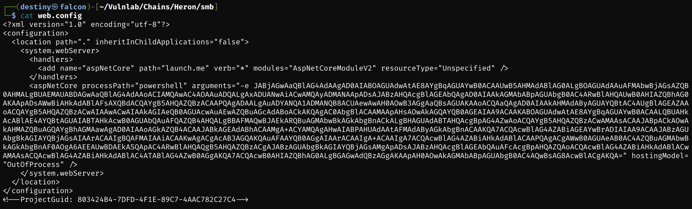

```
smb: \> del web.config
smb: \> put web.config
putting file web.config as \web.config (2.6 kb/s) (average 2.6 kb/s)
```

By visiting the page, we obtained a shell as `svc-web-accounting` on the DC and retrieved the `Heron_User-1` flag from `C:\`.

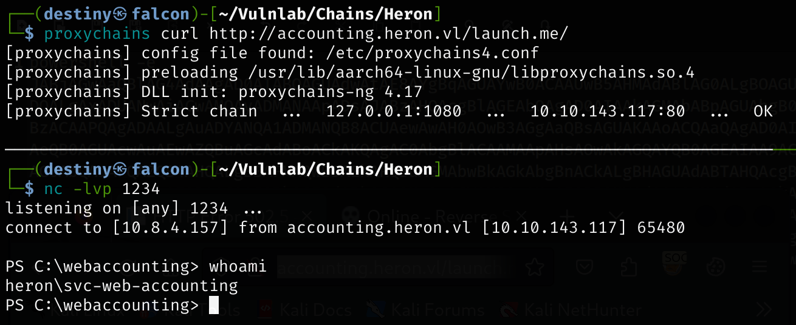

We couldn't find anything after enumerating the directories. However, from a writeup, we received a hint to check the `scripts` folder in `C:\Windows`. After enumerating it, we found an `ssh.ps1` file that contained the credentials of a user on the `frajmp` host.

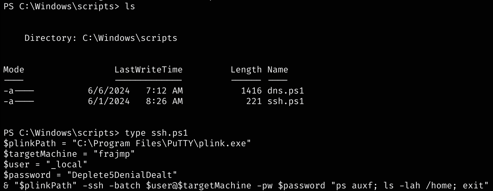

```
_local:Deplete5DenialDealt
```

In HostB, we were able to confirm that the user `_local` exists.

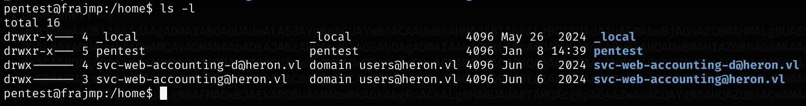

We switched to that user and discovered that the user had sudo all rights. We used the `sudo su` command to gain root access and retrieved the `Heron_User-2` flag.

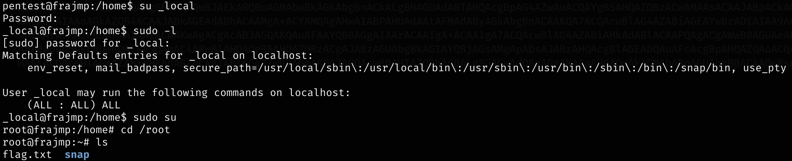

Since this Linux host is domain-joined, we began enumerating for Kerberos-related files. We found the `krb5.keytab` file in the `/etc` directory.

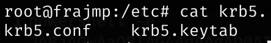

We used [Keytabextract.py](https://github.com/sosdave/KeyTabExtract/blob/master/keytabextract.py) to decrypt the `krb5.keytab` file and retrieve the NTLM hash of a user.

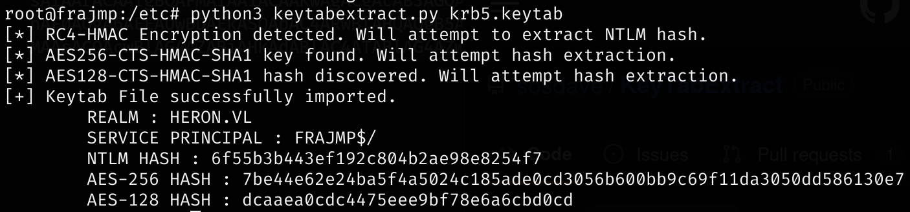

```
NTLM HASH : 6f55b3b443ef192c804b2ae98e8254f7
```

---

We used CrackMapExec with the credentials we had against the DC to dump the users of the domain. This allowed us to perform a password spray attack to identify which user's NTLM hash we had decrypted earlier.

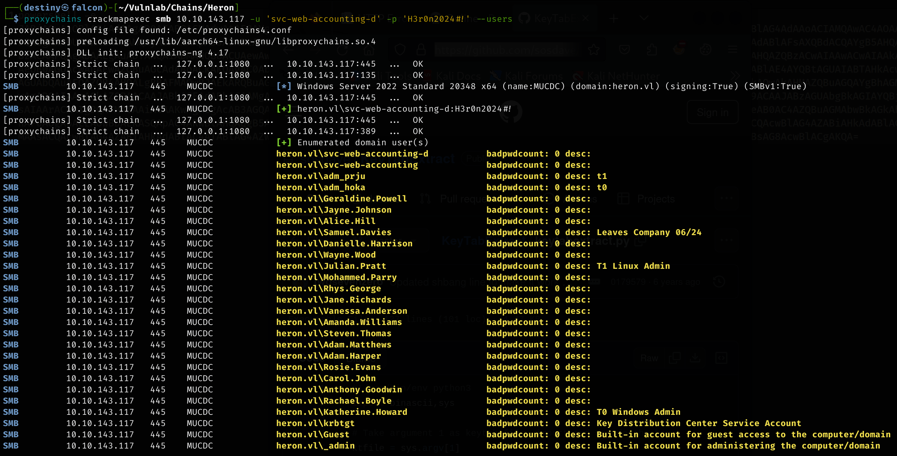

```
┌──(destiny㉿falcon)-[~/Vulnlab/Chains/Heron]
└─$ proxychains crackmapexec smb 10.10.143.117 -u users.txt -H '6f55b3b443ef192c804b2ae98e8254f7' 
```

We didn't have any luck, as the hash didn't match any user accounts.

==**From attacking and researching further, it was noted that the machine account `FRAJMP$` owns this hash, as shown in the output of the image.**==

---

We used the password of the user `_local` and performed a password spray attack again.

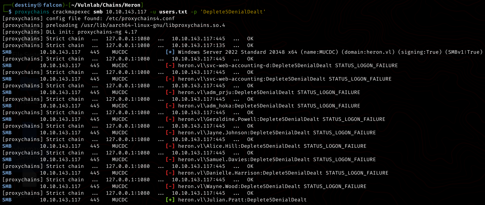

We were able to see that `Julian.Pratt` had the same password. We then checked the SMB shares for the user and found that we now had access to the `home$` share.

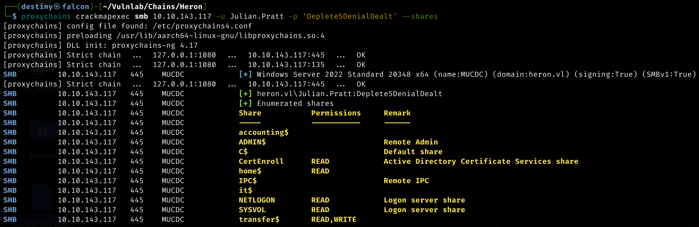

We logged into the share, and while enumerating, we found some Windows shortcut files in the user's home directory.

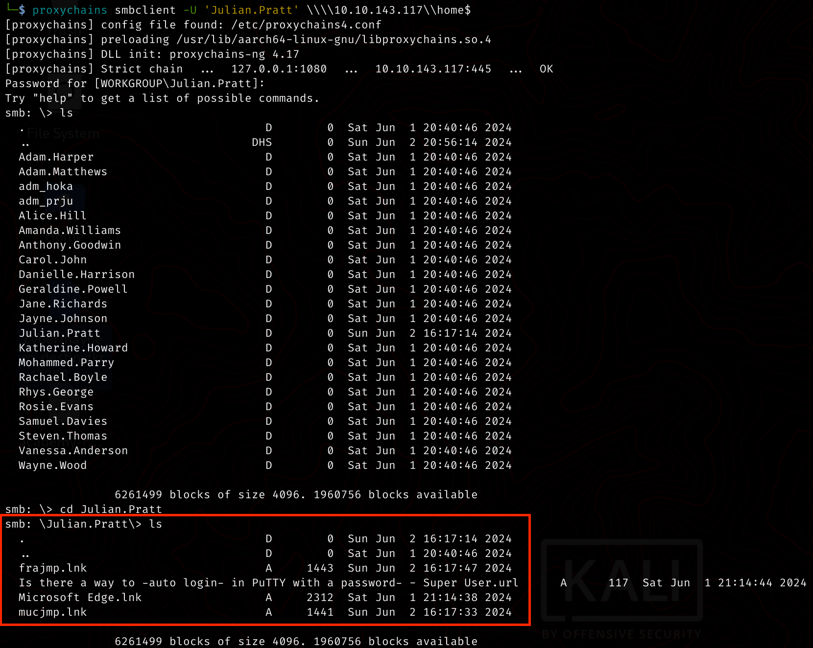

We can use a Windows machine to view the properties of these files, but since I didn't have one, I used the `cat` command from Falcon and was able to see a hardcoded credential pair.

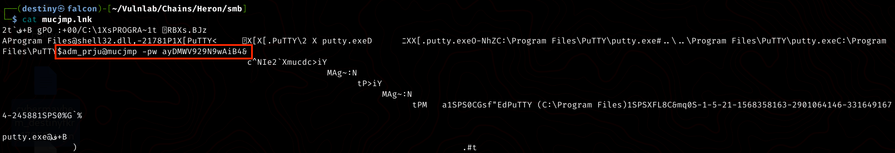

```
adm_prju@mucjmp:ayDMWV929N9wAiB4&
```

We used CrackMapExec to verify the credentials but failed.

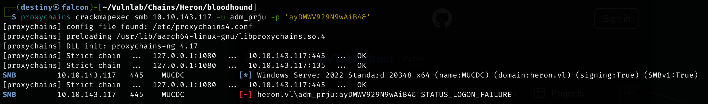

Using the credentials we had and were already working with, we ran a BloodHound-python scan to enumerate the AD network and generate the BloodHound graph.

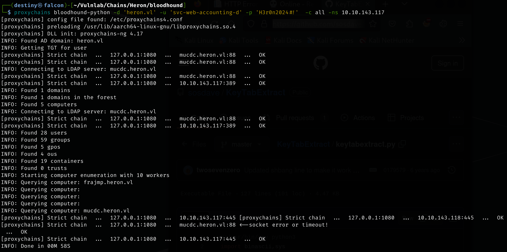

Meanwhile, we used a Windows machine to analyze the file and were able to see the correct password and copy it.

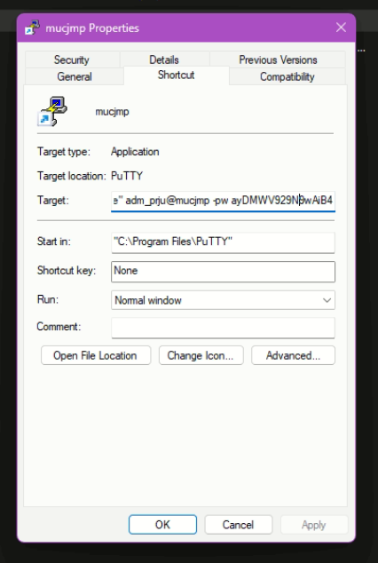

```
"C:\Program Files\PuTTY\putty.exe" adm_prju@mucjmp -pw ayDMWV929N9wAiB4
```

_Our old password just had an extra '&' at the end :P_

We also verified that the credentials of the user `adm_prju` are working now.

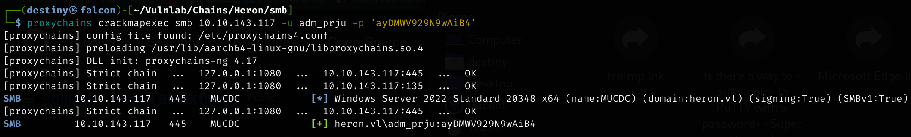

#### Bloodhound Enumeration 
##### Abusing Resource-Based Constrained Delegation | WriteAccountRestrictions

We marked the `ADM_PRJU` user as owned and used the "Shortest Path from Owned Principals" in BloodHound. We were able to see the following attack path:

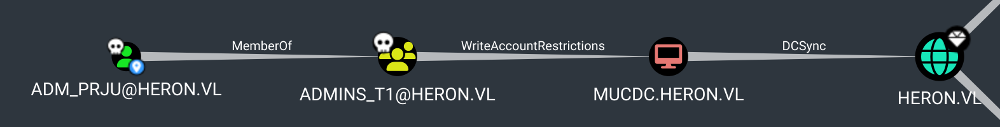

>The members of the group ADMINS_T1@HERON.VL have has write rights on all properties in the User Account Restrictions property set. Having write access to this property set translates to the ability to modify several attributes on computer MUCDC.HERON.VL, among which the msDS-AllowedToActOnBehalfOfOtherIdentity attribute is the most interesting. The other attributes in this set are listed in Dirk-jan's blog on this topic (see references). ~ Bloodhound

We needed to configure the target object so that the attacker-controlled computer could delegate to it. Impacket's `rbcd.py` script was used for that purpose.

```
impacket-rbcd -delegate-from 'ATTACKERSYSTEM$' -delegate-to 'TargetComputer' -action 'write' 'domain/user:password'
```

```
impacket-rbcd -delegate-from 'FRAJMP$' -delegate-to 'MUCDC$' -action 'write' 'heron.vl/adm_prju:ayDMWV929N9wAiB4'
```

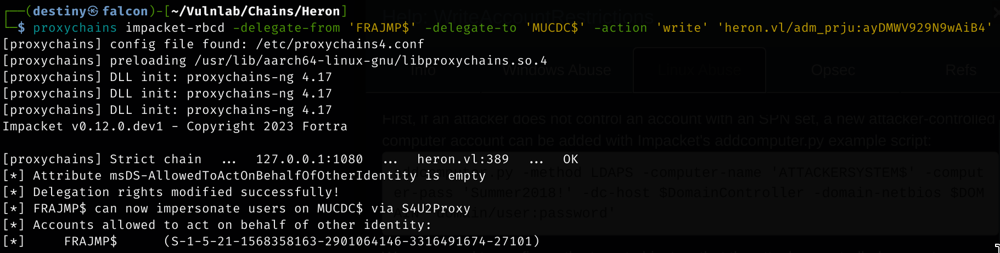

Finally, we were able to get a service ticket for the service name (sname) we wanted to "pretend" to be "admin" for. Impacket's `getST.py` example script was used for that purpose.

```
┌──(destiny㉿falcon)-[~/Vulnlab/Chains/Heron]
└─$ proxychains impacket-getST -spn 'cifs/MUCDC' -impersonate _admin -dc-ip '10.10.143.117' 'heron.vl/frajmp$' -hashes ':6f55b3b443ef192c804b2ae98e8254f7'
```

_We impersonated the '_admin' user since he was a Domain Admin of the `heron.vl` domain._
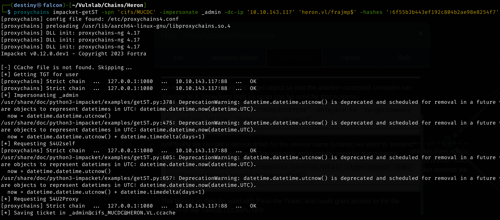

We exported the ticket and used `secretsdump` from Impacket to perform the DCSync attack but failed.

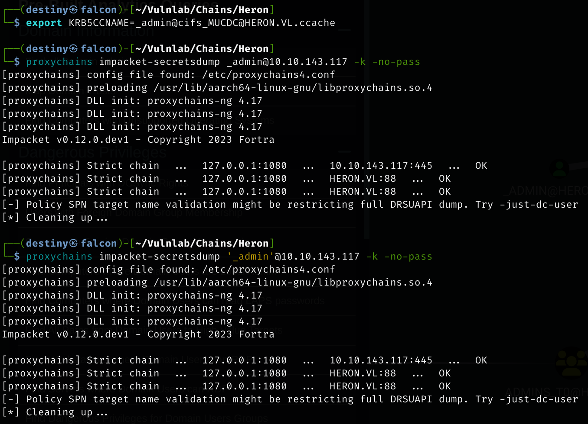

We added the domain before the username and included the hostname of the DC in the hosts file in Falcon. We were then able to successfully launch the attack and dump the hashes of the Domain Controller.

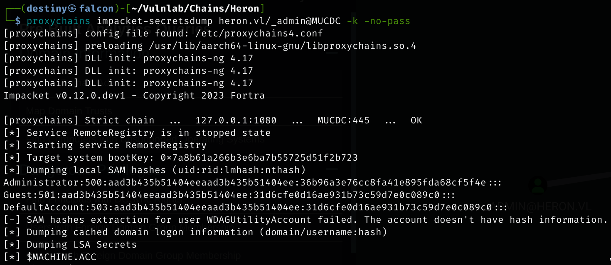

We tried to log in using the administrator hash with Evil-WinRM's Pass-the-Hash but failed. We also noted from the Nmap scan that the WinRM port was not open.

We tried RDP and also failed.

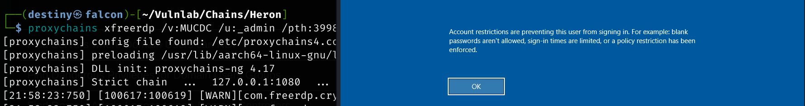

We used `wmiexec` from Impacket to get a shell on the Domain Controller (HostA) as the `_admin` user, retrieved the `Heron_Root` flag, and completed the full chain.

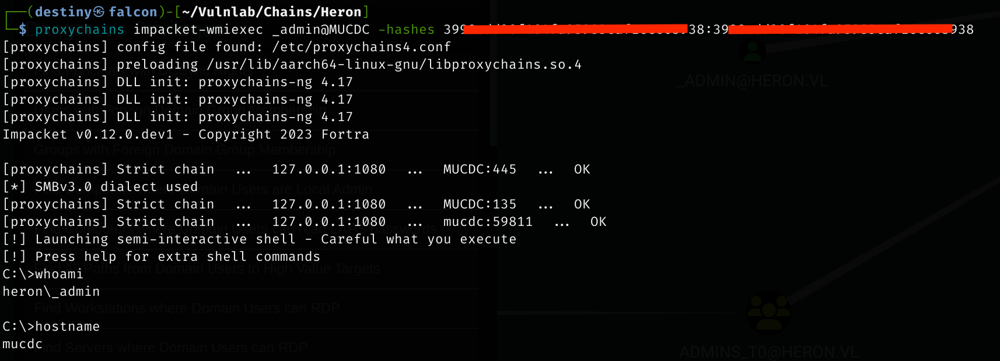

----