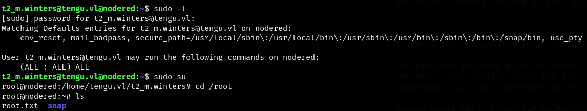

| Chain Name | Difficulty | Date Started | Date Completed |
| ---------- | ---------- | ------------ | -------------- |
| Tengu      | Medium     | 13/01/2025   | 13/01/2025     |
*Vulnlab.com* 

---

**Learning Points:**

- Learned how to use the `realm list` command to check whether a Linux host was joined to an AD domain.
- Learned how to exploit the Node-RED web application to gain command execution.
- Learned that when logging in using SSH as a domain user to a domain-joined Linux host, the correct format is `ssh username@domain@ip`.
- Learned how to exploit the `AllowedToDelegate` permission by impersonating another high-privileged user to access services.
- Learned how to enumerate cached passwords using `lsadump::cache` and target DPAPI, which stores credentials with user-specific keys, using `netexec`.
- Learned that when users are in the "Protected Users" group, NTLM authentication cannot be used (resulting in a `STATUS_ACCOUNT_RESTRICTIONS` error). In such cases, Kerberos must be used for attacks/logins.

---

**Attack Path :**
- Run an Nmap scan on the entire network and find port 1080 open on the Linux host.
- Exploit the Node-RED application to gain command execution on the host.
- Decrypt the configuration file credentials in Node-RED.
- Use Chisel to create a tunnel and pivot into the internal network, gaining access to the DC and SQL hosts.
- Access the MSSQL service running on the SQL host through ProxyChains and obtain a hashed credential of a user. Crack the hash using CrackStation.
- Run BloodHound-python with the cracked credentials to map the Active Directory (AD).
- SSH into the Linux host and read and decrypt the Kerberos keytab file to obtain the NTLM hash of the machine account.
- Use `netexec` with the `--gmsa` module and LDAP to read the GMSA password as the machine account user.
- Abuse the `AllowedToDelegate` privilege to impersonate a SQL admin and access the MSSQL service as a SQL admin.
- Enable `xp_cmdshell` and gain command execution on the SQL host with system privileges.
- Read cached credentials and DPAPI credentials, obtaining the password of a domain admin.
- Since the domain admin is in the "Protected Users" group, request a Kerberos ticket for that user and access the Domain Controller (DC) using PsExec with the ticket to retrieve the final flag.

---

**Activity Log:**

- Ran an Nmap scan to enumerate open ports.
- Found a Node-RED instance running on port 1880, version v3.1.6.
- Couldn’t find any exploits for this version, but discovered a function named **exec**.
- After researching, we found a way to gain command execution on the server. We inserted an `http in` module from the network section and assigned a word to it.
- In the `exec` module, we inserted a curl payload for testing. After visiting the URL associated with the `http in` module on the server, the `exec` command was triggered, and we observed a curl request being made to Eagle.
- We replaced the payload with a bash reverse shell, deployed it, and triggered the shell by visiting the endpoint using curl from Eagle. 
- As a result, we obtained a shell as the `nodered_svc` user on the `nodered` host.
- We triggered the exploit again and obtained a more stable shell using Penelope.
- We used the `realm list` command and confirmed that the host was joined to the `TENGU.VL` domain.
- We didn’t have permission to access the keytab file with the current user.
- We attempted to find flags but were unsuccessful. So, we began enumerating the Node-RED files for any credentials.
- We found a method to decrypt and obtain the password for the config using this [article](https://blog.hardill.me.uk/2021/02/17/viewing-node-red-credentials/).
- We used the script with the relevant files to decrypt the password.
- We couldn’t use this password for anything inside the host, and we could only access the other two hosts via RDP from the perimeter level.
- Additionally, we noted that HostB was named `SQL`, even though we could access the MSSQL port externally.
- We used Chisel to pivot and enumerate the internal network through the SOCKS proxy.
- We were able to log in to the MSSQL service on `sql.tengu.vl` using ProxyChains, but we didn’t have permission to enable the cmdshell to gain RCE on the machine.
- We started enumerating the databases and tables.
- We found a hash of the user `t2_m.winters` in the `users` table of the `demo` database.
- We inserted the hash into CrackStation and determined that the password is `Tengu123`.
- We couldn’t directly change our user to `t2_m.winters` as the user didn’t exist on the Linux host. However, we used the `username@domain` format and succeeded.
- We also tried SSH and had to use the same format when logging in.
- While checking sudo permissions, we discovered that the user had full permissions to run sudo.
- We simply used `sudo su` to gain root access and obtained the `Tengu_User-1` flag.
- With root access, we exported the `krb5.keytab` file and cracked it on Eagle.
- We successfully cracked the file using `keytabextract.py` and obtained the NTLM hash of the user `NODERED$`.
- Using CrackMapExec with ProxyChains, we confirmed that our user credentials worked.
- We ran BloodHound-python using the credentials we had to map the AD domain.
- We saw that the user `GMSA01$` is Kerberoastable. However, using the credentials we had, we couldn’t request the ticket.
- We couldn’t find anything interesting from the BloodHound graph either. We ran BloodHound-python again as the user `t2_m.winters`.
- Since we had the hash of the `NODERED$` machine account, we retrieved the GMSA hash using the `--gmsa` module on LDAP with `netexec`.
- We checked the execution rights and saw that the user had the `AllowedToDelegate` privilege on `sql.tengu.vl` and in the `sql_admins` group.
- We found two users under the `sql_admins` group.
- We attempted to impersonate `T1.M_Winters` and then logged in through MSSQL using the ticket.
- We exported the ticket and were able to log in to the MSSQL service on `sql.tengu.vl` (initially using the machine IP failed, but replacing it with `sql.tengu.vl` worked). We also enabled `xp_cmdshell` as we had the necessary privileges.
- We successfully gained command execution on the server.
- We uploaded a Meterpreter shell and used the `getsystem` command to escalate to `NT AUTHORITY\SYSTEM`, as we had high privileges for our user.
- We retrieved the `Tengu_User-2` flag from the desktop of the local administrator user using the elevated shell.
- We loaded Mimikatz using the `load kiwi` command and dumped the SAM to obtain the hash of the local administrator.
- Using `lsadump::cache`, we found domain cached credentials, including cached credentials for `c.fowler`.
- We also discovered that `c.fowler` is a domain admin.
- We used `netexec` to target DPAPI from Eagle and retrieved the password of the `T0_c.fowler` user.
- We attempted to authenticate as `T0_c.fowler` and gain SYSTEM access on the Domain Controller (DC), but failed as the user was in the "Protected Users" group and we received a `STATUS_ACCOUNT_RESTRICTIONS` error.
- We used `gettgt` to request a Kerberos ticket using the domain admin credentials and, using PsExec, obtained a shell on the DC as the domain admin, eventually getting the final flag.

---

| Host   | Host Name    | IP Address    | Status    |
| ------ | ------------ | ------------- | --------- |
| Host A | DC.tengu.vl  | 10.10.145.117 | UnChanged |
| Host B | SQL.tengu.vl | 10.10.145.118 | UnChanged |
| Host C | nodered      | 10.10.145.119 | UnChanged |

*Default Nmap Scan (Full Chain) from Perimeter level*
```
# Nmap 7.94SVN scan initiated Mon Jan 13 16:49:39 2025 as: /usr/lib/nmap/nmap -sC -sV -Pn -oA default -v 10.10.145.117-119
Nmap scan report for 10.10.145.117
Host is up (0.19s latency).
Not shown: 999 filtered tcp ports (no-response)
PORT     STATE SERVICE       VERSION
3389/tcp open  ms-wbt-server Microsoft Terminal Services
| rdp-ntlm-info: 
|   Target_Name: TENGU
|   NetBIOS_Domain_Name: TENGU
|   NetBIOS_Computer_Name: DC
|   DNS_Domain_Name: tengu.vl
|   DNS_Computer_Name: DC.tengu.vl
|   Product_Version: 10.0.20348
|_  System_Time: 2025-01-13T11:20:48+00:00
|_ssl-date: 2025-01-13T11:20:54+00:00; 0s from scanner time.
| ssl-cert: Subject: commonName=DC.tengu.vl
| Issuer: commonName=DC.tengu.vl
| Public Key type: rsa
| Public Key bits: 2048
| Signature Algorithm: sha256WithRSAEncryption
| Not valid before: 2025-01-12T11:14:12
| Not valid after:  2025-07-14T11:14:12
| MD5:   cc16:fcc0:32e6:30e2:5fef:e874:6b41:ab52
|_SHA-1: e399:2682:c021:bd6e:674c:fc6d:509d:ab78:890a:5f3b
Service Info: OS: Windows; CPE: cpe:/o:microsoft:windows

Nmap scan report for 10.10.145.118
Host is up (0.21s latency).
Not shown: 999 filtered tcp ports (no-response)
PORT     STATE SERVICE       VERSION
3389/tcp open  ms-wbt-server Microsoft Terminal Services
|_ssl-date: 2025-01-13T11:20:53+00:00; -1s from scanner time.
| rdp-ntlm-info: 
|   Target_Name: TENGU
|   NetBIOS_Domain_Name: TENGU
|   NetBIOS_Computer_Name: SQL
|   DNS_Domain_Name: tengu.vl
|   DNS_Computer_Name: SQL.tengu.vl
|   DNS_Tree_Name: tengu.vl
|   Product_Version: 10.0.20348
|_  System_Time: 2025-01-13T11:20:48+00:00
| ssl-cert: Subject: commonName=SQL.tengu.vl
| Issuer: commonName=SQL.tengu.vl
| Public Key type: rsa
| Public Key bits: 2048
| Signature Algorithm: sha256WithRSAEncryption
| Not valid before: 2025-01-12T11:14:08
| Not valid after:  2025-07-14T11:14:08
| MD5:   3d64:19bb:aff4:b762:a055:1dea:e7ea:3126
|_SHA-1: d215:8758:f5d2:b74e:3d2c:363f:77ad:290c:ac34:b112
Service Info: OS: Windows; CPE: cpe:/o:microsoft:windows

Host script results:
|_clock-skew: mean: -1s, deviation: 0s, median: -1s

Nmap scan report for 10.10.145.119
Host is up (0.18s latency).
Not shown: 999 closed tcp ports (reset)
PORT   STATE SERVICE VERSION
22/tcp open  ssh     OpenSSH 8.9p1 Ubuntu 3ubuntu0.6 (Ubuntu Linux; protocol 2.0)
| ssh-hostkey: 
|   256 86:a2:62:65:84:f4:ec:5b:a8:a8:a3:8f:83:a3:96:27 (ECDSA)
|_  256 41:c7:d4:28:ec:d8:5b:aa:97:ee:c0:be:3c:e3:aa:73 (ED25519)
Service Info: OS: Linux; CPE: cpe:/o:linux:linux_kernel

Post-scan script results:
| clock-skew: 
|   0s: 
|     10.10.145.117
|_    10.10.145.118
Read data files from: /usr/share/nmap
Service detection performed. Please report any incorrect results at https://nmap.org/submit/ .
# Nmap done at Mon Jan 13 16:50:55 2025 -- 3 IP addresses (3 hosts up) scanned in 75.59 seconds
```

A Node-RED instance was found on port 1880.


We also confirmed that it ran version v3.1.6.


We couldn't find any exploits for the specific version; however, we were able to find a function named **exec**.

>**exec** : Runs a system command and returns its output.


After googling, we found a way to gain command execution on the server. We inserted an `http in` module from the network section and assigned a word to it. In the `exec` module, we inserted a curl payload for testing. After visiting the URL associated with the `http in` module on the server address, the `exec` command was triggered, and we observed a curl request being made to Eagle.


We replaced the payload with a bash reverse shell, deployed it, and then triggered the shell by visiting the endpoint using curl from Eagle. As a result, we were able to obtain a shell as the `nodered_svc` user on the `nodered` host.


We triggered the exploit again and obtained the shell using Penelope to maintain a more stable shell.


We used the `realm list` command and confirmed that the host was joined to the `TENGU.VL` domain.


We also didn't have permission to access the keytab file with the current user.

```
nodered_svc@nodered:/home$ cat /etc/krb5.keytab 
cat: /etc/krb5.keytab: Permission denied
```

We tried searching for flags but were unsuccessful. Therefore, we began enumerating the Node-RED files for any credentials.


We found a way to decrypt and obtain the password for the config using this [article](https://blog.hardill.me.uk/2021/02/17/viewing-node-red-credentials/).

```js
const crypto = require('crypto');
 
var encryptionAlgorithm = "aes-256-ctr";
 
function decryptCreds(key, cipher) {
  var flows = cipher["$"];
  var initVector = Buffer.from(flows.substring(0, 32),'hex');
  flows = flows.substring(32);
  var decipher = crypto.createDecipheriv(encryptionAlgorithm, key, initVector);
  var decrypted = decipher.update(flows, 'base64', 'utf8') + decipher.final('utf8');
  return JSON.parse(decrypted);
}
 
var creds = require("./" + process.argv[2])
var secret = process.argv[3]
 
var key = crypto.createHash('sha256').update(secret).digest();
 
console.log(decryptCreds(key, creds))
```

We were able to use the script with the relevant files and decrypt the password.


```
username: 'nodered_connector', password: 'DreamPuppyOverall25'
```

We couldn't use this password for anything inside the host. We also only can access the other two hosts via RDP from the perimeter level.

Additionally, we noted that HostB was named `SQL`, even though we could access the MSSQL port externally.


We used Chisel to pivot and enumerate the internal network through the SOCKS proxy.


We were able to log in to the MSSQL service on `sql.tengu.vl` using ProxyChains, but we didn't have permission to enable the cmdshell to gain RCE on the machine.


We started enumerating the databases and tables.


We were able to find a hash of the user `t2_m.winters` in the `users` table in the `demo` database.


We inserted the hash into CrackStation and were able to determine that the password is `Tengu123`.


```
t2_m.winters:Tengu123
```

We couldn't directly change our user to `t2_m.winters` as the user didn't exist on the Linux host. However, we used the `username@domain` format and were successful.


We also tried SSH and had to use the same format when logging in.


While checking the sudo permissions, we discovered that the user had full permissions to run sudo. We simply used `sudo su` to gain root access and obtained the `Tengu_User-1` flag.



---

Since we had root access to the machine, we were able to export the `krb5.keytab` file and crack it on Eagle.

We successfully cracked the file using `keytabextract.py` and obtained the NTLM hash of the user `NODERED$`.

```
NODERED$:d4210ee2db0c03aa3611c9ef8a4dbf49
```


Using CrackMapExec with ProxyChains, we were able to confirm that our user credentials worked.


#### Bloodhound Enumeration

We ran BloodHound-python using the credentials we had to map the AD domain.


We were able to see that the user `GMSA01$` is kerberoastable.


Using the credentials we had, we couldn't request the ticket.


We couldn't see anything interesting from the BloodHound graph either. We ran BloodHound-python again as the user `t2_m.winters`.


**I’m not sure why, but in the write-ups, there was this connection in the BloodHound graph. I tried multiple scans with BloodHound in all formats but still couldn't see this connection, so I skipped this part and continued with the exploitation.**


Since we had the hash of the `NODERED$` machine account, the GMSA hash could be retrieved by using the `--gmsa` module on LDAP with `netexec`.


```
gMSA01$:a3a645c77e25cc005c8c2b659d571e6f
```

We checked the execution rights and were able to see that the user had the `AllowedToDelegate` privilege on `sql.tengu.vl` and the `sql_admins` group.


We found two users under the `sql_admins` group.


**This account had the `AllowedToDelegate` permission on the SQL host, which meant we could impersonate any user on this host through the MSSQL service, performing constrained delegation.**

We tried to impersonate `T1.M_Winters` and then logged in through MSSQL using the ticket.


```
proxychains impacket-getST -spn 'MSSQLSvc/sql.tengu.vl' -impersonate 'T1_M.WINTERS' -hashes :a3a645c77e25cc005c8c2b659d571e6f 'tengu.vl/gMSA01$'@sql.tengu.vl -dc-ip 10.10.145.117
```


We exported the ticket and were able to log in to the MSSQL service on `sql.tengu.vl` (we initially used the IP of the machine but failed to log in; when we replaced it with `sql.tengu.vl`, it worked). We also enabled `xp_cmdshell` as we had the necessary privileges.


We were able to get command execution on the server.


We were able to get command execution on the server.


We uploaded a Meterpreter shell and used the `getsystem` command to escalate to NT AUTHORITY\SYSTEM, as we had high privileges for our user.


We got the `Tengu_User-2` flag from the desktop of the local administrator user using the elevated shell.

We loaded Mimikatz using the `load kiwi` command, and by dumping the SAM, we obtained the hash of the local administrator.


```
Administrator:73db3fdd24bee6eeb5aac7e17e4aba4c
```

With `lsadump::cache`, domain cached credentials were found, including cached credentials for `c.fowler`. However, these credentials were not in NTLM hash format, so they couldn't be used in Pass-the-Hash (PTH) unless they were cracked.


We also were able to see that `c.fowler` is a domain admin.


To dump saved credentials from the Credential Manager/Task Scheduler, we targeted DPAPI, which stores credentials with user-specific keys. Being a local admin, we could have utilized `sharpdpapi` to dump all credentials. However, since I was bored with compiling it from the SLN file, I used `netexec` to launch the same attack from Eagle and was able to retrieve the password of the `T0_c.fowler` user.


```
T0_c.fowler:UntrimmedDisplaceModify25
```

_These credentials were used for a scheduled task, and as a result, they were stored in DPAPI._

We could now authenticate as `T0_c.fowler` and gain SYSTEM access on the Domain Controller (DC).

One final thing to remember is that this user is part of the "Protected Users" group, which means we couldn't use NTLM authentication (we would get a `STATUS_ACCOUNT_RESTRICTIONS` error). So, we had to use Kerberos instead!


```
impacket-getTGT tengu.vl/T0_c.fowler@DC.tengu.vl  
export KRB5CCNAME=T0_c.fowler@DC.tengu.vl.ccache  
impacket-psexec T0_c.fowler@DC.tengu.vl -k -no-pass
```

We got the final `Tengu_Root` flag and solved the chain.


---