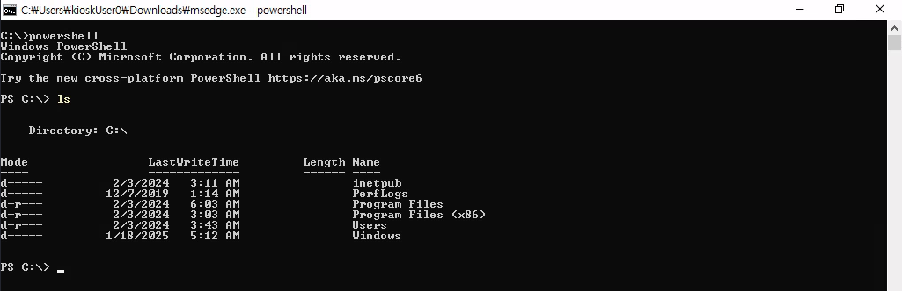

| Machine Name | Difficulty | Date Started | Date Completed |
| ------------ | ---------- | ------------ | -------------- |
| Escape       | Easy       | 11/12/2024   | 19/01/2025     |
*Vulnlab.com* 

---

Learning Points:
- Bypassing kiosk mode by using Microsoft Edge to enumerate the file system.
- Simple AppLocker bypass technique by renaming a file.
- Using the [BulletsPassView](https://www.nirsoft.net/utils/bullets_password_view.html#google_vignette) tool to view the masked passwords in a Windows program.
- Triggering a UAC prompt using PowerShell.

---

*Nmap scan all ports :*
```
destiny@falcon:~/vulnlab.com/Escape-W$ nmap 10.10.113.112 -p-                      
Starting Nmap 7.94SVN ( https://nmap.org ) at 2024-12-10 23:17 +0530
Nmap scan report for 10.10.113.112
Host is up (0.18s latency).
Not shown: 65534 filtered tcp ports (no-response)
PORT     STATE SERVICE
3389/tcp open  ms-wbt-server

Nmap done: 1 IP address (1 host up) scanned in 380.62 seconds
```

```
Nmap scan report for 10.10.113.112
Host is up (0.16s latency).
Not shown: 999 filtered tcp ports (no-response)
PORT     STATE SERVICE       VERSION
3389/tcp open  ms-wbt-server Microsoft Terminal Services
| ssl-cert: Subject: commonName=Escape
| Not valid before: 2024-12-09T17:37:27
|_Not valid after:  2025-06-10T17:37:27
|_ssl-date: 2024-12-10T17:46:16+00:00; -2s from scanner time.
| rdp-ntlm-info: 
|   Target_Name: ESCAPE
|   NetBIOS_Domain_Name: ESCAPE
|   NetBIOS_Computer_Name: ESCAPE
|   DNS_Domain_Name: Escape
|   DNS_Computer_Name: Escape
|   Product_Version: 10.0.19041
|_  System_Time: 2024-12-10T17:46:11+00:00
Service Info: OS: Windows; CPE: cpe:/o:microsoft:windows

Host script results:
|_clock-skew: mean: -2s, deviation: 0s, median: -2s
```

We were able to see that this host only have RDP Port open. We tried to RDP without any credentials but failed :

```
┌──(destiny㉿falcon)-[~]
└─$ xfreerdp /v:10.10.84.12
[13:25:20:676] [281694:281695] [INFO][com.freerdp.client.x11] - No user name set. - Using login name: destiny
[13:25:21:729] [281694:281695] [WARN][com.freerdp.crypto] - Certificate verification failure 'self-signed certificate (18)' at stack position 0
[13:25:21:729] [281694:281695] [WARN][com.freerdp.crypto] - CN = Escape
Domain:   
Password: 
[13:25:24:318] [281694:281695] [WARN][com.freerdp.core.nla] - SPNEGO received NTSTATUS: STATUS_LOGON_FAILURE [0xC000006D] from server
[13:25:24:318] [281694:281695] [ERROR][com.freerdp.core] - nla_recv_pdu:freerdp_set_last_error_ex ERRCONNECT_LOGON_FAILURE [0x00020014]
[13:25:24:318] [281694:281695] [ERROR][com.freerdp.core.rdp] - rdp_recv_callback: CONNECTION_STATE_NLA - nla_recv_pdu() fail
[13:25:24:318] [281694:281695] [ERROR][com.freerdp.core.transport] - transport_check_fds: transport->ReceiveCallback() - -1
```

We found a way to RDP into the machine and get the login screen without any credentials using the `-sec-nla` flag. 

> `-sec-nla`Disables **Network Level Authentication (NLA)**, which is a security feature in RDP. By disabling it, the connection will not require pre-authentication, which may be useful in environments where credentials are not provided until after the session begins or if the server does not support NLA.

```
xfreerdp /v:10.10.84.12 -sec-nla
```

We also found a username :


Could not login using a dummy credential .Using `KioskUser0` username we found, we were able to login without any passwords and got this output :


We were not able to access the Start menu items. After some research, we discovered that we were running in kiosk mode, and the display we saw was not a wallpaper but a webpage shown in Microsoft Edge.

We pressed the Windows button to bring up the Start menu again. Without clicking anything in the Start menu, we simply typed "Edge" and launched Microsoft Edge.


Using Edge, we were able to explore the file system.


Enumerating the files in the `_admin` directory, we found a password in the `profiles.xml` file that was encrypted and belonged to the Remote Desktop Plus application.


From Edge, we opened and saved the `cmd.exe` file, and were able to use Explorer to find it.


We were not able to execute it due to AppLocker restrictions on file names.


We also couldn’t rename the files by right-clicking, as right-click was disabled. However, we used the F2 key to rename the file to `msedge` and were able to execute `cmd`.


However, we couldn’t execute commands as we encountered errors like the following:


We spawned PowerShell from `cmd` and were able to execute commands.



From PowerShell, we executed the Remote Desktop Plus executable, copied the `profiles.xml` file to Downloads, and imported the config file. However, we found that the password was masked.


We used the [BulletsPassView](https://www.nirsoft.net/utils/bullets_password_view.html#google_vignette) tool and were able to see the password in clear text.


We were able to find a user named `admin`.


We used the `runas` command to spawn a shell as `admin`, but we did not get a system-level elevated shell.

```
runas /user:Escape\admin cmd
```


We used the below command to trigger a UAC prompt, clicked "Yes," and obtained the elevated shell.

```powershell
Start-Process powershell -Verb runAs
```


Using the shell, we were able to obtain both the user and root flags.


---